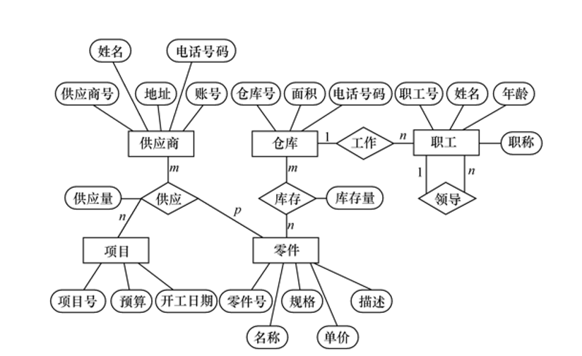

# 07-数据库设计

## 概述

* 目标：满足用户的
  * 信息管理需求：在数据库中存储/管理的对象
  * 数据操作需求：增删查改，统计
* 特点
  * 三分技术、七分管理、十二分基础数据
  * 结构设计（数据库相关）和行为设计（应用相关）相结合

### 基本步骤

1. 需求分析：独立于 DBMS
2. 概念结构设计：对应概念模式
3. 逻辑结构设计：对应逻辑模式/外模式，和 DBMS 相关
4. 物理结构设计：对应内模式，和 DBMS 相关
5. 数据库实施
6. 数据库运行维护

## 需求分析

* 调查用户需求
  * 信息要求 -> 数据要求：数据库中信息的内容、性质
  * 处理要求：需要完成的处理功能、性能
  * 完整性、安全性要求
* 结构化分析方法
* 强调用户的参与

### 数据字典

* 关于数据库中数据的描述
* 和 DBMS 中的数据字典对应

#### 数据项

* 数据项名、数据项含义说明、别名
* 数据类型、长度、取值范围、取值含义
* 与其他数据项的逻辑关系定义了数据的完整性约束条件
* 数据项之间的联系
* 注：取值范围、与其他数据项的逻辑关系ding'ydingy

#### 数据结构

* 数据结构名、含义说明
* 组成：{数据项/数据结构}

#### 数据流

* 数据流名、说明
* 数据流来源、去向
* 组成：{数据结构}
* 平均流量、高峰期流量

#### 数据存储

* 数据存储名、说明、编号
* 输入数据流、输出数据流
* 组成：{数据结构}
* 数据量
* 存取频度
* 存取方式：批处理/联机处理；检索/更新；顺序/随机

#### 处理过程

* 处理或成名，说明
* 输入：{数据流}
* 输出：{数据流}
* 处理：{简要说明}
  * 功能
  * 处理要求：数据量、事务数量、响应时间

## 概念模型

### 实体间联系

* 一对一 `1:1`：对于 A 中的实体，B 中没有/至多一个实体与之对应，反之亦然
* 一对多 `1:n`：对于 A 中的实体，B 中有零个/一个/多个实体与之对应，对于 B 中的实体，A 中有零个/一个实体与之对应
* 多对多 `m:n`：对于 A 中的实体，B 中有零个/一个/多个实体与之对应，反之亦然
* 多个实体间也围绕联系名，存在不同的联系
* 同一实体集中的不同实体也有联系：职工&领导关系（职工领导职工，1对多）

### E-R 图

* 实体型 + 实体属性 + 实体间联系
* 联系的度：参与联系的实体集的个数

#### 绘图规则

* 实体型：矩形
* 属性：椭圆形
* 联系：菱形
  * 通过无向边连接实体和联系，写上联系类型
  * 联系可以具有属性

<figure><figcaption>
简单的 ER 图
</figcaption></figure>

#### Is-A 关系

* 实体间的继承关系：子类继承父类所有属性，子类也可有自己的属性
* 使用三角形表示分类属性
* 可重叠约束：父类中的实体可以属于多个子类
* 不相交约束：父类中的实体最多属于一个子类
  * 在三角形中增加 x 表示
* 部分特化：父类中的实体可以不属于任何子类
* 完全特化：父类中的实体必须属于至少一个子类
  * 连线使用双线表示

#### 基数约束

* 对一对一，一对多，多对多的细化
* 表示上下限，`*`表示无穷大
* A 必须对应 xx-yy 个 B（xx-yy 读靠近 B 的一端）
* 强制参与约束：`min=1`
* 非强制参与约束：`min=0`

#### Part-Of 关系

* 某个实体型是另一个实体型的组成部分
* 非独占 Part-Of：整体被破坏后，另一部分实体仍然存在（对应非强制参与）
* 独占 Part-Of：整体被破坏后，另一部分实体也不存在
* 弱实体型：本身存在依赖于其他实体型的存在
  * 在数据库中需要其他实体的主键
  * 通过双菱形表示识别联系
  * 通过双矩形表示弱实体型
* 强实体型：本身存在不依赖于其他实体型的存在

## 概念结构设计

* 自顶向下：先定义全局框架，逐步细化
* 自底向上：先定义局部概念结构，随后集成为全局概念结构
* 逐步扩张：先定义最重要的核心概念结构，随后向外扩充，逐步生成其他概念结构
* 混合策略：自顶向下需求分析+自底向上设计概念结构

### 实体 & 属性

* 能作为属性的尽量作为属性
* 属性是不可分的数据项
* 属性不能包含其他属性
* 属性不能与其他实体具有联系
* 若不满足以上条件，则考虑将其作为实体

### 集成 ER 图

* 合并：解决分图间的冲突
  * 属性冲突：类型、取值、单位冲突
  * 命名冲突：同名异义、异名同义
  * 结构冲突
    * 同一对象在不同应用中有不同抽象：在一处是实体，另一处是属性
    * 同一实体在不同 E-R 图中包含的属性个数、属性排列次序不同
    * 实体间的联系在不同 E-R 图中为不同类型
* 修改、重构：消除不必要的冗余
  * 规范化理论：将联系变为函数依赖集$$F_L$$，求$$F_L$$的最小依赖$$G_L$$，考查$$D=F_L-G_L$$中的依赖是否冗余
  * 冗余的关系一定在$$D$$中，$$D$$中的关系不一定冗余
  * 当实体之间存在多种联系时，需要加以区分

## 逻辑结构设计

* 把 E-R 图用的概念结构转化为逻辑结构

### 转换规则

* 实体型 -> 关系模式
  * 实体的属性 -> 关系的属性
  * 实体的码 -> 关系的码
* 1:1 联系
  * -> 独立的关系模式（新开一张表）
  * 和某一端实体对应的关系模式合并（作为某一端的属性）
* 1:n 联系
  * -> 独立的关系模式
  * -> 和n端的对应关系模式合并
* m:n 联系 -> 独立的关系模式
* 多元联系（三个及以上实体间的联系）-> 独立的关系模式
* 具有相同码的关系模式可合并
* 每个实体需加入编号作为主键
* 需根据题意加入合适的信息：类别、数量……

### 垂直/水平分解

* 水平分解：把关系的元组分为若干自子集合，定义每个子集合为一个子关系（按照行拆分表）
  * 使用场景：部分元组较为常用，而其他元组不常用
* 垂直分解：把关系的属性分为若干子集，定义每个子集为一个子关系（按照列拆分表）
  * 优点：提升某些事务效率
  * 缺点：部分事务需要连接操作，降低效率
  * 适用场景：某些属性经常一起使用，且其他属性不经常使用，取决于分解后的总效率是否提高

## 物理结构设计

* 为关系模式设计存取方法
* 设计关系、索引等数据库文件的物理存储结构

### B+ 树索引

* 确定
  * 对哪些列建立索引
  * 哪些列建立组合索引
  * 哪些列设计为唯一索引
* 原则
  * 属性经常在查询条件中出现
  * 属性经常作为`MIN`、`MAX`、`SUM`等函数的参数
  * 属性经常在连接条件中出现
* 索引过多会带来开销

### Hash

* 属性经常出现在等值连接、等值比较中，且
  * 关系大小可预知，不变
  * 或 关系大小动态改变，但选用的数据库管理系统提供了动态 Hash 存取方法

### Cluster 聚簇

* 原理
  * 独立聚簇：将某属性的值相同的元组集中存放在连续的物理块中，减少磁盘 I/O
  * 组合聚簇：把多个连接的元组按连接属性值聚集存放，加速连接查询
* 一个数据库可以建立多个聚簇，一个关系只能加入一个聚簇
* 设计候选聚簇
  * 单个关系独立聚簇
  * 经常进行连接操作的多个关系：建立组合聚簇
  * 经常进行等值比较的关系的属性
  * 重复率高的属性
* 检查聚簇中的关系，取消不必要的关系
  * 经常进行权标扫描的关系
  * 更新操作远多于连接操作的关系
  * 重复出现的关系：原则开销最小的
* 局限
  * 只能提高特定引用的性能：`ORDER BY`、`GROUP BY`、`UNION`、`DISTINCT`
  * 建立维护开销大

### 确定数据库的存储结构

* 确定关系、索引、聚簇、日志、备份

#### 影响因素

* 硬件环境
* 应用需求
  * 存取时间
  * 存储空间利用率
  * 维护代价

#### 具体内容

* 确定数据存放位置
  * 将易变部分和稳定部分分开存放
  * 将高频存取和低频存取分开存放
  * 将大的表放在多个磁盘
  * 将日志文件和数据库对象分开存放
* 确定系统配置：基于缺省值设定
* 评价物理结构

## 数据库实施维护

* 数据载入：人工/计算机辅助
* 应用程序调试
* 数据试运行
  * 功能测试
  * 性能测试
  * 数据分期入库：逐步增加数据量
  * 数据库的转储和恢复

### 维护

* 数据库的转储和恢复​：定期备份数据库+日志，在故障时将数据库恢复到可用状态
* 数据库的安全性、完整性控制​：权限&完整性约束
* 数据库性能的监督、分析和改进​：使用监测工具监测性能
* 数据库的重组织与重构造​
  * 重组织：在运行后期，数据库的物理结构会发生变化，导致性能下降
  * 重构造：实体间的联系发生变化，调整模式/内模式，可调整程度有限
