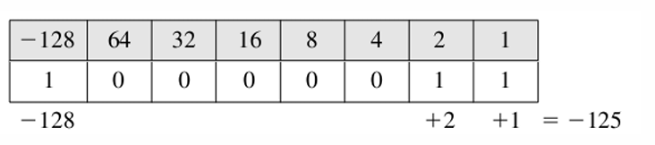
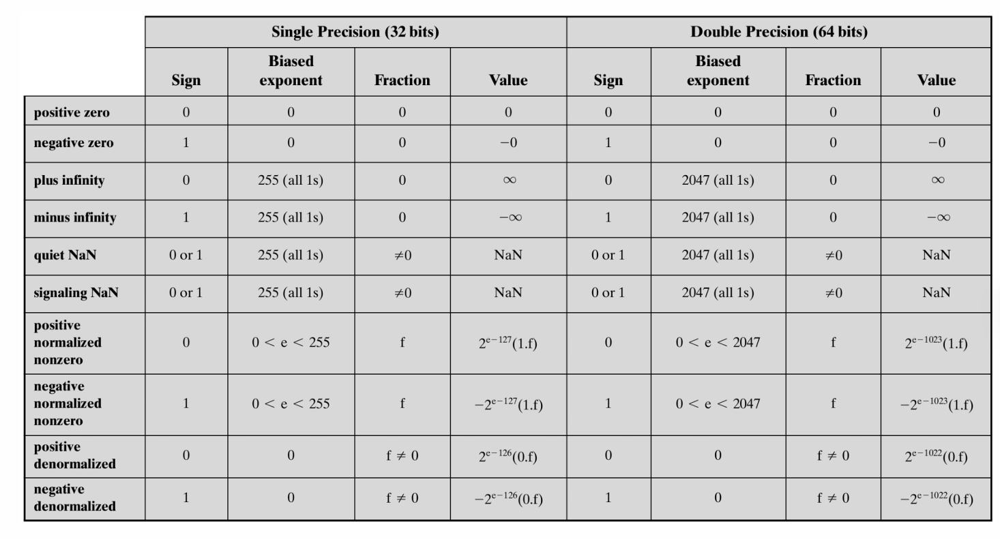

# 03-数据表示

* 二进制：耗电、信息密度低
* 同样长度的编码，表示数据有限，不同的编码方式对精度/范围作取舍

## 补码

* 补码：绝对值相反的两个数互为补
* 好处：避免不必要的硬件需求
* 值的范围：$$-2^{n-1} \le X \le 2^{n-1}-1$$
* **逻辑右移补0，算术右移补高位**
* 补码->十进制：最高位为$$-2^n$$

<figure><figcaption>
补码变为十进制
</figcaption></figure>

## 浮点数

* 科学计数法：$$\pm S \times B^E$$
* 第1位存符号
* 规格化：二进制下默认$S$的首位是1，不需存入
* $$E$$加偏移量：127
* 在同一量级内等距
* 越小越密集
* 为了利用最左边的部分，避免出现underflow，出现非规格数

<figure><figcaption>
特殊的浮点数
</figcaption></figure>


quiet NaN：符号为0，表示未初始化的值，用于捕获异常

signaling NaN：用来表示未定义的算术结果，如除数=0


## BCD

* 用二进制数表示十进制数
* 第一位为符号位
  * +：1100/0
  * -：1101/1

## 舍入

* 浮点数是离散的，很多值都无法精确表示，需要用靠近真值的浮点数替换
* 就近：多余部分0开头掐掉，1开头进1
* 朝正无穷：正数进1，负数掐掉（因为负数尾数越大值越小）
* 朝负无穷：负数进1，正数掐掉
* 朝0：掐掉


同一个数两台机器可能有不同的表示

