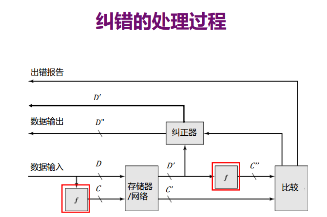
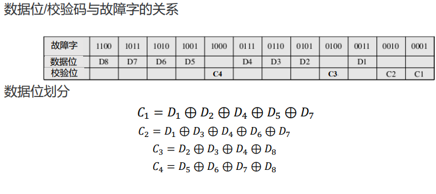

# 04-校验码

## 校验码

* 数据在运算传输的过程中不可避免会出错
* 发现错误更难：矫正错误肯定需要额外信息

## 纠错

* 基本思想：储存额外的数据（校验码C）对数据D进行校正
* 处理过程
  * 使用f在D上生成C
  * 传输，对面获得D‘ C’
  * 对面使用D'生成C‘’和C‘进行比较
  * 没差错则使用数据，否则校正/报告

<figure><figcaption>
纠错的处理过程
</figcaption></figure>


D C 都有出错的可能性

一旦进入传输的过程，源数据D/C都不存在了


## 奇偶校验码

* 基本原理：数1的个数
* 奇校验：多$$\oplus$$一个1
* 若$$C^{''}\oplus C^{'}$$
  * \=0：正确/偶数位出错
  * \=1：奇数位出错
* 优点：代价低
* 缺点：坏掉两个就不行了、无法校正
* 适合对较短长度的数据进行检错

## 海明码

* 基本思想：分组进行奇偶校验，确保能够通过校验码出错的位数定位到唯一的出错位置
* 缺陷：额外成本大、要将数据分成字节

### 校验码长度

* 假设数据长度为$$M$$ 校验码长度为$$K$$ 最多有1位发生错误
* 那么所有情况是 $$M+K+1$$
* 为了覆盖所有情况，$$2^K \ge M+ K +1$$

### 数据位划分

* 二进制下只有1个1的位置留给校验码
* 校验码异或所有对应位置为1的数据

<figure><figcaption>
海明码
</figcaption></figure>

### 错误情形

* 若$$C^{''}\oplus C^{'}$$
  * 全为0：没有错误
  * 仅1位1：校验码出错（因为数据位不会只有1个1）
  * 多位1：数据出错，对应数据取反即可

## 循环冗余校验 CRC

* 适合用流格式传输存储的数据
* 步骤
  1. 提前约定好生成多项式
  2. 假设数据有$$M$$位，左移数据$$K$$位（右侧补0），并用$$K+1$$位生成多项式除它（除法需要模2运算，比如说$$0-1=1$$）
  3. 采用$$K$$位余数作为校验码，把校验码放在数据（不含补的0）后面，一同存储或传输
* 如果$$M+K$$位内容可以被生成多项式除尽，则没有检测到错误
