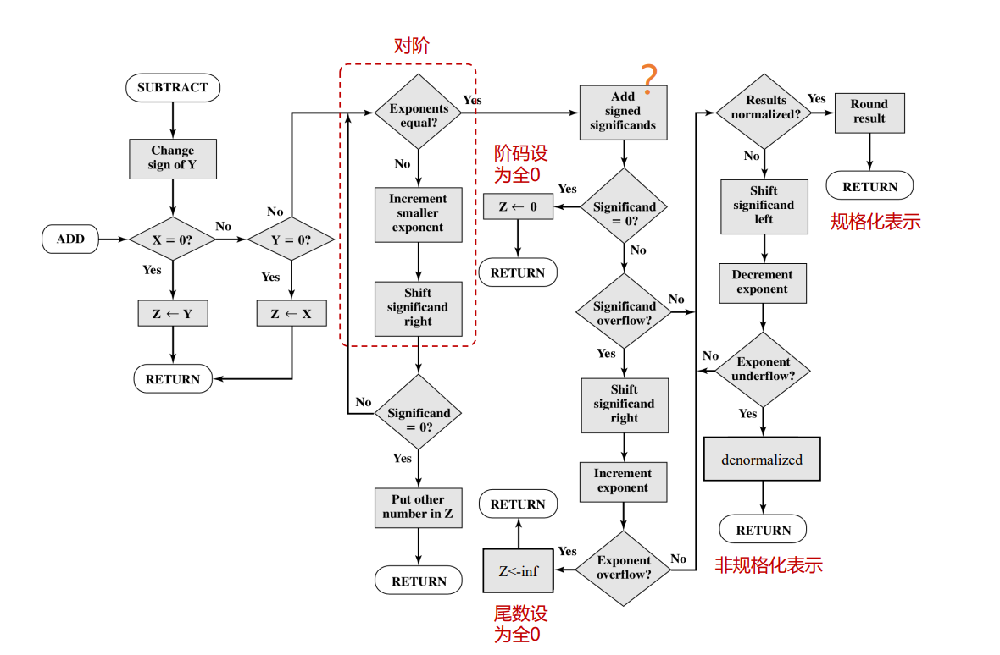

# 06-浮点运算

## 加减法

* 必须确保两个操作数具有相同的指数值
* $$X \pm Y=\left(X_S \times B^{X_E-Y_E} \pm Y_S\right) \times B^{Y_E} (X_E\le Y_E)$$

### 步骤

* 检查0
* 对阶：把小的往大的靠近（防止上溢，不用care最终会被忽略掉的小的位数）
* 加或减有效值
* 规格化结果

<figure><figcaption>
浮点数加减法
</figcaption></figure>

### 注意事项

* Add signed significands（尾数）：取决于正负号对应进行加减，64位运算
* 若尾数溢出需要右移并调整指数
* 若调整后指数溢出要设为inf
* 对于0/inf的情况，需要把阶码/尾数也设为0

### 原码加法

* 如果两个操作数有相同的符号，做加法；否则，做减法
* 加法：直接相加
  * 最高位进位：溢出
  * 符号和被加数（被减数）相同
* 减法：加第二个操作数的补数
  * 若最高位有进位：正确（转过了一圈）
  * 若没有取补数（手动转一圈）

## 乘法

* 任一操作数为0 乘积为0
* 阶码相加，减偏移量（相加后有两个偏移量）
* 有效值相乘
* 结果规格化、舍入

<figure><figcaption>
浮点数乘法
</figcaption></figure>

## 除法

* 除数为0：Inf/出错
* 被除数为0：0
* 被除数和除数阶码相减，加偏移量
* 有效值相除
* 规格化&舍入

<figure><figcaption>
浮点数除法
</figcaption></figure>

## 精度&保护位

* 寄存器的长度大于有效值长度，多余的用作保护位
* 保护位用0填充，位于有效值的右端
* 保护位可能带来精度下降：保护位只能减少结果的误差，无法保护源数
