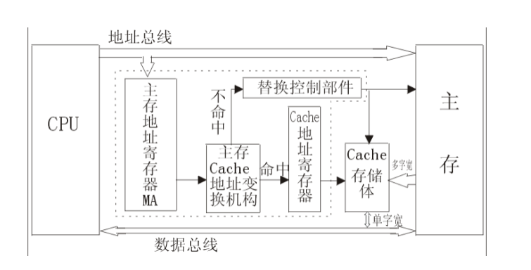

# 09-Cache

* 内存墙：CPU的速度比内存快，且两者差距不断扩大
* 解决内存墙：在CPU和主存间添加一块小而快的Cache，存放主存中部分信息的“副本”
* Cache是**SRAM**

## 工作流程

1. 检查：检查CPU要访问的字是否在Cache中
2. 分情况处理
   * Hit：直接传送
   * Miss：将包含这个字固定大小的**块**读入Cache，同时从Cache中传送该字给CPU

### 判断命中

* Cache通过tags标识内容在主存中的位置

### 程序访问局部性

1. 时间局部性：在相对较短的时间内，重复访问特定/相同位置的信息：循环
2. 空间局部性：在相对较短的时间内，访问相邻的数据

因此：

* 时间局部性：miss时同时将数据传给Cache和CPU
* 空间局部性：将块而非字传给Cache

### 平均访问时间

* $$p$$：命中率、$$T_C$$：Cache访问时间、$$T_M$$：主存访问时间，则
* 使用Cache的平均访问时间：$$T_A=p \times T_C+(1-p) \times (T_C +T_M) = T_C + (1-p) \times T_M$$
* $$p$$越大，$$T_C$$越小，越快
* 目的：让$$T_A$$接近$$T_C$$，消除内存墙
* 方法：降低$$p$$
* 难点：Cache的容量远远小于主存的容量

### Cache的构成

<figure><figcaption><p>Cache的构成</p></figcaption></figure>

* Cache控制器：虚框内
* Cache储存体：SRAM
  * Tag：存放主存的组号
  * Cache：存放对应块的数据信息

## Cache的设计要素

### 容量

* 扩大Cache容量：
  * $$p$$增大
  * 但是：$$T_C$$也增大

### 映射方式

#### 直接映射

* 将块映射到固定行
* $$i$$：Cache行号 $$j$$：主存行号 $$C$$ ：Cache行数，有$$i=j\mod C$$
* 若Cache有$$2^c$$行 每行包含$$2^d$$个字，内存有$$2^m$$个块（$$2^{d+m}$$个字），需要$$m-c$$位区分cache映射到了哪一块
* 主存地址对应Cache：

| Cache标记   | Cache行号 | 块内地址    |
| --------- | ------- | ------- |
| $$m-c$$ 位 | $$c$$ 位 | $$d$$ 位 |

* 标记+Cache行号即为块号
* 优点：简单、快速
* 缺点：抖动现象（Thrashing）：重复访问映射到同一行中的不同行会导致块被来回交换，效率大幅降低
* 适合大容量Cache

#### 关联映射

* 主存块装入Cache中任意一行
* 若Cache有$$2^c$$行 每行包含$$2^d$$个字，内存有$$2^m$$个块（$$2^{d+m}$$个字）
* 主存地址对应Cache：

| Cache标记/块号 | 块内地址    |
| ---------- | ------- |
| $$m$$ 位    | $$d$$ 位 |

* 优点：避免抖动
* 缺点：实现复杂、搜索代价$$O(n)$$
* 适合小容量Cache

#### 组关联映射

* Cache分为若干组，每一组包含相同数量的行，每个主存块被映射到固定组的任意一行
* $$s$$：Cache组号 $$j$$：主存块号 $$S$$：组数
* K-路组关联映射：$$K=C/S$$
* 若Cache有$$2^c$$行 每行包含$$2^d$$个字 $$2^K$$组，内存有$$2^m$$个块（$$2^{d+m}$$个字）
* 主存地址对应Cache：

| Cache标记   | Cache组号 | 块内地址    |
| --------- | ------- | ------- |
| $$m-K$$ 位 | $$K$$ 位 | $$d$$ 位 |

* 折中不同容量的Cache，优缺点兼备

#### 比较

* 关联度（Correlation）：主存块映射到Cache中可能存放的位置个数
  * 直接映射：$$1$$
  * 关联映射：$$C$$
  * 组关联映射：$$K$$
* 关联度越低，命中率越低（直接映射中多个主存块竞争同一个位置造成抖动）
* 关联度越低，判断是否命中越快
* 关联度越低，标记所占额外空间开销越小（Cache组号是否提供了主存映射地址的信息）

### 替换算法

* 直接映射直接替换，不用选择
* 关联映射和组关联映射需要选择换哪个块
* 硬件实现

#### LRU Least Recently Used 最近最少用

* 假设：最近使用过的数据块很有可能被再次使用
* 策略：替换掉Cache中最长时间未被访问的数据块
* 实现：例：2路组关联映射
  * 每行包含一个USE位
  * 同一组的某一行被访问时 将USE位设为1 将另一个USE位设为0
  * 新数据读入时替换掉USE位为0的行的数据块

#### FIFO First in First out 先进先出

* 假设：最近进入Cache的数据很有可能被再次使用
* 策略：替换掉Cache中停留时间最长的数据块
* 实现：时间片轮转法/环形缓冲技术
  * 每行包含标识位
  * 同组某行被替换时，将下一行设为0（若被替换的是最后一行，将第一行设为0）
  * 读入新数据时替换掉标识位为0的数据块

#### Less Frequently Used 最不常用

* 假设：访问越频繁的数据块越有可能被使用
* 策略：替换掉Cache中被访问次数最少的数据块
* 实现：为每一行设置计数器

#### 随机

* 假设：数据块再次使用的可能性相同
* 性能**稍逊于**其他算法

### 写策略

* 一致性：Cache中数据块被替换时，需考虑数据块是否被修改
* 若被修改需写回主存

#### 写直达

* 所有写操作同时对cache和主存进行
* 优点：主存中的数据是最新的
* 缺点：产生大量主存访问、减慢写操作

#### 写回法

* 仅更新Cache，当替换时写回主存
* 利用**脏位Dirty Bit**记录是否被修改
* 优点：减少访问主存次数
* 缺点：主存数据不是最新，影响需要从整个存储Hierarchy中当前Cache以下的部分（如I/O）中使用数据的情况

### 行大小

* 行大小&命中率关系复杂
* 行大小从1开始增加，命中率增加：利用空间局部性，覆盖更多相邻块
* 行大小较大后继续增加，（相同容量的）Cache命中率会下降
  * 行数变少，块数量变少，替换次数增加
  * 每个数据块中包含的数据在主存中位置变远，被使用的可能性减小

### Cache数目

#### 一级 vs 多级

* 一级：片内Cache（Cache和CPU在一个芯片上），减少数据在总线上的传输时间
* 多级：
  * L1未命中时，减少处理器对总线上DRAM或ROM的访问
  * 使用单独的数据路径，代替系统总线在L2缓存和处理器之间传输数据，减轻系统总线负担
* 多级的平均访问时间：$$L_i$$需$$T_i$$时间访问，$$L_1$$ - $$L_i$$联合命中率为$$P_i$$，$$T_A=T_1 + \sum (1-P_i) \times T_{i+1} + (1-P_N) \times T_M$$（注意：无论是否hit都要一级一级访问下去）

#### 统一 vs 分立

* 统一：将数据和指令缓存在同一处
  * 负载平衡，命中率更高
  * 只需设计、实现1个cache
* 分离：将数据和指令分开缓存
  * 消除cache在取值/译码单元和执行单元的竞争
  * 有利于指令流水线

## 注意事项

* 字、块都是从0开始
* Cache行位数=标记位 + 有效位（1） + 脏位（写直达0 写回1） + 数据位（Byte\*8）

### 行优先&列优先

```plaintext
1, 3, 5
4, 2, 6,
7, 8, 9
```

* 行优先：1，3，5，4，2，6，7，8，9
* 列优先：1，4，7，3，2，8，5，6，9
