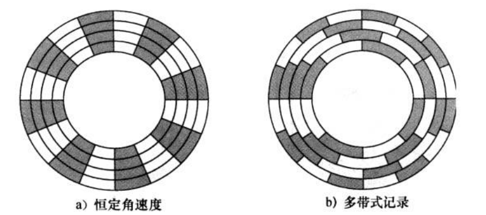

# 10-外部存储器

* 特性
  * 储存不经常使用、数据量较大的信息
  * 非易失

## 磁盘存储器

* 磁盘：涂有**可磁化材料**的**非磁性材料**（基材）构成的圆形盘片
  * 基材：铝、铝合金、玻璃
  * 玻璃基材的优势
    * 改善磁膜表面的均匀性，提高磁盘的可靠性
    * 显著减少整体表面瑕疵，以帮助减少读写错误
    * 能够支持（磁头）较低的**飞行高度**
    * 更高的硬度，使磁盘转动时更加稳定
    * 更强的抗冲击和抗损伤能力
* 软盘&硬盘

## 硬盘

### 结构

#### 盘片

* 多层盘面

#### 磁头

* 对盘片进行读写操作
* 每个盘面表面有一个读写磁头，所有磁头通过机械方式固定在一起，同时移动，与磁盘中心等距
* 磁头必须产生或感应足够大的电磁场，以便正确地读写
* 磁头越窄，离盘片的距离就越近
* 更高的数据密度需要更窄的磁头和更窄的磁道，这将导致更高的出错风险
* 温彻斯特磁头（Winchester head）
  * 磁头实际上是一个空气动力箔片，当磁盘静止时，它轻轻地停留在盘片的表面上
  * 旋转圆盘时产生的空气压力足以使箔片上升到盘片表面上方

### 读写机制

* 读写期间磁头静止、盘片旋转
* 磁头数量
  * 单磁头：读写公用，软盘/早期硬盘
  * 双磁头：使用单独的磁头读取，当代硬盘
* 写入
  * 电流脉冲被发送到写入磁头
  * 变化的电流激发出磁场
  * 产生的磁性图案记录在盘片表面
  * 反转电流方向，记录介质上的磁化方向也会反转
* 读取
  * 读取磁头：磁阻（MR）敏感器，电阻取决于在其下移动的介质磁化方向
  * 电流通过MR敏感器时，通过电压信号检测其电阻变化
  * MR敏感器允许更高频率的操作，实现更高的储存密度和更快的操作速度

### 数据组织

* 磁道：盘片上的数据组织呈现为同心圆环
* 扇区：存取512B用户数据，数据以扇区的形式传入/出磁盘
* 相邻磁道、扇区之间留有间隙
* 柱面：盘片上位于相同的相对位置的一组磁道

<figure><figcaption>
磁盘的数据组织
</figcaption></figure>

#### CAV Constant Angular Velocity 恒定角速度

* 增大记录在盘片区域上的信息位的间隔，使得磁盘能够以恒定的速度扫描信息
* 优点：能以磁道号和扇区号**直接寻址**
* 缺点：容量受最内层磁道限制，外层浪费空间大

#### Multiple Zone Recording 多带式记录

* 外层的同心圆的磁道数量多余内层数量
* 优点：提升储存容量
* 缺点：需要更复杂的电路

### 格式化

* 磁道必须有一些起始点和辨别每个扇区起点终点的方法
* 格式化时，会附有仅被磁盘使用、不被用户存取的额外数据

#### 物理扇区

* Gap：缓冲，防止过去

| Gap1 | ID域 | Gap2 | 数据域 | 间隙 |
| ---- | --- | ---- | --- | -- |
| 17   | 7   | 41   | 515 | 20 |

#### ID域

* 同步字节：提示即将到达新的数据区域

| 同步字节 | 道号 | 头号 | 扇号 | CRC |
| ---- | -- | -- | -- | --- |
| 1    | 2  | 1  | 1  | 2   |

#### 数据域

| 同步字节 | 数据  | CRC |
| ---- | --- | --- |
| 1    | 512 | 2   |

### I/O访问时间

* 寻道时间 Seek Time：初始启动时间，磁头定位到磁道所需时间
* 旋转延迟 Rotational Delay：等待相应扇区的起始处到达磁头所需时间，平均为磁道旋转半周所需的时间
* 传送时间 Transfer Time：数据传输所需的时间
* 平均访问时间：$$T_a=T_s+\frac{1}{2r}+\frac{b}{rN}$$
  * $$b$$：传送的字节数，$$r$$：旋转速率，转/秒，$$N$$：每磁道的字节数（扇区数和扇区字节数之积）
  * $$T_s$$ **平均**寻道时间
  * $$\frac{1}{2r}$$ **平均**旋转延迟
  * $$\frac{b}{rN}$$ **实际**传送时间 若有数据传输率的数值直接用数据传输率来算 $$\frac{b}{N}$$可以是传输/磁道的扇区数的比值，也可以是数据大小的比值
  * 要将转速转换为rps：15000rpm=250rps
* 读取多个相邻磁道，只需考虑1次寻道时间，每个磁道都需考虑旋转延迟

> 例：某个硬盘的平均寻道时间为4ms，转速为15000rpm，每磁道500扇区，每扇区512B，现读取一个由2500个扇区组成的文件

* 顺序组织：$$T=4 \cdot 10^{-3}+5\cdot \left(\frac{1}{2 \cdot 250}+\frac{512 \cdot 500}{250 \cdot 512 \cdot 500}\right)=0.034 s$$
* 随机存取：$$T=2500 \cdot \left( 4 \cdot 10^{-3}+\frac{1}{2 \cdot 250}+\frac{512}{250 \cdot 512 \cdot 500}\right)=15.02s$$
* 因此有了磁盘整理 将碎片数据重新顺序排列

### 磁头寻道/磁盘调度

* 目标：有多个磁盘访问任务时，平均寻道时间最小

> 例：磁头目前位于100号磁道 需要访问55，58，39，18，90，160，150，38，184号磁道，磁盘边界为$$[0,200]$$

#### FCFS First Come First Service 先来先服务

* 按请求顺序寻道
* 优点：公平简单
* 缺点：请求磁道分散时耗时长
* 上例中，需移动$$|100-55|+|55-58|+|58-39|+...+|150-38|+|38-184|=498$$，平均寻道长度$$55.3$$个磁道

#### SSTF Shortest Seek Time First 最短寻道时间优先

* 优先处理离当前位置最近的寻道任务，类似贪心
* 优点：局部最优，平均寻道时间缩短
* 缺点：产生”饥饿“现象，两端的磁道请求可能会长时间等待
* 上例中，需移动$$|100-90|+|90-58|+...+|38-18|+|18-150|+|150-160|+|160-184|=|100-18|+|184-18|=248$$，平均寻道长度$$27.5$$个磁道

#### SCAN 扫描/电梯

* 总是按照一个方向调度，在终点折返
* 优点：性能较好、不产生饥饿现象
* 缺点：只有到最边上的磁道才能改变磁头的移动方向，对于各个位置磁道响应频率不平均（某几根磁道的数据可能频繁访问，错过后要等折返回来）
* 上例中，需移动$$|100-200|+|200-18|=282$$，平均寻道长度$$31.3$$个磁道

#### C-SCAN 循环扫描

* 只有磁头朝1个方向时响应请求，移到终点后立刻返回起点，返回途中不处理数据
* 优点：对于磁道响应频率更平均
* 缺点：平均寻道时间更长
* 上例中，需移动$$|100-200|+|200-0|+|0-90|=390$$，平均寻道长度$$43.3$$个磁道

#### LOOK

* 基于SCAN算法，前方无请求就换向
* 上例中，需移动$$|100-184|+|184-18|=250$$，平均寻道长度$$27.8$$个磁道

#### C-LOOK

* 基于C-SCAN算法，前方无请求就回最远的请求点
* 上例中，需移动$$|100-184|+|184-18|+|90-18|=322$$，平均寻道长度$$35.8$$个磁道

## 光存储器

### CD

* CD：Compact Disk 光盘
* CD-ROM：光盘只读存储器，较CD更耐用且有纠错功能
* 优点：
  * 可更换
  * 大规模复制方便
* 缺点：
  * 只读
  * 存取时间长
* CD-R：可刻录CD
  * 包含染色层，用于改变反射率，并且由高强度激光激活
  * 可用适当强度的激光改变染色层，写入一次
  * 生成的盘兼容CD-ROM驱动器
* CD-RW：可刻录光盘
  * 使用在两种不同相位状态下拥有两种显著不同反射率的材料，激光束能改变材料的相位状态
  * 材料会老化，支持50万-100万次擦除

#### 读取

* 通过播放器/光驱中的低强度激光束读取信息
  * 照在凹坑pit上，因表面不平散射，返回低强度的激光
  * 照在台land上，表面平坦，返回高强度的激光
* 盘片上包含一条单螺旋的轨道，轨道上所有扇区角度相同
* 盘片旋转角速度变化，使读取凹坑的线速度恒定

### DVD

* 位组装更紧密：光道间隙 凹坑间距 4.7GB
* 双层结构：设有半反射层，通过调整焦距读取配一层 8.5GB
* DVD-ROM：双面记录数据 17GB
* 同样有DVD-R DVD-RW
* 高清晰视频光盘（蓝光DVD）使用更短波长的激光（蓝-紫光）实现更高的位密度 25GB

## 磁带

* 使用与磁盘类似的记录和读取技术
* 记录：以柔韧的聚酯薄膜作介质，外涂磁性材料
* 读取：顺序读取，要读N必须从1读到N-1（相较于磁盘的直接存取）
* 记录方式
  * 并行记录：把1位分成8个bit记录在8根磁道上，第9根磁道作奇偶校验
  * 串行记录：数据以位为单位存放在磁道上（蛇形记录，当前使用较多）
  * 同时读写多磁道：依然是串行，以块为单位存在不同磁道上，磁头同时读取多磁道，效率更高

## U盘/固态

* 使用闪存，非易失性半导体存储器
* U盘：体积小、容量大、携带方便、寿命长
* 固态硬盘：较U盘容量更大，性能更高
* 较磁盘抗振性好，无噪声，能耗低，发热量低
