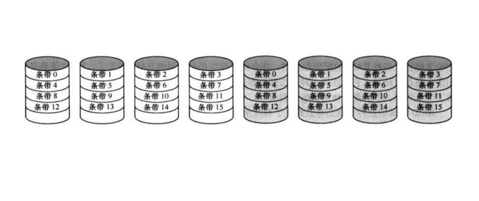
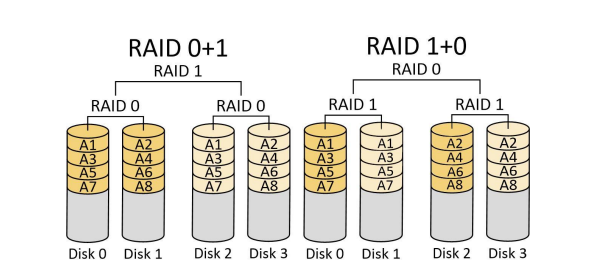
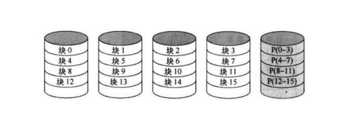
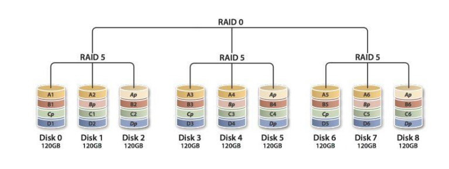

# 11-RAID

## 定义

* Redundant Arrays of Independent Disks
* 基本思想
  * 将多个独立操作的磁盘组织成磁盘阵列，以增加容量
  * 数据存储在多个盘体上，并行工作提高数据传输率
  * 采用数据冗余进行错误恢复
* 特性
  * 一组物理磁盘驱动器，被视为单个逻辑驱动器
  * 数据分布在多个物理磁盘上
  * 冗余磁盘用于校验并恢复信息

## 分类

| 级别 | 描述         | 磁盘数量    | 种类   | 数据可用性         | 大I/O输出传输能力                   | 小I/O请求数据                     |
| -- | ---------- | ------- | ---- | ------------- | ---------------------------- | ---------------------------- |
| 0  | 非冗余        | $$N$$   | 条带化  | 最低            | 很高                           | 很高                           |
| 1  | 镜像         | $$2N$$  | 镜像   | 比2，3，4，5高，比6低 | 
读：比单盘高 写：类似
        | 
读：2倍 写：类似
          |
| 2  | 海明码冗余      | $$N+m$$ | 并行存取 | 高             | 最高                           | 单盘2倍                         |
| 3  | 位交错奇偶校验    | $$N+1$$ | 并行存取 | 高             | 最高                           | 单盘2倍                         |
| 4  | 块交错奇偶校验    | $$N+1$$ | 独立存取 | 高             | 
读：RAID0 写：低于单盘
     | 
读：RAID0 写：显著低于单盘
   |
| 5  | 块交错分布式奇偶校验 | $$N+1$$ | 独立存取 | 高             | 
读：RAID0 写：低于单盘
     | 
读：RAID0 写：显著低于单盘
   |
| 6  | 块交错分布式奇偶校验 | $$N+2$$ | 独立存取 | 最高            | 
读：RAID0 写：低于RAID 5
 | 
读：RAID0 写：低于RAID 5
 |

### RAID 0

* 特点
  * 数据以条带的形式在可用的磁盘上分布
  * 不采用冗余来改善性能（非RAID）
* 用途（与单个大容量磁盘相比）
  * 高速度传输率
  * 高速响应I/O请求：两个I/O请求所需要的数据块可能在不同的磁盘上

<figure><figcaption>
RAID 0
</figcaption></figure>

### RAID 1

* 特点
  * 采用了数据条带
  * 采用简单地备份所有数据的方法来实现冗余
* 访问
  * 读：可选择寻道时间较小的（RAID 0的两倍）
  * 写：并行更新2个条带，受限于写入慢的磁盘（不比RAID 0好多少）
* 优点
  * 高速响应请求：1个数据块可由2块盘各自响应
  * 恢复简单，单个磁盘损坏不会影响数据访问
* 缺点：贵
* 用途：系统软件、数据、关键文件

<figure><figcaption>
RAID 1
</figcaption></figure>

#### RAID 01 & RAID 10

* RAID 01：先0（条带化）后1（镜像）
* RAID 10：先1（镜像）后0（条带化）
* 传输率、磁盘利用率：无差别
* 容错率：**RAID 01更弱**（如果RAID 0 时磁盘就坏了，那RAID 1就没有意义了，因为生成的镜像全是坏镜像）

<figure><figcaption>
RAID 01 vs RAID 10 
</figcaption></figure>

### RAID 2

* 特点
  * 并行存取：每个I/O请求由所有磁盘同时响应
  * 驱动器轴**同步旋转**，磁头**始终位于同一位置**
  * 数据条带小，只有1字节/1字
* 纠错：同一条带计算海明码，储存在校验盘的对应位置
* 访问
  * 读：获取数据+校验码
  * 写：写入所有数据+校验盘
* 缺点
  * 冗余盘多 价格贵
  * 适用于多磁盘易出错环境，对单磁盘已具备高可靠性的情况无意义

### RAID 3

* 特点
  * 并行存取
  * 驱动器轴**同步旋转**，磁头**始终位于同一位置**
  * 数据条带小
* 纠错：奇偶校验
* 优点：数据传输率高（尤其是大I/O请求）
* 缺点：一次只能执行一个I/O请求

### RAID 4


能并行处理I/O请求的是独立存取而非并行存取


<figure><figcaption>
RAID 4
</figcaption></figure>

* 特点
  * 独立存取：每个磁盘操作独立，并行处理各I/O请求
  * 数据条带大
* 校验：以数据条带为单位进行奇偶校验，校验位存在校验盘的对应条带
* 缺点：瓶颈
  * 写损失：小I/O请求需要读2次（原数据 原校验位） 写2次（新数据 新校验位） $$\text{新校验位}=\text{原校验位}\oplus\text{原数据}\oplus\text{新数据}$$
  * 大I/O更新所有磁盘没有写损失：老数据全都不复存在，只需异或新数据位
  * 负载不均衡：所有操作都涉及唯一的奇偶校验盘，成为瓶颈

### RAID 5

<figure><figcaption>
RAID 5
</figcaption></figure>

* 基于RAID 4
* 在所有磁盘上分布了奇偶校验条带：负载均衡
* 访问仍需2读2写

#### RAID 50

<figure><figcaption>
RAID 50
</figcaption></figure>

* 先5后0
* 同一组最多坏1块
* 目的：提高性能（牺牲利用率）

### RAID 6

* 采用两种不同的校验码，分开存在2块盘
* 优点：提升数据可用性，最多坏2块
* 确定：校验数据更多，较RAID5写损失更大
