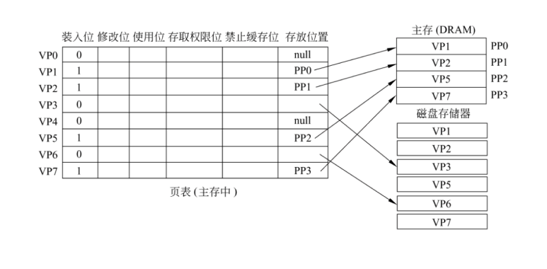
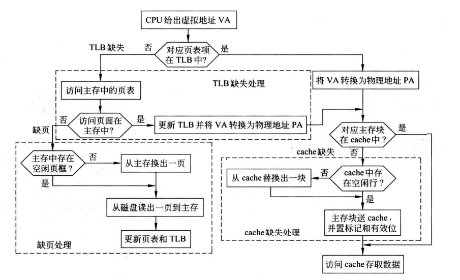

# 12-虚拟存储器

## 存储器管理

* 早期计算机：单道程序设计（仅包含系统软件 + **1个**用户程序）
* 现代计算机：操作系统 + 若干个用户程序
  * 当所有任务等待I/O时，为避免处理器处于空闲状态，需要尽可能让更多任务进入主存
  * 多道程序设计：让处理器处理多个任务，提升处理器利用率
* 存储器管理
  * 在多道程序系统中，主存需要进一步划分给多个任务，划分的任务由操作系统动态执行
  * 这里不考虑“进程”这一概念

## 将更多任务装入主存

* 增大主存容量
* 交换技术 Exchange
  * 当主存中没有就绪任务时，OS调入其他任务
  * 分区 Partitioning / 分页 Paging
* 虚拟处理器
  * 请求分页：将不活跃的页面放在外存，仅将需要的页面调入主存
  * 虚拟地址

### 分区方式

* 系统区：固定地址 存放OS
* 用户区：存放用户程序

#### 简单固定分区

* 用户区划分成长度不等的定长分区
* 任务调入主存时分配可用的、能容纳的最小空间
* 优点：简单
* 缺点：浪费空间

#### 可变长分区

* 用户区按每个任务所需的内存大小进行分配
* 优点：提高主存利用率
* 缺点：时间越长，碎片越多

### 分页方式

* 页框（page frame）：主存划分成固定长且比较小的存储块
* 页（page）：任务划分成固定长的程序块
* 将页装入页框中
* 同一任务所需的页无需放入连续的页框
* 逻辑地址：指令中的地址
* 物理地址：主存中的地址

## 虚拟存储器

* 基本思想：**请求分页**，仅将当前需要的页面调入主存
  * 通过硬件转换逻辑地址为物理地址
  * miss时在主存和硬盘间交换信息
* 优点：对物理内存的封装
  * 不受容量限制，可载入更多任务
  * 无需考虑物理内存的状态，页实际存放的位置

### 设计

* 页大小：4KB 8KB
* 映射：关联映射
* 写策略：写回（主存比硬盘快100000多倍）
* 类型
  * 分页式虚拟存储器
  * 分段式虚拟存储器
  * 段页式虚拟存储器

### 分页式虚拟存储器

* 主存和虚拟地址空间都被划分为**大小相等**的页面
  * 虚拟页 / 逻辑页：虚拟地址空间中的页面
  * 物理页 / 页框：主存空间中的页面
* 页表：虚拟页与物理页的映射
  * 页表包含了所有虚拟页的信息：存放位置（页框号）、valid bit、dirty bit、存取权限
  * 保存在主存中
  * 虚拟地址：页号+偏移量
  * 实际地址：页表映射的页框号+偏移量
  * 页框号位数：主存位数-页面大小位数
* 优点：实现简单、开销小
* 缺点：数据/x指令可能跨页

<figure><figcaption>
页表
</figcaption></figure>

#### 快表 后备转换缓冲器 Translation Lookaside Buffer TLB

* 页表的缓存
* 快表Tag位数：虚拟地址位数-页面大小位数
* 映射：（组）关联映射
* 替换：随机替换
* 主存中的页表：慢表

#### CPU 访存过程

<figure><figcaption>
CPU访存过程
</figcaption></figure>

1. CPU给出虚拟地址 `VA`
2. 将`VA`转换为`PA`
   * 若对应的页表项在TLB中：直接转换
   * 若对应的页表项不在TLB中：缺页处理
3. 获取数据
   * 主存块在Cache中：直接获取
   * 主存块不在Cache中：Cache缺失处理

#### 访存情况

| TLB  | Page | Cache | 说明                         | 主存访问         | 硬盘访问                  |
| ---- | ---- | ----- | -------------------------- | ------------ | --------------------- |
| Hit  | Hit  | Hit   | 直接从Cache获取数据               | 0            | 0                     |
| Hit  | Hit  | Miss  | 将数据从主存读入Cache后获取           | 1 写Cache     | 0                     |
| Miss | Hit  | Hit   | 将页表读入快表 直接从Cache获取数据       | 1 读页表        | 0                     |
| Miss | Hit  | Miss  | 将页表读入快表 将数据从主存读入Cache后获取   | 2 读页表+写Cache | 0                     |
| Miss | Miss | Miss  | 将页表读入快表 将数据同时读入主存与Cache后获取 | 2 读页表+写Cache | 1 主存读数据（同时主存自己写入页表相关） |
| Hit  | Miss | Miss  | 不可能                        |              |                       |
| Hit  | Miss | Hit   | 不可能                        |              |                       |
| Miss | Miss | Hit   | 不可能                        |              |                       |

* 页缺失，主存中一定不存在对应的数据，Cache中一定没有对应缓存
* 页缺失，页表中一定不存在对应的映射，TLB中一定没有对应缓存
* Cache Miss：硬件处理
* Page Miss：OS处理
* TLB Miss：硬件/OS处理均可

### 分段式虚拟存储器

* 将程序与数据分成**不同大小**的段，将所需的段加载到主存
* 虚拟地址：段号+段内偏移量
* 优点：与程序自然分界对应，便于维护
* 缺点：段长度不固定

### 段页式虚拟存储器

* 将数据分段，段内再分页
* 虚拟地址：段号+页号+页内偏移量
* 优点：按段实现共享、保护
* 缺点：需要多次查表
