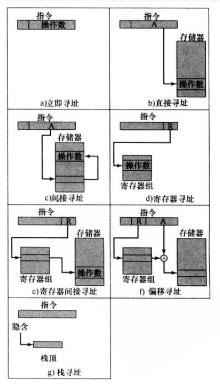

# 13-指令系统

## 指令的要素

* 操作码：将要完成的操作
* 源操作数引用
* 结果操作数引用
* 下一指令引用

## 操作码

* 数据传送
  * 源/目标操作数的位置
  * 传送数据的长度
  * 操作数的寻址方式
* 算术运算
* 逻辑运算
* 输入/输出
* 控制转移
  * 分支/跳转：将跳转的目标地址作为操作数之一
  * 跳步指令：若满足条件，下一条指令被跳过
* 过程调用：`call` `ret`

## 操作数

### 地址

* 二元操作需要：2个源操作数 1个目的操作数 隐含的下一指令地址
* 指令中的操作数数目越少：
  * 指令长度短，简化CPU设计
  * 指令条数增加，耗时增加，程序更复杂
* 多地址指令：多个寄存器可用，允许只使用寄存器运算，加快执行

### 数值

* 受限：幅值/浮点数精度
* 类型
  * 二进制整数/定点数
  * 二进制浮点数
  * BCD

### 字符

* ASCII：7位bit串
* 扩展的二进制编码的十进制交换码 [EBCDIC](https://en.wikipedia.org/wiki/EBCDIC)：8位bit串，字母的编码在16进制下的最后一位都在0-9之间
* Unicode：16/32位

### 逻辑数据

* 类似`bitset`，每一位代表真/假
* 对数据项的具体位进行操作

### 操作数引用

* 实际值
* 地址
  * 寄存器
  * 主存/虚拟内存

## 寻址方式

<figure><figcaption>
寻址方式
</figcaption></figure>

## 指令的要素

* 操作码：将要完成的操作
* 源操作数引用
* 结果操作数引用
* 下一指令引用

## 操作码

* 数据传送
  * 源/目标操作数的位置
  * 传送数据的长度
  * 操作数的寻址方式
* 算术运算
* 逻辑运算
* 输入/输出
* 控制转移
  * 分支/跳转：将跳转的目标地址作为操作数之一
  * 跳步指令：若满足条件，下一条指令被跳过
* 过程调用：`call` `ret`

## 操作数

### 地址

* 二元操作需要：2个源操作数 1个目的操作数 隐含的下一指令地址
* 指令中的操作数数目越少：
  * 指令长度短，简化CPU设计
  * 指令条数增加，耗时增加，程序更复杂
* 多地址指令：多个寄存器可用，允许只使用寄存器运算，加快执行

### 数值

* 受限：幅值/浮点数精度
* 类型
  * 二进制整数/定点数
  * 二进制浮点数
  * BCD

### 字符

* ASCII：7位bit串
* 扩展的二进制编码的十进制交换码 [EBCDIC](https://en.wikipedia.org/wiki/EBCDIC)：8位bit串，字母的编码在16进制下的最后一位都在0-9之间
* Unicode：16/32位

### 逻辑数据

* 类似`bitset`，每一位代表真/假
* 对数据项的具体位进行操作

### 操作数引用

* 实际值
* 地址
  * 寄存器
  * 主存/虚拟内存

## 寻址方式

* `A`：指令中地址字段的值（指令中的编码）
* `R`：寄存器内的值
* `(X)`：地址为`X`的内容
* `EA`：被访问位置的实际（有效）地址

| 名称        | 用法                                                                                  | 算法                                                                                                                                                                       | 优点                               | 缺点      |
| --------- | ----------------------------------------------------------------------------------- | ------------------------------------------------------------------------------------------------------------------------------------------------------------------------ | -------------------------------- | ------- |
| 立即寻址      | 
常数 设置变量初始值
                                                                | `op`=`A`                                                                                                                                                                 | 无需存储器访问                          | 数值大小受限  |
| 直接寻址      | 早期常用，现在不常见                                                                          | `EA`=`A`                                                                                                                                                                 | 
1次存储器访问 无需专门计算地址
       | 地址空间受限  |
| 间接寻址      | 注：在`A`有限的情况下，能将`A`范围内的整页都保留在物理寄存器中，减少缺页                                             | `EA`=`(A)`                                                                                                                                                               | 扩大了地址空间                          | 2次存储器访问 |
| 寄存器寻址     |                                                                                     | `EA`=`R`                                                                                                                                                                 | 
节省指令空间 无需存储器访问
         | 地址空间受限  |
| 寄存器间接寻址   |                                                                                     | `EA`=`(R)`                                                                                                                                                               | 
扩大地址空间 相较于间接寻址少1次存储器访问
 |         |
| 偏移寻址      | 偏移寻址要求指令有两个地址字段，至少其中一个是显式的                                                          | `EA`=`(R)`+`A`                                                                                                                                                           |                                  |         |
| - 相对寻址    |                                                                                     | `EA`=`PC`+`A`                                                                                                                                                            | 利用局部性，节省指令中地址位数                  |         |
| - 基址寄存器寻址 | 
虚拟内存空间中的程序重定位 若有$N$个基址寄存器，$k$位偏移量，则能映射到$N \times 2^k$个地址 偏移量一般为无符号数，非负
 | `EA`=`Base`+`A`                                                                                                                                                          | 利用局部性，节省指令中地址位数                  |         |
| - 变址寻址    |                                                                                     | 
<code>EA</code>=<code>A</code>+<code>(R)</code> 前变址：<code>EA</code>=(<code>A</code>+<code>(R)</code>) 后变址：<code>EA</code>=<code>(A)</code>+<code>(R)</code>
 | 高效进行重复操作                         |         |
| 栈寻址       | 
栈指针保存在寄存器中，本质还是寄存器（间接）寻址 注：栈向下（地址减少的方向）增长
                                 | `EA`=`esp`                                                                                                                                                               |                                  |         |

## 指令设计

### 指令设计原则

* 长度
  * 便于开发和节省空间、时间的权衡
  * 尽量短
  * 是字节的整数倍
  * 指令长度 = 存储器传送长度/数据总线宽度（或二者成倍数关系）
  * 变长指令：功能更多、寻址便利和硬件复杂的权衡
* 操作码位数足够：为未来预留
  * 操作码数目和寻址能力的权衡
  * 使用变长操作码
  * 寻址位的考虑因素
    * 寻址方式的总数
    * 操作数数量
    * 寄存器 vs 存储器
    * 寄存器组的数目（分组减少指令指定寄存器位数）
    * 地址范围
    * 寻址粒度（字长越大，所需地址位越小）
* 编码无二义性
* 合理选择地址字段的格式
* 尽量规整：简化硬件实现

### 指令集设计原则

* 完备性/完整性
* 兼容性：兼容既有指令系统
* 均匀性：处理多种数据
* 可扩充性：操作码预留一定的编码空间

### 设计的基本问题

* 操作指令表
* 数据类型
* 指令个数
* 寄存器：数目 用途
* 寻址：寻址方式种类 有效地址计算
* 下一条指令地址的确定：PC
* `A`：指令中地址字段的值（指令中的编码）
* `R`：寄存器内的值
* `(X)`：地址为`X`的内容
* `EA`：被访问位置的实际（有效）地址

| 名称        | 用法                                                                                  | 算法                                                                                                                                                                       | 优点                               | 缺点      |
| --------- | ----------------------------------------------------------------------------------- | ------------------------------------------------------------------------------------------------------------------------------------------------------------------------ | -------------------------------- | ------- |
| 立即寻址      | 
常数 设置变量初始值
                                                                | `op`=`A`                                                                                                                                                                 | 无需存储器访问                          | 数值大小受限  |
| 直接寻址      | 早期常用，现在不常见                                                                          | `EA`=`A`                                                                                                                                                                 | 
1次存储器访问 无需专门计算地址
       | 地址空间受限  |
| 间接寻址      | 注：在`A`有限的情况下，能将`A`范围内的整页都保留在物理寄存器中，减少缺页                                             | `EA`=`(A)`                                                                                                                                                               | 扩大了地址空间                          | 2次存储器访问 |
| 寄存器寻址     |                                                                                     | `EA`=`R`                                                                                                                                                                 | 
节省指令空间 无需存储器访问
         | 地址空间受限  |
| 寄存器间接寻址   |                                                                                     | `EA`=`(R)`                                                                                                                                                               | 
扩大地址空间 相较于间接寻址少1次存储器访问
 |         |
| 偏移寻址      | 偏移寻址要求指令有两个地址字段，至少其中一个是显式的                                                          | `EA`=`(R)`+`A`                                                                                                                                                           |                                  |         |
| - 相对寻址    |                                                                                     | `EA`=`PC`+`A`                                                                                                                                                            | 利用局部性，节省指令中地址位数                  |         |
| - 基址寄存器寻址 | 
虚拟内存空间中的程序重定位 若有$N$个基址寄存器，$k$位偏移量，则能映射到$N \times 2^k$个地址 偏移量一般为无符号数，非负
 | `EA`=`Base`+`A`                                                                                                                                                          | 利用局部性，节省指令中地址位数                  |         |
| - 变址寻址    |                                                                                     | 
<code>EA</code>=<code>A</code>+<code>(R)</code> 前变址：<code>EA</code>=(<code>A</code>+<code>(R)</code>) 后变址：<code>EA</code>=<code>(A)</code>+<code>(R)</code>
 | 高效进行重复操作                         |         |
| 栈寻址       | 
栈指针保存在寄存器中，本质还是寄存器（间接）寻址 注：栈向下（地址减少的方向）增长
                                 | `EA`=`esp`                                                                                                                                                               |                                  |         |

## 指令设计

### 指令设计原则

* 长度
  * 便于开发和节省空间、时间的权衡
  * 尽量短
  * 是字节的整数倍
  * 指令长度 = 存储器传送长度/数据总线宽度（或二者成倍数关系）
  * 变长指令：功能更多、寻址便利和硬件复杂的权衡
* 操作码位数足够：为未来预留
  * 操作码数目和寻址能力的权衡
  * 使用变长操作码
  * 寻址位的考虑因素
    * 寻址方式的总数
    * 操作数数量
    * 寄存器 vs 存储器
    * 寄存器组的数目（分组减少指令指定寄存器位数）
    * 地址范围
    * 寻址粒度（字长越大，所需地址位越小）
* 编码无二义性
* 合理选择地址字段的格式
* 尽量规整：简化硬件实现

### 指令集设计原则

* 完备性/完整性
* 兼容性：兼容既有指令系统
* 均匀性：处理多种数据
* 可扩充性：操作码预留一定的编码空间

### 设计的基本问题

* 操作指令表
* 数据类型
* 指令个数
* 寄存器：数目 用途
* 寻址：寻址方式种类 有效地址计算
* 下一条指令地址的确定：PC
