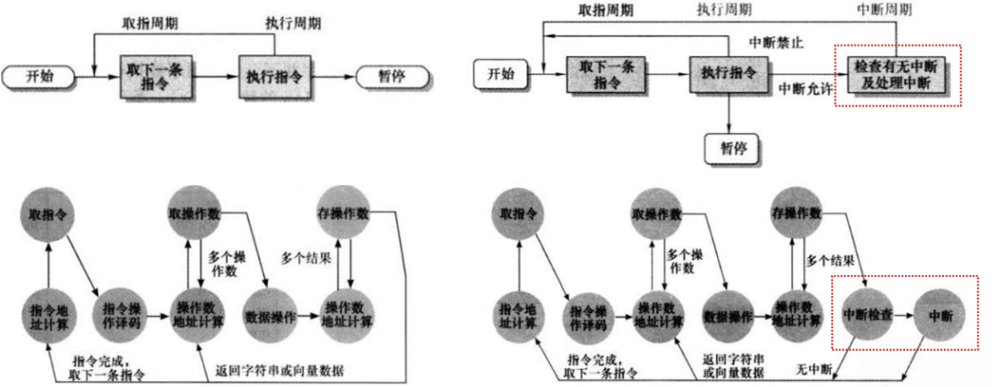

# 14-指令流水线

## 指令周期

* 指令周期：处理单个指令的过程
  * 取指周期：从内存中提取一条指令
  * 执行周期：执行所提取的命令
* 带中断的指令周期

<figure><figcaption><p>不带中断的指令周期/带中断的指令周期</p></figcaption></figure>

### 间址周期

* 操作数/间接寻址涉及访存
* 间址周期：把间接地址的读取看成是一个额外的指令子周期

### 控制和状态寄存器


这些寄存器都对用户不可见 详见第15章


* PC 程序计数器：存有待取指令的地址
* IR 指令寄存器：存有最近取来的指令
* MAR 存储地址寄存器：存有存储器位置的地址
* MBR 存储缓冲寄存器 / MDR 存储数据寄存器：存即将写入/刚刚读出存储器的字

### 数据流


具体流程《计算机组成与体系结构\_性能设计》 P283


#### 取指周期

* PC将地址传送到MAR，传给地址总线
* 控制器通过控制总线请求读存储器
* 存储器收到读请求后读取地址总线上的地址，将读取到的指令返回数据总线
* CPU将数据总线上返回的指令复制给MBR，再转给IR

#### 间址周期

* MBR最右边的$$N$$位是地址引用，被传送给MAR
* MAR将地址通过总线传给存储器
* 控制器通过控制总线请求读存储器
* 存储器读出所需的数据/地址，送入MBR

#### 中断周期

* 保存PC当前值（返回地址）
  * 地址（栈顶-1）传入MAR
  * 数据传入MBR写入存储器
* 控制器将中断程序的入口地址送入PC

## 指令流水线

* 处理指令分为不同阶段，每个阶段由相应功能部件完成

### 两阶段方法

* 将指令处理分为：取指+执行
* 在执行时取下一条指令
* 问题
  * 执行时间长于取指时间
  * 访存冲突
  * 分支/跳转时待取指令未知

### 六阶段方法

| 简称 | 全程                       | 任务                |
| -- | ------------------------ | ----------------- |
| FI | 取指 Fetch Instruction     | 读下一条预期的指令到MBR     |
| DI | 译码 Decode Instruction    | 确定操作码、操作数指定符      |
| CO | 计算操作数 Calculate Operands | 计算源操作数的有效地址       |
| FO | 取操作数 Fetch Operands      | 从存储器中取操作数         |
| EI | 执行 Evaluate Instruction  | 完成指定操作，若需写入寄存器则写入 |
| WO | 写操作数 Write Operand       | 将结果存入存储器          |

* 划分成更多，耗时几乎相等的阶段
* 不是所有指令都包含全部的6个阶段（`LOAD`不用WO），但为了简化设计，假设指令都需6阶段
* 不是所有阶段都并行完成：存在等待
  * FI FO WO涉及访存
* 转移/中断需排空流水线，带来无效读取

### 流水线性能

* 假设
  * 流水线第$$i$$段电路延迟时间 $$t_i$$
  * 最大段延迟 $$t_m$$
  * 指令流水线段数 $$k$$
  * 锁存延时 $$d$$ 数据和信号从上一段传到下一段所需的段间锁存接收时间
* 周期时间 $$t= \text{max}[t_i] + d = t_m + d$$
* $$k$$阶段流水线指令执行$$n$$条指令耗时 $$T_{k,n}=\left[ k + (n-1) \right] t$$
* 加速比 $$S_k = \frac{nkt}{\left[ k + (n-1) \right] t}=\frac{n}{1+\frac{n-1}{k}}$$
* 误解：阶段数越多，执行速度越快
* 原因：阶段间移动数据&控制逻辑存在开销，随阶段增加急剧增加

### 冒险 Hazard

* 在某些情况下，指令流水线会阻塞或停顿（stall），导致后续指令无法正确执行

#### 结构冒险

* 原因：已进入流水线的不同指令在同一时刻访问相同硬件资源（一个要读主存，另一个要写）
* 解决：
  * 使用多个不同的硬件资源
  * 分时使用同一个硬件资源

#### 数据冒险

* 原因：未生成指令想要的数据

> \[!NOTE]
>
> ```assembly
> ADD eax,ebx
> SUB ecx,eax
> ```
>
> 上例中 `SUB` 指令读 `eax`（CO）在 `ADD`指令写`eax`（EI）之前

* 解决
  * 插入NOP指令
    * 软件层面，编译期间
    * 优点：硬件控制简单
    * 缺点：浪费空间，时间
  * 插入气泡
    * 硬件层面，执行期间阻塞
    * 优点：不增加指令条数
    * 缺点：硬件复杂，时间开销
  * 转发/旁路：将寄存器的值直接转发到ALU的输入端
  * 交换指令顺序：编译期间

#### 控制冒险

* 原因：指令的执行顺序被更改
  * 分支、循环
  * 中断
  * 异常
  * 调用/返回
* 解决
  * 多个指令流：对于分支的两种情况（跳转/非跳转）分别维护流水线
    * 缺点：访问寄存器/主存产生竞争，后续分支需添加新的指令流
  * 预取分支目标：识别分支指令时，预取分支目标处的指令（相较于多个指令流仅预取，不执行）
  * 循环缓冲器：将最近顺序取来的指令Cache
  * 分支预测
    * 静态预测
      * 预测绝不发生：始终不跳转
      * 预测总是发生：始终跳转
      * 根据操作码预测
    * 动态预测
      * 分支预测：发生/不发生切换的状态变化
      * 转移历史表
