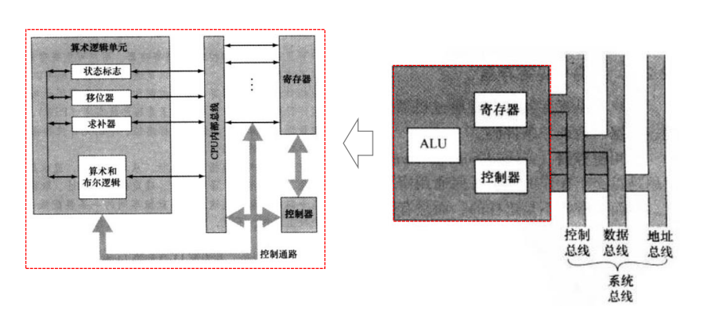
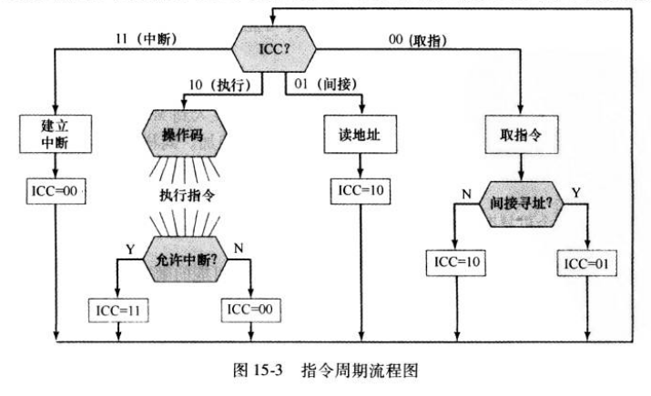
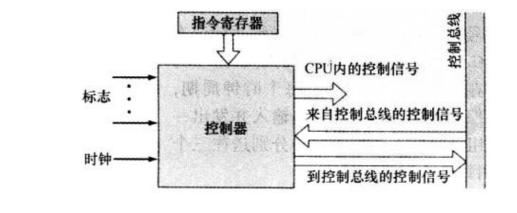
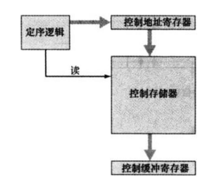
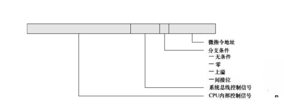
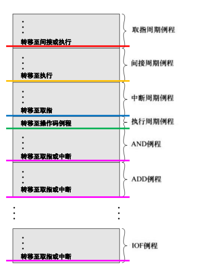
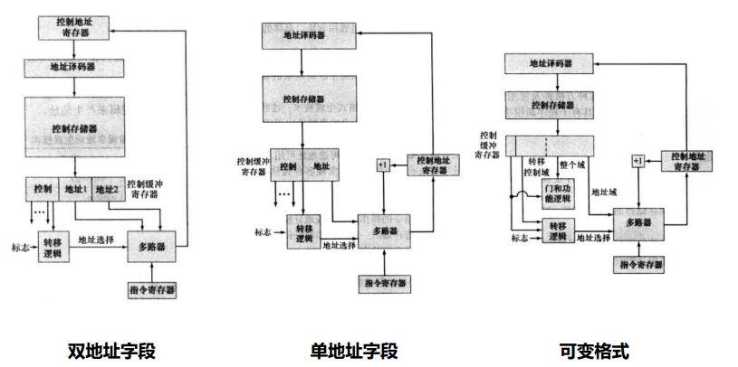
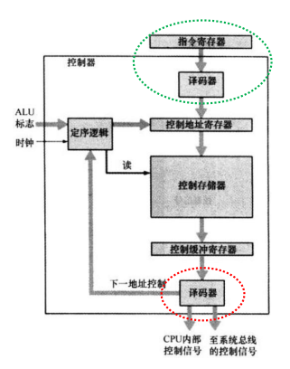

# 15-控制器

## 15-控制器

<figure><figcaption><p>控制器</p></figcaption></figure>


哪些情况需要控制器？

* 执行指令：需要访存、计算等操作
* 外部中断
* CPU的各类标记


## 寄存器

### 用户可见寄存

* 通用寄存器：各种用途
* 数据寄存器：见用于保存数据，无法用于操作数地址的计算
* 地址寄存器：具有某些通用性/专注于某种具体的寻址方式（段指针，变址寄存器，栈指针）
* 条件码寄存器/Flag寄存器：CPU设置条件位作为操作结果，部分用户可见

#### 设计出发点

* 通用的寄存器/各个寄存器的用途
* 寄存器数量
  * 太少的寄存器导致更多的存储器访问
  * 太多的寄存器不能显著的减少存储器访问
* 寄存器长度
  * 应能保存大多数数据类型的值
  * 某些机器允许两个相邻的寄存器作为一个寄存器来保持两倍长度的值

#### 保存恢复

* 子程序调用会自动保存所有用户可见寄存器，并在返回时自动取回
  * 作为调用/返回指令的一部分，由CPU完成
  * 允许各个子程序独立地使用用户可见的寄存器
* 子程序调用之外的保存用户可见寄存器的内容由程序员完成

### 控制/状态寄存器

* PC 程序计数器：存有待取指令的地址
* IR 指令寄存器：存有最近取来的指令
* MAR 存储地址寄存器：存有存储器位置的地址，直接和地址总线相连
* MBR 存储缓冲寄存器 / MDR 存储数据寄存器：存即将写入/刚刚读出存储器的字，直接和数据总线相连
* PSW 程序状态字：包含状态信息的寄存器
  * 符号：算术结果的符号位
  * 零：结果为0被置位
  * 进位：运算时最高位产生进位/借位时置位
  * 等于：逻辑比较结果相等置位
  * 溢出
  * 中断允许/禁止：用于允许/禁止中断
  * 监管：CPU在监管模式/用户模式中
* 其他
  * 指向附加状态信息的存储器块的指针寄存器
  * 向量式中断的机器：中断向量寄存器
  * 系统栈指针
  * 虚拟存储器：页表指针寄存器


ALU可对MBR和用户可见寄存器直接存取


#### 设计出发点

* 对操作系统的定制&支持
* 控制信息在寄存器/存储器的分配：权衡成本/速度，一般将主存最前的字用于控制目的

## 微操作

* 指令周期由子周期组成：取指、间址、执行、中断
* 子周期由**涉及CPU寄存器操作**的位操作组成
* 分组原则
  * 顺序恰当：MAR先存地址，才能从内存中读给MBR
  * 避免冲突：不能同时操作同一部件
  * 尽可能时间少

### 取指周期

```pseudocode
t1: MAR <- (PC)
t2: MBR <- Memory(MAR)
 PC  <- (PC) + I
t3: IR  <- MBR
```

### 间址周期

* 完成间址周期后，IR的间址被替换为操作数，可正常执行

```pseudocode
t1: MAR <- (IR(Addr)) // 指的是取 IR Addr的这几位，后同
t2: MBR <- Memory(MAR)
t3: IR(Address) <- (MBR(Addr))
```

### 执行周期

* 取决于不同指令

```pseudocode
// ADD R1, X
t1: MAR <- (IR(Addr))
t2: MBR <- Memory(MAR)
t3: R1  <- (R1) + (MBR)

// BSA X 转移并保存地址 将地址保存在X，从X+1继续执行
t1: MAR <- (IR(Addr))
 MBR <- (PC)
t2: PC  <- (IR(Addr))
 Memory <- (MBR)
t3: PC  <- (PC) + I
```

### 中断周期

```pseudocode
t1: MBR <- (PC)
 MAR <- Save_Addr
t2: PC  <- Routine_Addr
 Memory <- MBR
```

### 指令周期代码

* 取指、间址、中断周期各有一个微操作序列，执行周期则对于每个操作码有一个微操作序列
* 本质上是个状态机，通过ICC寄存器表示状态

<figure><figcaption><p>指令周期流程图</p></figcaption></figure>

## 控制器

### CPU内部总线

* ALU和寄存器都连接在CPU内部总线上
* 为了数据的传递，内部总线和元件间有门和控制信号
* 控制线控制着数据和系统总线（外部）的交换以及ALU的操作

### 控制CPU的功能需求

* CPU的基本元素：ALU、寄存器组、内部数据通路、控制器、外部数据通路
* CPU需要完成的微操作
  * 在寄存器之间传送数据
  * 将数据优点寄存器传送到外部接口（系统总线）
  * 将数据由外部接口传送到寄存器
  * 将寄存器作为输入和输出，完成算术和逻辑运算
* 基本任务
  * 定序：根据正在执行的程序使CPU以正确的顺序通过微操作
  * 执行：控制器使每个微操作得以完成

### 控制器的输入

* 指令寄存器：当前指令的寻址方式、操作码
* 标志：CPU的状态，前一个ALU完成的结果
* 始终：控制前在每个时钟脉冲完成一组/一个微操作
* 来自控制暂且的控制信号：中断请求……

### 控制器的输出

<figure><figcaption><p>控制器的输入输出</p></figcaption></figure>

* CPU内控制信号
  * 寄存器间传送数据
  * 启动特定的ALU功能
* 控制总线的控制信号
  * 到存储器的控制信号
  * 到I/O模块的控制信号

### 控制器的最小特性

* 只需知道被执行的指令/结果的性质，无需关注具体值
* 只输出控制信号实现控制

## 控制器实现

### 硬布线

* 为每个输出设计一个**关于输入的布尔表达式**，通过组合电路将输入信号转换为输出信号

#### 控制器输入

* 标志&控制总线信号
* 指令寄存器：译码，$$n$$个输入转换为$$2^n$$个输出
* 时钟
  * 在一个指令周期内，控制器要在不同时间单位发送不同的控制信号
  * 使用一个定时器作为控制器的输入，并且控制器在指令周期结束时必须通知定时器以使 其重新开始计数

### 微程序

<figure><figcaption><p>微程序</p></figcaption></figure>

* 介于软硬件之间
  * 设计固件比硬件容易
  * 写固件程序比软件难
* 微指令：每行描述一个时间内的一组微操作
* 优点
  * 简化硬件设计
  * 成本低，减小出错机会
* 缺点：效率较硬布线慢

#### 基本思路

* 控制器的任务：产生控制信号（0/1）
* 生成“比特串”（**控制字**）表示控制器需完成的微操作序列
* 控制字
  * 添加几位用于指示条件真假
  * 添加地址字段，若条件为真则跳转地址，否则顺序执行

<figure><figcaption><p>控制字</p></figcaption></figure>

#### 执行

<figure><figcaption><p>微程序的执行</p></figcaption></figure>

#### 任务

* 定序：微指令中放1个/2个/可变的下一步地址？
  * 考虑微指令的大小（硬件成本）、地址生成时间（效率）
  * 双地址字段：微指令提供2个地址
  * 单地址字段：微指令提供1个地址，另一地址是顺序地址
  * 可变格式：两种格式，通过额外的bit指定格式
  * 通过多路选择器确定下一条微指令的地址
* 执行：传送控制信号

<figure><figcaption><p>微程序的下一个地址</p></figcaption></figure>

#### 构成

* 定序逻辑：向控制地址寄存器装入地址，并发出读命令
* 控制地址寄存器 CAR：含有下面即将被读取的微指令地址
* 控制存储器：存有一组伪指令
* 控制缓冲寄存器 CBR：存放被读出的微指令

#### 工作流程

1. 定序逻辑发读命令给控制存储器
2. 从控制存储器读出微指令，传送CBR
3. 译码器读取CBR的内容生成控制信号，并为定序逻辑提供下一条地址信息
4. 定序逻辑根据地址信息、ALU标志等输入，重新将地址装入到控制地址寄存器
5. 生成新地址的选择
   * 顺序：地址+1
   * 跳转
   * 机器指令例程：根据IR中的操作码，转移到机器指令例程的第一条微指令

<figure><figcaption><p>微程序的工作流程</p></figcaption></figure>

## 盲区

* 微指令有$$x$$个互斥类，每个类有$$a_i$$条指令，则控制字段需要$$\sum \lceil \log_2{a_i} \rceil$$位
* 控制器不在指令流水线数据通路中
