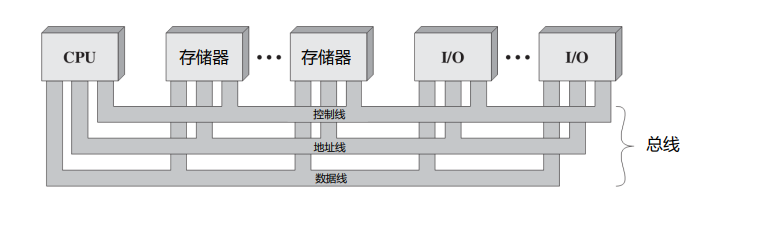
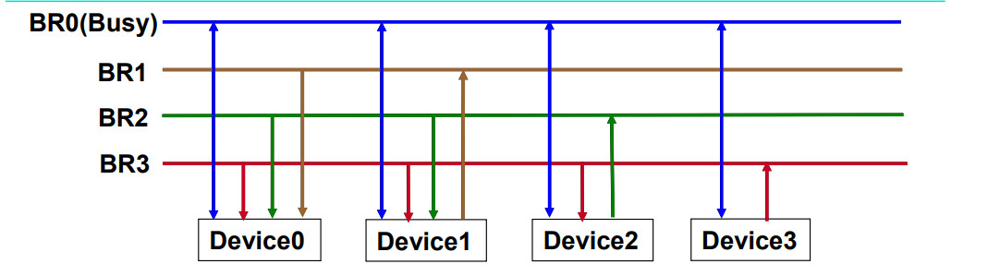
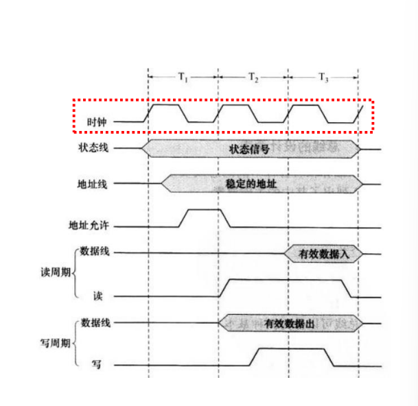
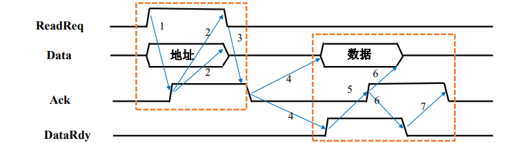

# 16-总线

## 基础知识

### 类型

* 芯片内部总线：连接芯片内部的各个部分（CPU连接寄存器、ALU）
* 系统总线：连接CPU、存储器、IO控制器、其他功能设备
* 通信总线：连接主机和IO设备、其他不同的计算机系统

### 总线结构

<figure><figcaption>
总线结构
</figcaption></figure>

* 数据线：传输数据，数量决定一次传输的数据大小
* 地址线：指定数据来源/去向，决定寻址空间大小
* 控制线：控制对数据线、地址线的存取、使用
* 地址线和数据线可以复用

#### 控制线发送的信号

| 名称   | 英文名称              | 作用               |
| ---- | ----------------- | ---------------- |
| 时钟   | clock             | 用于总线同步操作         |
| 总线请求 | bus request       | 表示模块需要获得对总线的控制   |
| 总线允许 | bus grant         | 发出请求的设备已经被允许控制总线 |
| 中断请求 | interrupt request | 表示某个中断正在悬而未决     |
| 中断响应 | interrupt ACK     | 未决的终端请求被响应       |
| 存储器读 | memory read       | 从存储器读数据到总线       |
| 存储器写 | memory write      | 将数据从总线写入存储器      |
| I/O读 | I/O read          | 从I/O端口读数据到总线     |
| I/O写 | I/O write         | 将数据从总线写入I/O端口    |

### 数据传输

* 能被多个设备监听，但是同一时刻只能由**一个设备**发送数据
* 当发送数据时需
  1. 获得总线使用权
  2. 通过总线发送数据
* 当接收数据时
  1. 获得总线使用权
  2. 通过总线向目标设备请求，等待目标设备发送数据
* 在使用过程中，其他设备不能抢占总线

## 用途

|    | 专用 dedicated 总线   | 复用 multiplexed 总线 |
| -- | ----------------- | ----------------- |
| 特点 | 始终只负责一项功能，分配给特定组件 | 将同一线路用于多种用途       |
| 优点 | 吞吐量高，减少冲突         | 节约空间、成本           |
| 缺点 | 规模、成本大            | 控制电路更复杂，共享降低性能    |

## 仲裁


各类仲裁模式的示意图请参阅 PPT，为节约篇幅，此处不再附图。


* 仲裁：当多个设备需与总线通信时，通过某种策略选择一个设备
* 平衡因素：
  * 优先级：优先级高的设备优先被服务
  * 公平性：优先级最低的设备不能一致被延迟

### 集中式仲裁

* 由仲裁器（arbiter）或总线控制器（bus controller）负责分配总线使用权
* 信号线：硬件读取信号线上的信号获知总线状态
  * BG/允许线：仲裁器->设备，表明设备正被授权使用总线，每个设备有独立的BG信号
  * BR/请求线：设备->仲裁器，表明需要使用总线
  * BS/繁忙线

#### 链式查询 Daisy chain

* 设备串行连接
* 允许信号从高优先级设备下发到低优先级设备
* 仲裁器收到请求后，在总线不忙的前提下发起允许信号
* 若设备收到允许信号并发起总线请求，设备将总线设置为繁忙状态，允许信号不再进一步传递
* 优点
  * 确定优先级很简单
  * 可灵活添加设备
* 缺点
  * 不能保证公平性：远端设备无法及时访问
  * 对电路故障敏感（链式）
  * 限制总线速度

#### 计数器查询

* 将允许线替换为ID线
* 总线空闲时，仲裁器通过ID线发送计数
* 若发送请求的设备ID=裁决器当前的计数，裁决器停止计数，设备总线设置为忙
* 优点
  * 可通过不通的初始计数灵活确定设备优先级
    * 强调优先级：从1开始
    * 强调公平性：从下一个设备的ID开始
  * 对电路故障不敏感
* 缺点
  * 需要添加设备ID线
  * 需要解码、比较ID信号
  * 限制总线的速度

#### 独立请求

* 繁忙线共享、允许线和请求线独立
* 当设备请求总线时通过请求线发送信号给仲裁器
* 仲裁器决定优先级（固定/链式/LRU/FIFO……）
* 优点
  * 快速响应
  * 优先级可编程
* 缺点
  * 控制逻辑复杂
  * 控制线路更多

### 分布式仲裁

* 每个设备都包含访问控制逻辑，各个设备共同作用分享总线

#### 自举式

<figure><figcaption>
自举式仲裁
</figcaption></figure>

* 优先级固定
* 需请求总线的设备在对应的总线请求线上发送信号
* 若使用总线时，设备需分析BR0和比自己优先级更高的设备的请求线（接入的请求线）的信号，当全部空闲时才能使用
* 最低级的设备无需请求线，因为没有其他设备需以此为依据去判断
* N条设备N条请求线
* 上图中优先级3>2>1>0

#### 冲突检测

* 当设备想要使用总线时检测总线是否繁忙，不繁忙即发送
* 同时使用产生冲突时：
  * 在传输设备时监听总线检查是否冲突
  * 若冲突立即停止传输，在随机间隔时间后再次请求

## 时序

* 确认总线事务的起止时间
* 总线事务：地址+数据+数据+……+数据

### 同步时序

<figure><figcaption>
同步时序
</figcaption></figure>

* 事件的发生由时钟决定
* 总线包含时钟线，定时发送规则的0/1信号
* 时间在时钟周期开始时发生
* 优点：更易实现，测试
* 缺点
  * 所有设备共享一个时钟，存在瓶颈
  * 总线长度受到时钟偏差限制

### 异步时序

<figure><figcaption>
异步时序
</figcaption></figure>

* 事件的发生取决于前一事件的发生（握手信号）
* 采用握手协议，双方都同意时才会继续
* 非互锁/半互锁/全互锁
* 优点：可灵活协调不同设备
* 缺点
  * 逻辑复杂
  * 对噪声敏感

| 步骤 | 内容                     | 意图                |
| -- | ---------------------- | ----------------- |
| 1  | CPU设置地址 ReadReq线       | CPU告知存储器需读取       |
| 2  | 存储器读取地址 设置Ack线         | 存储器告知CPU地址读取完毕    |
| 3  | CPU释放地址线和ReadReq线      | CPU告知存储器已收到存储器的回应 |
| 4  | 存储器释放Ack线              | 完成地址传输，即将数据传输     |
| 5  | CPU将数据传到数据线 设置DataRdy线 | 存储器告知CPU读取数据      |
| 6  | CPU读取数据 设置Ack线         | CPU告知存储器数据读取完毕    |
| 7  | 存储器释放数据线 DataRdy线      | 存储器告知CPU收到CPU的回应  |
| 8  | CPU释放Ack线              | 完成数据传输            |

### 半同步

* 同步+异步
* 在异步时序中引入时钟以减少噪声，准备和响应信号只在时针上升沿有效
* 结合二者优点

### 分离事务

* A请求B和B回复A之间存在空闲时间，在设备准备数据期间释放总线
* 优点：增加总线利用率
* 缺点：增加总线时间的持续时间和系统复杂度

## 速率指标

* 总线带宽：最大传输速率，**不考虑仲裁、握手、地址传输**
* 数据传输速率：考虑仲裁、握手、地址传输等因素
* 总线宽度：组成总线的线数

### 同步vs异步

> 例：假设同步总线的时钟周期为50ns，每次传输需要一个时钟周期，异步总线每次握手需要40ns。两个总线都是32位宽，内存的数据准备时间为230ns。当从存储器中读出一个32位的字时，计算两个总线的数据传输速率。
>
> 1. 同步总线
>    * 发送指令和地址到内存：50ns
>    * 准备数据：230ns向上取整，**与时钟周期对齐**，250ns
>    * 将数据传输到CPU：50ns
>    * 速率：$$32bit/350ns=91.4Mbps$$
> 2. 异步总线
>    * 步骤1：40ns
>    * 步骤2-4：max(230ns,40ns\*3) **握手时间和访存时间重叠**
>    * 步骤5-7：40ns\*3
>    * 速率：$$32bit/390ns=82.1Mbps$$

### 不同数据块大小的数据传输速率

* 块传输/猝发传输/Burst是一个意思，都是一次传多个字

> 假设系统具有以下特征:
>
> 1. 它支持访问大小为4到16个字（每个字32位）的块
> 2. 同步总线具有64位宽和200MHz时钟频率，需要1个时钟周期来传输地址或64位数据
> 3. 在两个总线事务之间有2个空闲时钟周期
> 4. 内存访问时准备前4个字需要200ns，后面每4个字准备需要20ns
> 5. 当前面的数据在总线上传输时，内存可以同时读取后面的数据
>
> 如果读取256个字，分别计算每次传输4个字和16个字时的数据传输速率、传输时间和每秒总线事务数
>
> 200MHz=> 5ns的时钟周期
>
> 1. 每次传输4个字
>    * 发送地址：5ns 1cycle
>    * 准备数据：200ns 40cycle
>    * 数据传输：10ns 2cycle
>    * 空闲：10ns 2cycle
>    * 共
>      * $$256/4*45=2880cycle=14400ns$$
>      * 传输速率：$$256*32bit/14400ns=568.9Mbps$$
>      * 每秒总线事务数：$$1/(14400/64)=4.44M$$
> 2. 每次传输16个字
>    * 发送地址：5ns 1cycle
>    * 准备前4个字的数据：200ns 40cycle
>    * 准备第5-16个字的数据：60ns 12cycle（同时传输第1-12个字的数据）
>    * 传输第13-16个字的数据：10ns 2cycle
>    * 空闲：10ns 2cycle
>    * 共
>      * $$256/16*57=912cycle=4560ns$$
>      * 传输速率：$$1796.5Mbps$$
>      * 每秒总线事务数：$$3.51M$$

### 一些结论

* 一个总线事务需要至少$$x$$个周期时：至少有$$1$$个周期用来传输，至少有$$x-1$$个周期用来准备、传送其他信息

### 提高总线的数据传输率

| 举措            | 成本               |
| ------------- | ---------------- |
| 提高时钟频率        |                  |
| 增加数据总线宽度      | 总线线路增加           |
| 块传输           | 高复杂性             |
| 分离总线事务，减少空闲时间 | 复杂性高，增加单个事务的持续时间 |
| 分离地址和数据线      | 总线线路增加           |

## 总线层次结构


&#x20;各类总线结构的示意图请参阅 PPT，为节约篇幅，此处不再附图。


### 单总线结构

* CPU/存储器/IO模块都连接到一条**系统总线**
* 优点：简单、易于扩展
* 缺点
  * 连接设备越多，总线长度越大，延迟越大
  * 传输请求增加后总线容量存在瓶颈

### 双总线结构 I

* 在CPU和存储器单独增加存储器总线
* 优点：降低系统总线负担，增加CPU和主存的传输效率

### 双总线结构 II

* 单独拆分I/O，将系统总线分为：存储器总线、IO总线、IOP
* 优点：降低I/O对总线的负担

### 多总线结构 I

* 增加本地总线连接CPU和Cache
* 优点：分离CPU和I/O的交互

### 多总线结构 II

* 将系统总线分为存储器总线、I/O 总线和 **DMA 总线**
* 优点：增加I/O效率

### 多总线结构 III

* 增加高速I/O总线连接高速设备
* 优点：增加I/O交互效率
