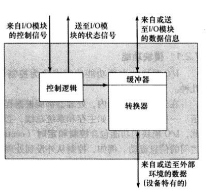
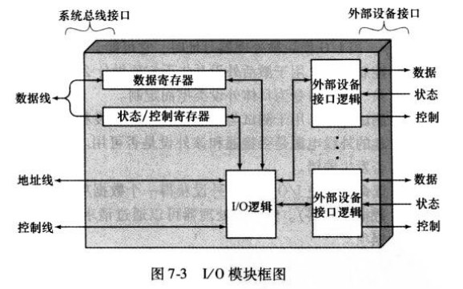
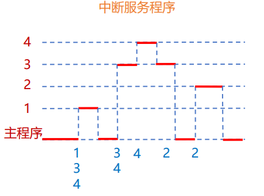

# 17-输入输出

## 外设 & I/O模块

### 外设

* 连接到输入输出模块的各种设备
* 提供外部环境/计算机系统之间的数据交换
* 不能将外设直接论连接系统总线
  * 外设种类繁多，操作方法多种多样
  * 外设数据传输速度与存储器、处理器不匹配
  * 外设使用的数据格式和字长与处理器不同

#### 外设接口

<figure><figcaption>
外设接口示意图
</figcaption></figure>

* 外设接收来自I/O模块（见下文）的控制信号，发出状态信号
* 外设通过数据信号发送/接受信息
* 与设备相关的控制逻辑控制设备操作，响应I/O模块的命令
* 缓冲器用于缓存输入/输出模块和外设之间传送的数据

### I/O模块

* 通过系统总线或中央交换器和存储器连接
* 通过专用数据线与一个或多个外设连接

#### 功能

* 处理器通信
  * 命令译码：接受CPU发送到控制总线上的命令
  * 数据：经由数据总线和CPU交换I/O数据
  * 状态报告：向CPU报告I/O的状态
  * 地址识别：I/O模块必须知道外设的唯一地址
* I/O设备通信：命令、状态信息、数据
* 数据缓冲：解决速率不匹配问题
* 控制与定时：主存/总线资源共享
* 检错：报告给处理器，检查内容包括
  * 设备报告的机械/电路故障
  * 传输中数据位的变化

#### 结构

<figure><figcaption>
I/O模块的结构
</figcaption></figure>

#### 外部接口

* 串行：一根线传输数据，每次传输1位数据
* 并行：多根线传输，每次传输多位数据
* 并行接口的局限：多条线的传输存在误差，当传输速度和总线长度增加时，时钟频率受限，无法达到同时传送的精度
* FireWire：IEEE标准串行总线
* USB：Universal Serial Bus 通用串行总线

## I/O操作技术

### 编程式I/O

* 无中断，执行I/O操作时必须轮询，等待I/O操作完成
* I/O命令：为了执行I/O操作，指定具体I/O模块和外设地址，发送I/O命令
  * 控制命令
  * 测试命令
  * 读命令
  * 写命令
* I/O指令：与I/O命令一一映射，指令形式取决于编址方式
* 编址方式
  * 存储器映射式I/O：存储设备与I/O设备有统一的地址空间（只需单一的读/写线）
  * 分离式I/O：同一地址，指向的存储设备与I/O设备不同（需增加特定指令，以及输入/输出命令线做区分）

### 中断驱动式I/O

* CPU发送I/O指令后继续执行其他指令，当I/O模块完工后再中断CPU
* 不足：I/O传送速度受处理器限制，处理器每次传送都需执行很多指令

#### I/O模块的角度

1. I/O模块接受来自处理器的读命令
2. I/O模块从外设中读入数据
3. 数据进入I/O模块的数据寄存器后，I/O模块通过控制总线向CPU发送中断信号
4. I/O模块等待直到处理器请求该数据时为止
5. 当处理器有数据请求时，I/O模块将数据传送到数据总线上，准备另一个I/O操作

#### CPU的角度

1. CPU发送读命令
2. CPU离开去做其他事情，在指令周期结束检查中断
3. 当I/O模块的中断出现时，CPU保存当前程序的现场
4. CPU从I/O模块读取数据字，存入主存
5. CPU恢复刚才运行的程序现场，继续运行

#### 中断禁止/允许

* 在一些操作中间不允许中断，必须等待完成后才能中断

#### 响应优先级/处理优先级

* 响应优先级：多个任务同时出现，响应优先级最高的先响应
* 处理优先级：在处理中断过程中，高处理优先级的任务能打断低处理优先级的
* 掩码字：1为屏蔽，0为开放
* 目的
  * 响应优先级：确保高优先级任务先响应
  * 处理优先级：动态处理更紧急任务，防止高优先级任务被延迟

> 例 假设中断系统中有4个中断源，其响应优先级为L1>L2>L3>L4，处理优先级为L1>L4>L3>L2。如果在主程序执行时同时发生L1、L3和L4中断，并且在处理L3中断的过程中发生L2中断，写出掩码字和所有中断服务程序的过程。

<figure><figcaption>
中断服务顺序
</figcaption></figure>

| 掩码字 | L1 | L2 | L3 | L4 |
| --- | -- | -- | -- | -- |
| L1  | 1  | 1  | 1  | 1  |
| L2  | 0  | 1  | 0  | 0  |
| L3  | 0  | 1  | 1  | 0  |
| L4  | 0  | 1  | 1  | 1  |

#### 设备识别/分配优先级

| 方案    | 设备识别             | 分配优先级          |
| ----- | ---------------- | -------------- |
| 多条中断线 | 仍需采用下面三种方案来判断    | 处理器挑选优先级最高的中断线 |
| 软件轮询  | 软件轮询I/O模块确定中断模块  | 软件轮询次序决定优先级    |
| 菊花链   | 硬件轮询，类似于总线里面的菊花链 | 硬件链接次序决定优先级    |
| 向量式中断 | 特定的中断控制器解码/分析优先级 | 中断控制器决定        |

### DMA Direct Memory Access

* I/O模块与主存直接交换数据，无需处理器干涉
* 仍使用中断

#### 操作步骤

1. 处理器向DMA模块发送命令：读/写、I/O设备地址，内存起始位置，字数
2. 处理器继续执行其他工作
3. DMA逐字读/写数据进入存储器
4. DMA完成后向处理器发送中断信号

#### 解决CPU/DMA争用主存

* CPU停止法：DMA访存时向CPU发送信号，使CPU停止访问主存
  * 优点：控制简单
  * 缺点：影响CPU、没有充分利用内存
  * 适用：高速I/O设备的块传输
* 周期窃取：DMA单字传送，需传送时CPU让出1个周期，周期结束传送完立刻释放总线
  * 优点：充分利用CPU、内存，及时响应I/O
  * 缺点：DMA每次都请求总线
  * 适用：I/O周期大于储存周期
* 交替分时访问：每个周期分为两部分，前半部分给CPU，后半部分给DMA
  * 优点：CPU未停止/等待，DMA不请求总线
  * 缺点：CPU周期大于储存周期

#### 配置机制

* 单总线分离DMA：DMA使用编程式I/O，便宜低效
* 单总线集合的DMA-I/O
  * DMA是I/O模块的一部分，也可能是控制I/O模块的单独模块
  * 减少总线周期数
* I/O总线：使用I/O总线将I/O模块连接到DMA模块，共享DMA，易于拓展

#### 实例 硬盘存取

| 任务     | 方式    |
| ------ | ----- |
| 传递参数设置 | 查询方式  |
| 寻道     | 中断方式  |
| 查找扇区   | 中断方式  |
| 连续读写   | DMA方式 |
| 结束/校验  | 中断方式  |

## I/O模块的演变

1. CPU直接控制外设
2. 编程式I/O
3. DMA
4. I/O通道：I/O模块有自己的处理器，带有专门为I/O操作定制的指令集
5. I/O处理器：I/O模块有一个局部存储器，I/O模块成为一个自 治的计算机，常用于与交互式终端进行通信
