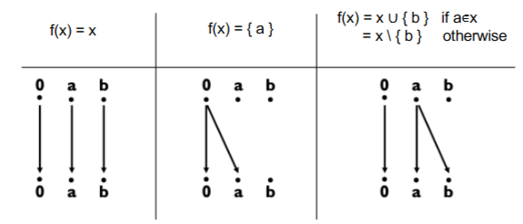

# 13-过程间分析

* 目的：分析虚函数、发现漏洞

## 基础知识

* 调用图
  * 节点：函数
  * 边：调用关系
  * 边标签：调用位置
* Context Sensitivity（上下文敏感性）：在分析函数（或方法）时，能够区分不同调用上下文（call context）对函数行为的影响。
  * 会根据调用路径的不同，为同一个函数构建不同的分析结果。
  * 相同的函数在不同调用上下文中可能表现不同
  * 示例：`foo(1)` 和 `foo(2)` —— 分析分别处理，而不是统一分析 `foo`。

### 上下文敏感的 DFA

#### 基于克隆的 DFA

* 针对每次调用，将函数进行克隆，使得克隆后的函数只有一次调用，只需分析一次调用上下文

#### 基于总结的 DFA

* Top-Down 分析：先分析调用者，再分析被调用者
  * 更明确
* Bottom-Up 分析：先分析被调用者，再分析调用者
  * 需要检查所有可能路径
  * 同一级别的分析可并行，不同级别的分析可流水线处理

## 用图可达性 Graph Reachability 分析 DFA

### 常量传播复习

* 合并函数
  * `UNDEF` ^ `CONST` = `CONST`
  * `CONST` ^ `NAC` = `NAC`
  * `CONST` ^ `CONST` = `CONST`
  * `CONST` ^ `CONST‘` = `NAC`
* 转移策略
  * Meet-Then-Transfer：对于表达式，先合并各个路径的结果，然后再进行转移
  * Transfer-Then-Meet：对于表达式，先进行计算，然后再合并各个路径的结果（可以传播两个路径上可能`x` `y` 的值不同，但是`x op y`的值相同的情况）

### 检测可能未定义的变量

* 只有两个状态：`DEF` `UNDEF`
* `x = y` 时，`m(x) = m(y)`
* `x = y op z` 时，只有当 `y` 和 `z` 都是 `DEF` 时，`x` 才是 `DEF`
* 合并函数
  * `UNDEF` ^ `DEF` = `UNDEF`
  * `DEF` ^ `DEF` = `DEF`

### Interprocedural Finite Distributive Subset（IFDS）分析

* 使用图可达性分析 DFA
* 对于所有变量的分析从`0`开始
* 如果变量的值没变，就从上面一层直接拉下来
* 如果变量被定义，就从`0`拉到变量
* 如果变量调用了某个外部方法，就断掉和上面一层的联系，将参数所在的节点连接方法，将方法的返回值拉下来
* 如果变量被其他值赋值，就从上面其他值的位置拉下来
* **所有能通往最初`0`节点的 Data Flow Fact 都为真**


<figure><figcaption><p>基础转移方法</p></figcaption></figure>

#### 分析变量未定义问题

* 如果一个节点到`0`节点是 CFL-Reachable 的，那么这个节点的变量是未定义的
* 将未赋值参数的函数调用/返回使用`[]`标识
* 将已赋值参数的函数调用/返回使用`()`标识
* CFL Reachable：节点到`0`的路径满足下面的文法

```plaintext
N → S N | ( N | [ N | 𝟄
S → S S | ( S ) | [ S ] | 𝟄
```

#### 优化

* Tabulation Algorithm：避免重复访问函数，直接将上一层的参数节点拉到下一层的返回值
* Demand-Driven Algorithm：只分析需要的函数调用，不分析所有函数调用
  * 预处理：O(1)，查询：O(n)
  * 传统的计算传递闭包：预处理 O(n^3)，查询 O(1)
  * 有无折中方案？索引
* 索引：检测节点间是否存在路径
  * 标签：`[low, high]`
  * `high`：后序节点
  * `low`：子树中的最小节点
  * $$A \to B \Rightarrow Label_b \subseteq Label_a$$（仅为单向，区间包含不一定可达）

### 基于 CFL 可达性的 Flow-Insensitive 的别名分析

* 查看两个变量是否有相同的值
* `a=b.c`：构建图$$b\overset{\rrbracket_c}{\to} a$$
* 如果两个变量之间的所有路径上的括号都能匹配，值就是一样的

## Fast CFL Reachability for Context-Sensitive Data Dependence Analysis

* 同级别依赖：函数内变量
* 跨级别依赖：跨函数变量
* 通过画图，使用以下的上下文无关文法匹配括号，找到变量间依赖（具体见 PPT）

```plaintext
S -> S S | (_1 S )_1 | ... | (_n S )_n | 𝟄
```

### CS-DDA

略，不考
