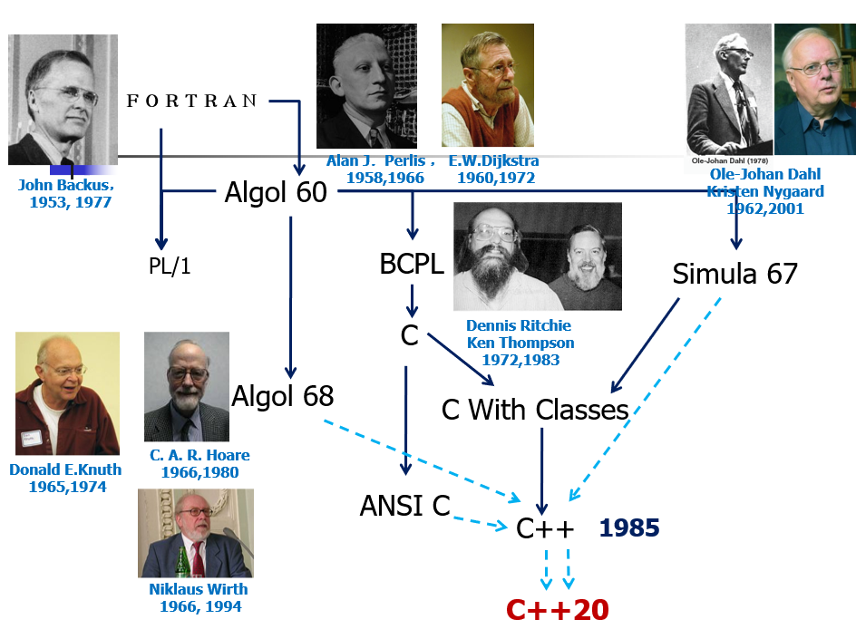

# 01-C++ 介绍 & 历史

## Why C++?

* 填补了编程领域的重要生态位：有效使用硬件 + 管理高复杂性的应用程序

### 零开销抽象 Zero-Overhead Abstraction

> 1. You don't pay for what you don't use.
> 2. What you do use is just as efficient as what you could reasonably write by hand.

* 没有使用的语言特性不会带来开销
* 编译器在编译期进行优化，运行时没有额外开销

## 编程范式

* 过程式编程 Procedural Programming
* 面向对象编程 Object-Oriented Programming
* 命令式编程 Imperative Programming
* 函数式编程 Functional Programming：Lisp, Scheme, Haskell, Erlang
* 逻辑编程 Logical Programming：Prolog
* 并发编程 Concurrent Programming
* 泛型编程 Generic Programming：通过类型参数化实现代码复用

## C++ 历史

### 三条脉络

<figure><figcaption>
C++ 历史
</figcaption></figure>

* 结构化编程：Algol 68
* 系统化编程：BCPL, C
* 面向对象编程：Simula 67
* 愿望：带有 Simula 类的 Algol68 以 C 为基础实现

### 涉及到的语言

* Simula I
  * 基于 ALGOL 60
  * 用于系统仿真
  * 实现垃圾回收
* Simula 67：面向对象编程语言
  * 基于 Simula I
  * 提出了类、对象、虚函数等机制
  * 性能差：运行时类型检查、垃圾回收
* BCPL：用于系统编程的语言
  * 特点：无类型系统、可直接操纵内存、语法简单、可移植
  * 优点：高效，接近汇编性能
  * 缺点：代码可读性差、Debug 困难
  * 后继：B 语言、C 语言
* C with Classes
  * 1979 年，Bjarne Stroustrup 在贝尔实验室
  * 结合 Simula 的面向对象特性与 C 的高效性

### C vs C++

* 超集，兼容 C
* C++ 支持 C 所支持的全部编程技巧
* 任何 C 程序都能被 C++ 用基本相同的方法编写，并具备同等开销

### 工具

* Cpre / cPP：将 C with Classes 代码预处理为 C 代码：可利用既有 C 编译器和链接器编译
* Cfront：C++ 编译器前端
  * 解析 `*.cpp` 文件，语义分析
  * 生成标准的 C 代码
* cc：C 语言编译器
* Linker：链接编译后的编译单元
  * 核心思想：连接兼容性重于代码兼容性，代码所用语言、版本可不同，在二进制层面的规则一致即可正常协作
