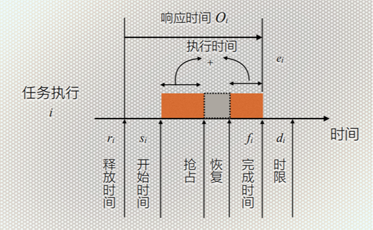
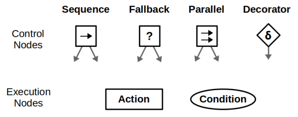
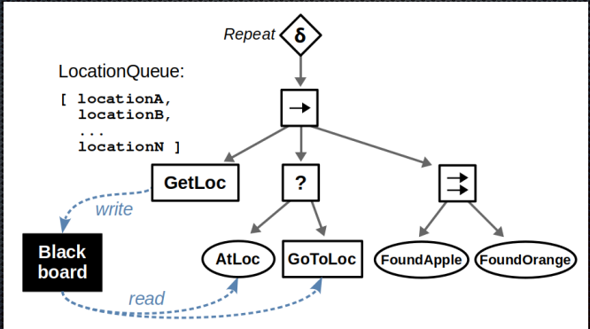

# 2025-复习提纲


本页面的笔记基于2025/12的重点撰写，仅供参考。

每年期末重点大概率有变化，应以复习时的实际情况为准。


## 嵌入式系统概述 01

### 术语演化

* **泛在计算** Ubiquitous Computing：任何时间、地点的计算
* **不可见计算机** Invisible Computer：计算机集成入物件中
* **普适计算** Pervasive Computing：计算无处不在，计算设备对日常生活的渗透
* **环境智能** Ambient Intelligence：智能环境

### 嵌入式系统

* 定义
  * 以应用为中心
  * 以计算机技术为基础
  * 软硬件可裁减
  * 适用于应用系统对功能、可靠性、成本、体积、功耗有严格要求的专用计算机系统
* 组成：应用软件 + 中间件 + 运行/实时内核 + 驱动 + 系统硬件
* 特征
  * 形式多样、面向特定应用
  * 高度制约的环境
  * 与外部环境交互
  * 实时性、安全性、可靠性
  * 关注成本
  * 并发性
* 分类
  * 嵌入式处理器位数
  * 速度
    * **强实时系统**：响应时间在**毫秒/微秒级**
    * **一般实时系统**：响应时间在**几秒级**
    * **弱实时系统**：响应时间为**数十秒或更长**，随系统负载的轻重而变化
  * 确定性
    * **硬实时**：对响应时间**严格要求**，若无法满足会引发系统崩溃/致命错误
    * **软实时**：对响应时间**有一定要求**，若无法满足不会引发系统崩溃/致命错误
  * 复杂程度：循环轮询系统、有限状态机系统、前后台系统、单处理器多任务系统、多处理器多任务系统
* 应用：移动互联网、可穿戴设备、智慧交通、智能安防……
* 发展趋势：嵌入式人工智能、嵌入式系统安全、互联

## 存储器架构 03 【考一道题】

### 复杂性

* **组合各种存储技术**，**层次架构**
* **地址空间被分解成若干子空间**来提供不同类型的存储器访问

### 存储器层次架构

* 寄存器
* Cache、TLB、SPM
* 主存
* 闪存、硬盘、云

### 存储器访问时间难以预测

* 不同层次的存储器访问时间不同
* 地址转换时可能产生 TLB Miss 等，导致时间难以预测

## 嵌入式软件系统 05

### 嵌入式软件与桌面软件的对比

* **内存有限**
* **CPU 处理能力**：保守设计
* **OS**：Windows、Linux、RTOS、专有OS或裸机
* **实时性**：运行的可预测性，对 OS 的选择和程序设计都有影响
* **开发流程**：嵌入式环境资源不足以用来开发，**交叉开发**
* **执行流程**：程序从嵌入式设备开机就开始运行，到关机才停止
* 每一个**嵌入式设备**都是不同的
* 嵌入式软件**开发工具**有显著的不同
  * 交叉编译器
  * 包含汇编代码
  * 内存映射复杂：对精确性要求严格，对链接器要求高
  * 嵌入式调试器并不是一个单一的组件，而是一系列对应不同运行环境的工具
  * 其他⼯具：分析实时性能、设备功耗的**分析器**
* **软件组件**
  * 嵌入式编译器提供的**库**应当适合嵌入式环境
  * 与**硬件交互**
  * **网络支持**：符合互联标准
  * **有组织的数据存储**：应对电源故障和多线程
  * **LCD**：图像和用户界面支持

### 嵌入式软件架构模式

* **非结构化单体架构**：模块间为图结构
* **分层架构**：逻辑划分为若干层，仅通过定义良好的抽象层交互
* **事件驱动架构**：利用中断响应事件，事件 -> 消息处理器 -> 唤醒系统
* **微服务架构**：将应用程序构建为为业务领域开发的小型自治服务的集合

### 实时嵌入式软件常用的设计模式

* **单核**
  * **轮询**：简单，效率低
  * **有限状态机**：类似于轮询，但是每个状态决定下一状态
  * **中断处理**：抖动最小化
  * **DMA**：无需 CPU 参与即可传输数据
* **RTOS**
  * **资源同步**：决定了对共享资源的访问是否安全（“谁能用”）
  * **活动同步**：决定执行是否已达到特定状态（“何时用”）
* **发布和订阅模型**：松耦合，发布者和订阅者不直接通信
* **低功耗设计模式**：设备处于低功耗状态，发生唤醒事件后再打开
* **多核**

### 数据获取/存储相关的中断设计模式

* **线性数据存储**：中断服务程序可以直接访问的共享内存位置，存在竞态条件问题，需用互斥锁保护
* **乒乓缓冲/双缓冲**：两个缓冲区交替使用，缓解竞态条件问题
* **循环缓冲**
* **带有通知的循环缓冲区**：使用信号量/事件标志通知数据可用
* **消息队列**：类似于使用带有信号量的线性缓冲区

## 嵌入式操作系统 06 +

### RTOS、IOT OS

* 实时系统：计算的正确性不仅取决于程序的逻辑正确性，也取决于**结果产生的时间**，如果系统的时间约束条件得不到满足，将会发生系统出错
* 实时操作系统：支持**构建实时系统**的操作系统
* 术语
  * 确定性：系统始终会**为同一已知输入产生相同输出**
  * 非确定性系统：输出随机变化
  * 截止时限 Deadline：必须在该时间点之前完成某项任务

#### RTOS and GPOS 相似/不同

* 相似
  * 多任务级别
  * 软件和硬件资源管理
  * 为应用提供基本的OS服务
  * API 接口抽象
* 不同
  * 更**快**的特性
  * 满足应用需要的**剪裁能力**
  * **减少内存需求**
  * 为实时嵌入式系统提供**可剪裁的调度策略**
  * 嵌入式应用上下文中具有更好的**可靠性**
  * 支持**无盘化**嵌入式系统，允许从ROM或RAM上引导和运行
  * 对不同硬件平台具有更好的**可移植性**

#### RTOS 关键要求

* 操作系统的**时间行为必须是可预测的**：调度策略确定性、禁止中断的时间尽可能短
* 操作系统必须**管理线程和进程的调度**
* 一些系统要求操作**系统管理时间**
* 操作系统必须是**快速**的
* **可靠性**
* **简洁紧凑**

#### 为何使用 RTOS

* **可被复用**的标准软件组件
* **灵活性**
* **响应时间**

#### RTOS 类别

* **快速专有内核**
* **对于标准操作系统的实时扩展**
  * 单内核：在 OS 内核中**修改内核调度**
  * 双内核：**在硬件上运行实时内核**，标准 OS 作为低优先级任务运行
  * 优点
    * 可配备标准操作系统的 API：GUI、文件系统等
    * 标准 OS 的增强功能也可很快速地应用在嵌入式领域
    * 非实时进程不会影响实时进程
  * 缺点：驱动冲突、实时进程不能使用标准OS的服务

#### RTOS 内核系统服务

* 任务管理
* 同步与通信
* 内存管理
* 时间管理
* IO管理
* 异常与中断管理

#### 物联网操作系统

* 要求
  * 内存占用小
  * 支持异构硬件
  * 网络连接
  * 节能
  * 实时功能
  * 安全
* 通用架构
  * 应用层
  * 系统层：库、设备驱动、低功耗网络栈、系统内核
  * 硬件抽象层
  * 硬件层
* 非技术属性
  * 开放的标准
  * 认证
  * 文档
  * 代码成熟度
  * 代码许可
  * 操作系统提供商
* 分类
  * 事件驱动的操作系统
  * 多线程操作系统
  * 纯 RTOS

### 实时调度

#### 任务模型

* 定义：调度程序做出的关于任务的假设
  * 假设调度开始之前**知道所有要执行的任务**
  * 支持**任务的到达**
  * 支持任务**反复执行**
  * 任务是**突发性的**：重复出现但时间不规律，任务的两次执行时间间隔有一个下限
  * 优先序约束
  * 任务执行可以有一些先决条件才开始或恢复执行：得到互斥锁

#### 与任务执行相关的时间

<figure><figcaption></figcaption></figure>

* 释放时间 $$r_i$$：任务**变为就绪**的时间点
* 开始时间 $$s_i$$：任务**首次开始执行**的时间点
* 完成时间 $$f_i$$：任务**完成执行**的时间点
* 时限 $$d_i$$：任务**必须完成**的时间点
* 响应时间 $$O_i = f_i - r_i$$，任务**从释放到完成**的时间
* 执行时间 $$C_i = \sum{执行片段}$$，任务不被阻塞不被抢占的**纯执行时间**

#### 时限约束

* **硬截止时限**：进程没在截止时限前完成则系统失败，对应硬实时调度
* **软截止时限**：进程没在截止时限前完成也不算错误，对应软实时调度

#### 调度程序的度量

* **可行调度**：所有任务执行都符合他们的时限
* **利用率**：CPU 用于执行任务时间的百分比
* **调度开销**：制定调度决策所需的时间
* **延迟**：$$\max(f_i - d_i)$$，可行调度时延迟 $$\leq 0$$
* **总完成时间**：$$\max(f_i) - \min(r_i)$$

### RMS、EDF 及改进 【必考】 +

#### RMS

* 周期 $$T_i$$：相邻两次任务释放（出现）的时间间隔
* 执行时间 $$C_i$$：单次任务执行所需的 CPU 时间
* 固定优先级，**周期短**的任务优先级高
* 静态调度算法，适用于周期性任务
* 可调度上界 $$U(n) = n(2^{1/n} - 1)$$
  * $$n$$ 为任务数
  * 当 $$n \to \infty$$ 时，$$U(n) \to \ln 2 \approx 0.693$$
* 当 $$\sum{C_i / T_i} \leq U(n)$$ 时，任务集可调度，超过后无法保证可调度性（但可能可调度）

#### EDF

* 动态优先级，**截止时限近**的任务优先级高（通常将截止时限设为周期结束）
* 当且仅当 $$\sum{C_i / T_i} \leq 1$$ 时，任务集可调度：**单处理器上最优的调度算法**

#### 改进版 EDF

* 任务间存在依赖关系（有向无环图）时，EDF 可能不可行
* **修改释放时间**：$$r^`_j = \max(r_j, r_i + C_i)$$，其中 $$i$$ 是 $$j$$ 的前驱任务
* **修改截止时限**：$$d^`_i = \min(d_i, \min(d_j - C_j))$$，其中 $$j$$ 是 $$i$$ 的后继任务

## 同步 通信 存储管理 07

### 动态内存管理缺陷

* **不确定性**：每次调用时间开销不同
* **内存碎片**
* **线程不安全**
* 在小型嵌入式系统中**效率低/不可用**
* 实现较大，**占用代码空间**
* 使**链接器配置复杂**

### 内存管理方法

* **静态内存分配**：编译时为任务和内核对象（队列、信号量）分配内存
  * 可靠，但使用效率低，需考虑内存上限
* **动态内存分配**：提供分配内存函数，运行时请求/释放内存
  * 灵活，但可能导致内存泄漏/碎片化
* **内存池**：预先分配一块内存，划分为多个固定大小的块，减少碎片化

### 内存管理实例

#### µC/OS II

* **实模式存储管理**：不划分内核/用户空间
* **固定分区存储管理**
  * 将内存划分为分区，分区内划分为大小相同的内存块，各个分区之间的内存块大小可以不同
  * 用户从不同内存分区中请求不同大小的内存块，释放时放回对应分区
  * 优点：减少碎片化

#### FreeRTOS

* 将内存分配保留在可移植层，提供不同的内存分配实现，应用程序可按需选择
  * `heap_1`：不允许释放内存
  * `heap_2`：允许释放内存，但不合并相邻的空闲块
  * `heap_3`：直接使用标准库的 `malloc()` 和 `free()`
  * `heap_4`：合并相邻的空闲块，避免碎片化
  * `heap_5`：支持多个不连续的内存区域
* 调用 `pvPortMalloc()` 分配内存，调用 `vPortFree()` 释放内存

## 建模 08

### 模型具备的特征

* 简单
* 经得起理论检验
* 提供逻辑推理能力
* 可执行
* 可综合
* 能够适应不同的任务
* 描述不存在歧义，易于理解易于修改
* 高表现力

### 建模语言

* 有明确的定义和标准语法，用于表示结构和功能参与者及其随时间变化的主要关系
* 形式
  * 图形、文本
  * 面向文档、仿真或执行
  * 专注于体系架构层面内容、实现层面内容

### 建模实例（反馈控制、开环/闭环控制、PID 算法）

* 反馈控制：**用输出修正输入**
  * 将系统的输出信息返送到输入端，与输入信息进行比较，并利用二者的偏差进行控制的过程
  * 正反馈：输出**增强**输入信息
  * 负反馈：输出**抵消**输入信息，使系统稳定
* 开环控制：**无反馈系统**，输入信号不受输出影响
  * 场景：系统稳定，外界干扰少（自动售货机、洗衣机）
  * 缺点：精度低，无法纠偏
* 闭环控制：**有反馈系统**，输入信号受输出影响
  * 优点：精确、自适应调节、稳定性高
  * 场景：什么都有
* PID 算法：按偏差的**比例、积分、微分**来调节控制量
  * 比例环节 P：偏差越大，控制量越大
  * 积分环节 I：消除长期偏差
  * 微分环节 D：预测未来偏差
  * 连续系统：$$u(t) = K_p e(t) + K_i \int_0^t e(\tau)d\tau + K_d \frac{de(t)}{dt}$$
  * 离散系统
    * 位置式：$$u[k] = K_p e[k] + K_i T \sum_{i=0}^{k} e[i] + K_d \frac{e[k] - e[k-1]}{T}$$
    * 增量式：$$u[k] = u[k-1] + K_p (e[k] - e[k-1]) + K_i T e[k] + K_d \frac{e[k] - 2e[k-1] + e[k-2]}{T}$$
  * 其中 $$K_p, K_i, K_d$$ 可调节
  * $$e(t)$$：偏差，设定值与测量值之差
  * $$u(t)$$：控制量

## FSM 09 +

### 反应式系统

* 定义：能够持续**与环境进行交互**并**及时的进行响应**
* 特征：**事件驱动**，当系统接收到一个外部事件时，需要对事件进行处理，然后产生响应

### FSM【必考】

* 定义：表示有限个状态以及在这些状态之间的转移和动作等行为的数学计算模型
* Moore 机：输出**完全由当前状态决定**，与输入信号的当前值无关，状态数量更多
* Mealy 机：输出**既依赖于当前状态，也与输入信号的当前值有关**，实现简洁，即时对输入产生输出
* DFA：下一个状态/输出唯一确定
* NFA：下一个状态或输出有多个值
* 层次 FSM：由多个层次嵌套中的有限状态机组成的状态机（状态内部也可能是一个状态机，下略，同章节其他内容明确要考，感觉 HFSM 不会考）

### 行为树【必考】

* 定义：由节点和连接线构成的层级树状图来展示控制流程和系统操作
* 优点：灵活、模块化
* 缺点：复杂、性能开销

#### 节点

<figure><figcaption></figcaption></figure>

* 控制节点
  * 顺序节点：依次执行子节点，直到**一个失败或全部成功**
  * 选择节点：依次执行子节点，直到**一个成功或全部失败**
  * 并行节点：同时执行所有子节点，当**成功的子节点数量达到阈值**时返回成功
  * 装饰节点：修改子节点的行为
* 叶节点
  * 动作节点：执行具体任务
  * 条件节点：检查条件是否满足，返回成功或失败

<figure><figcaption></figcaption></figure>

## IOT 11

### 概述

* 物联网 Internet of Things：通过红外感应、全球定位系统等技术，按照规定的协议，**把任何物品与互联网相连，进行信息交换和通信**，以实现智能化识别、定位、跟踪、监控和管理的一种网络概念
* 设备：具有强制性**通信能力**和选择性**传感、激励、数据捕获、数据存储和数据处理能力**的设备
* 物：物理世界（物理装置）或信息世界（虚拟事物）中的**对象，可以被标识并整合入通信网**
* 优势：技术优化、改进的数据采集、减少浪费、提高客户参与度
* 劣势：安全、隐私、灵活性、复杂性、合规性
* 应用：智能家居、可穿戴设备、智慧城市……
* 特征
  * **智能**：从生成的数据中提取知识
  * **架构**：一个支持许多其他架构的混合架构
  * **复杂的系统**：一组动态变化的对象
  * **规模**：可伸缩性
  * **时间**：数十亿并行和同时发生的事件
  * **空间**：定位
  * **一切都是服务**：将资源作为服务消费

### IoT 技术

* 物联网体系结构
  * **应用层**：消费物联网、产业物联网
  * **平台层**：云服务
  * **传输层**：广域网、LPWAN、局域网
  * **感知层**：传感器、RFID、定位、雷达
* IoT 多样化的技术环境：硬件、IDE、通信、IoT 协议、网络骨干网、软件、云平台、机器学习算法和软件
* IOT 平台：一种多层技术，能够在物联网领域中直接提供、管理和自动化连接设备；提供了一套随时可用的功能；加快开发，兼顾可扩展性和跨设备兼容性
  * 作为中间件：充当硬件层和应用层之间的中介

### 设备管理

* 帮助对所有连接的设备，在全球化范围内**进行规模化的远程管理**
* 主要功能：生命周期、设备分组、设备影子、物模型、数据解析、数据存储、在线调试、固件升级、远程配置、实时监控
* 物模型：是**设备在云端功能的描述**，包括设备属性、数据、服务和事件
* 设备影子：**缓存设备状态**，设备离线后，重新上线可以主动拉取云端指令

### 数字孪生

* 定义：充分利用物理模型、传感器更新、运行历史等数据，集成多学科、多物理量、多尺度、多概率的仿真过程，在虚拟空间中完成映射，从而反映相对应的实体装备的全生命周期过程
* 价值：可见性、预测性、假设分析、对行为进行理解和解释的记录与沟通机制、连接不同系统
* 和仿真的异同：仿真仅可以离线模拟物理世界，不具备分析优化功能，不具备实时性、闭环性
* 和信息物理系统（CPS）的异同
  * 两者都是通过数字手段构建系统为现实服务
  * CPS 属于系统实现，数字孪生侧重模型构建
  * 数字孪生是 CPS 的技术基础，是具体的物化体现

### 边缘计算 +

#### 基于云的 IOT 解决方案不足

1. 大规模边缘设备对**计算能力有挑战**
2. 数据需要在用户设备与云数据中心传输，长距离传输会**导致高网络延迟**
3. 终端用户设备资源有限，将任务分摊到网络边缘有益于**高效利用资源**
4. 数据**安全性和隐私保护**面临挑战

#### 边缘计算

* 定义：一种将主要处理和数据存储**放在网络的边缘节点**的分布式计算形式
* 云/边比较
  * 位置分布在不同的地理位置
  * 低成本，低延迟，低能耗
  * 容量：小规模的雾节点形成大系统
  * 资源与服务的临近性：靠近用户、处于网络边缘
  * 应用：支持大多数应用程序
* 优势：减少带宽、减少延时、改善隐私，安全性

#### 设备端学习

* 定义：在**部署硬件设备上**本地自适应或训练机器学习模型，无需持续依赖 中心服务器
* 动因
  * 集中式机器学习在本地数据动态、隐私或高度个性化的现代应用中已显局限
  * 设备端学习反映了对**响应性、个性化和隐私保护**的现实需求
* 优势：个性化、低延时、保护隐私、降低通信和后端压力

## BSP Bootloader 12

* BSP：Board Support Package，嵌入式系统中连接硬件平台和操作系统的关键软件层
  * **启动代码**
  * **硬件抽象层**（HAL）：隐藏硬件的具体实现细节，提供统一的接口
  * **驱动程序**：直接与硬件设备交互的软件组件
* 职责：提供对特定硬件平台的支持，确保操作系统能够正确识别和使用硬件功能，使操作系统能够在该平台上运行
* 引导：将操作系统装入内存，并开始执行
* 引导模式
  * 不需要 BootLoader 的模式：系统**直接在闪存 / ROM 上运行**，启动效率高，运行速度低
  * 需要 BootLoader 的模式：通过 BootLoader **加载到 RAM**，启动速度慢，运行速度快
