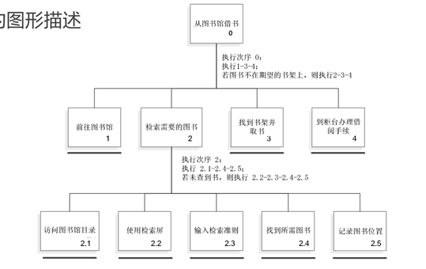

# 04-设计-交互需求

## 需求

* 关于目标产品的一种陈述，它指定了产品应做什么，或者应如何工作
* 具体、明确、无歧义

### 需求活动

* 搜集数据
* 解释数据
* 提取需求

## 用户是不同的

* 每个人都有共性和个性
* 交互人员应意识到个性差异

### 体验水平差异

* 新手用户 -> 中间（熟练）用户 -> 专家用户
* 市场人员：要求适合新手的交互
* 程序员：创造适合专家的界面
* 中间用户被忽略
* 目标
  * 让新手快速成为中间用户
  * 避免为想成为专家的用户设置障碍
  * 让中间用户感到愉快

#### 新手用户

* 特点：敏感，容易有挫折感
* 要求
  * 不能将新手状态视为目标
  * 让学习过程快速且富有针对性
  * 确保程序充分反映用户关于任务的心智模型
  * 无论什么样的帮助，都不应该在界面中固定
  * 使用具有向导功能的对话框作为帮助
  * 不要使用在线帮助
  * 菜单项应该是解释性的

#### 中间用户

* 特点
  * 需要工具
  * 知道如何使用参考资料
  * 能否区分经常使用和很少使用的功能
  * 高级功能的存在让永久的中间用户放心
* 设计要求
  * 工具提示（Tooltip）
  * 在线帮助
  * 常用功能放在用户界面的前端和中心
  * 提供一些额外的高级特性

#### 专家用户

* 特点
  * 对缺少经验的用户有异乎寻常的影响：“专家”
  * 欣赏更新更强大的功能
  * 不会受到复杂性增加的干扰
* 要求：能快速访问经常使用的功能

### 年龄差异

* 老年人
  * 技术提供对残缺部位的支持
  * 设计：清楚、简单、容许出错
  * 利用冗余支持信息访问
* 儿童
  * 增加参与感
  * 允许多种输入方式：触觉、手写
  * 文本、图片、声音

### 文化差异

* 符号含义不同
* 姿势理解存在差别
* 颜色含义不同

### 健康差异

* 视觉损伤、听觉损伤、身体损伤、语音损伤、诵读困难

## 产品是不同的

* 功能不同
* 物理（硬件）条件不同
* 使用环境不同：物理环境、社会环境、组织环境、技术环境

## 人物角色 Persona

* 基于观察到的真实人的行为和动机
* 在统计到的实际用户的行为数据的基础上形成的综合原型
* 在整个设计过程中代表真实的人

### 作用

* 解决三个设计问题
  * 弹性用户：缺乏明确的用户，难以界定用户需求
  * 自参考设计：设计者/程序员以自己为用户，按自身喜好设计系统
  * 边缘情况设计：被 corner case 主导设计，偏离主要需求

### 构造

* 谁将使用系统？
* 这些用户属于哪些类型的人群？
* 是什么因素决定他们将怎样使用系统？
* 他们与软件的关系有什么特征？
* 他们通常需要软件提供什么支持？
* 他们对软件会有怎样的行为？他们对软件的行为有什么期望？

### 示例

#### 设计任务

* 目标：设计一款运行在笔记本电脑上的演示程序包
* 主要使用者：
  * 公司销售部的一位同事
  * 公司的销售代表
* 使用需求：
  * 能快捷、方便地创建标准格式的简单幻灯片
  * 支持带有项目符号的文字内容或简单图表
  * 图形素材依靠软件提供的标准图形库

#### 人物角色（Persona）

* 名称：日常最低要求演示者
* 基本特征：
  * 经常使用该演示软件
  * 关注操作的快速性与方便性
  * 偏好简单、直接的使用方式
* 核心需求：
  * 简洁、标准的演示格式
  * 常用内容类型包括：
    * 项目符号列表
    * 条形图、饼图等常见图表
    * 标准图形库中的基础图形

## 需求获取

### 观察

* 直接观察：陪同被观察者工作，**可能影响被观察者的日常活动**
  * 提问：这是你通常完成任务的方式吗？
* 间接观察：用视频/录音，观察者更舒适

### 场景

* **非正式**的**叙述性**描述
* 形式：讲故事、小品、在给定环境下按照时间顺序的情节
* 从场景中发掘用户需求

### 人物角色 + 场景剧本 = 需求

1. 创建问题和前景综述
   * 问题综述：目前存在的问题，反映需要改变的情况
   * 前景综述：问题综述的倒置，描述问题解决后的理想状态
2. 头脑风暴
3. 确定人物角色的期望
   * 界面表现模型和用户心理模型匹配
   * 确定
     * 影响人物角色愿望的态度、经历、渴望，以及其他社会、文化、环境和认知因素
     * 人物角色在使用产品体验方面可能有的一般期待和愿望
     * 人物角色认为什么是数据的基本单元或者元素
4. 构造情景场景剧本
   * 关注人物角色的活动、心理模型、动机
   * 集中于产品如何最好的帮助人物角色达到目标
   * 描述用户的行动，忽略细节
5. 确定需求
   * 数据需求
   * 功能需求
   * 其他需求

### 原型

* 和真正产品较为接近，以便人们不断评估改进设计的模型

#### 概念模型 & 心智模型

* 概念模型：设计者对系统的抽象表示（文件夹，回收站）
  * 基于对象的概念模型：“隐喻”，类比现实物理世界
* 心智模型：用户对世界的理解，受到已有知识、思维定势的局限
* 理想状态：概念模型与心智模型一致

#### 重要性

* 评估和反馈是交互设计的核心
* 用户往往不能准确描述自己的需要，但在看到或尝试某些事物后，就能立即知道自己不需要什么
* 与文档相比，涉众能够更容易地看到、持有和与原型进行交互
* 团队成员能够有效沟通
* 原型回答问题，并支持设计师在备选方案中进行选择

#### 分类

* 低保真原型：草图、故事板（结合场景）、模型
  * 简单，快速、便宜、易于修改
  * “绿野仙踪”法：设计人员假装成系统，响应用户和系统的交互
* 高保真原型：和最初产品较为接近
  * 难以修改
  * 风险：用户会认为原型就是系统，开发人员可能认为已找到了一个用户满意的设计

## 需求分析

### 人物分析

* 记录人们如何完成任务
* 基于**现有**情形
* 分析基本原理，了解人们想要达到什么目标，如何达到这些目标，并由此建立需求

### 层次化任务分析

* 把任务逐层分解为子任务
  * 分解中止点
    * 包含复杂机械响应：移动鼠标
    * 涉及内部认知性决断：选择菜单项
* 组织成执行次序
* 用途
  * 手册/教学
  * 需求获取、系统设计
  * 详细接口设计：菜单设计

```plaintext
1. 借书
  1. 前往图书馆
  2. 检索需要的图书
    2.1 访问图书馆目录
    2.2 使用检索屏
    2.3 输入检索准则
    2.4 找出需要的图书
    2.5 记录图书位置
  3. 找到书架并取书
  4. 到柜台办理借阅手续

执行次序0：执行1-3-4；若图书不在期望的书架上，则执行2-3-4。
执行次序2：执行2.1-2.4-2.5；若未查到此书，则执行2.2-2.3-2.4-2.5
```

#### 方框 - 线条图示

<figure><figcaption><p>方框 - 线条图示</p></figcaption></figure>
