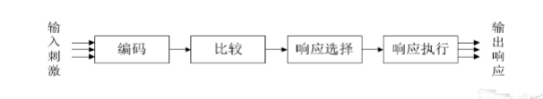
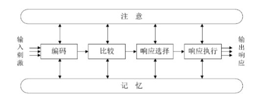
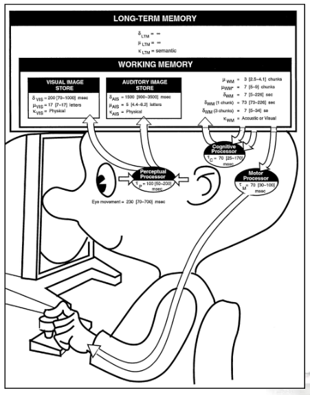

# 10-人机交互基础知识

## 人的认知

### 信息处理模型 & 扩展的信息处理模型

* 作用：研究人对外界信息的接收、存储、集成、检索和使用
  * 预测人执行特定任务的效率
  * 推算人感知响应刺激的反应时间
  * 信息过载会出现怎样的瓶颈现象
* 拓展的信息模型：增加注意、记忆，在信息处理的各个阶段交互

<figure><figcaption>
信息处理模型
</figcaption></figure>

<figure><figcaption>
扩展的信息处理模型
</figcaption></figure>

### 人类处理机模型

<figure><figcaption>
人类处理机模型
</figcaption></figure>

* 两个记忆模块
  * 工作记忆：处理当前任务的信息，含声音存储区域、视觉存储区域
  * 长时记忆：存储过去的经验和知识
* 三个交互式组件
  * 感知处理器：接受外界信息，存储到声音存储和视觉存储区域
  * 认知处理器：处理工作记忆和长时记忆中的信息，存入工作记忆
  * 动作处理器：基于工作记忆中的信息，产生动作
* 存在的问题
  * 把认知过程描述为处理步骤
  * 仅关注单个人和单个任务的执行过程，忽略人与人、任务与任务之间的互动
  * 忽视环境和其他人可能带来的影响

## 认知心理学

* 关注人的高级心理过程：记忆、思维、语言、感知和问题解决能力等
* 对 HCI 的贡献：理解人机交互过程，预测用户行为

### 格式塔（Gestalt）心理学

* 完形心理学
* 研究人类如何整体性地感知和理解世界
* 整体论：整体不等于部分之和
* 用户在感知事物的时候总是尽可能将其视为一个“好”的型式
  * 先感知整体结构，再感知局部细节

#### 主要原则

| 原则       | 说明                        | 在设计中的应用                    |
| -------- | ------------------------- | -------------------------- |
| 相近性原则    | 空间上靠近的物体容易被视为整体           | 按相关性对组件分组，组内靠近，组间分开        |
| 相似性原则    | 相似的物体容易被视为整体              | 功能相近的组件使用相同或相近的表现形式        |
| 连续性原则    | 共线或相同方向的物体会被组合在一起         | 对齐组件                       |
| 对称性原则    | 相互对称且能够组合为有意义单元的物体会被组合在一起 | 利用对称性进行分组                  |
| 完整和闭合性原则 | 忽视轮廓的间隙，将事物视作整体           | 使用空白帮助分组；遮住组件的部分以表明页面外还有内容 |

#### 前景 & 背景

* 前景：关注的对象
* 背景：前景之外的其他部分
* 前景和背景在某些情况下可以互换
* 通过设置明暗/模糊度差异来区分前景和背景

## 人脑中的记忆结构

* 感觉记忆：瞬时记忆，持续约1秒
  * 把相继出现的一组图片组合成一个连续的图像序列，产生动态的影像信息
* 短时记忆：工作记忆，约保持30秒
  * 感觉记忆编码后形成
  * 储存当前使用的信息，是信息加工系统的核心
  * 信息容量约为7±2个信息单元
  * **计算机内存**
* 长时记忆
  * 短时记忆进一步加工变成长时记忆
  * 只有**与长时记忆区的信息具有联系的新信息**才能够进入长时记忆
  * 容量几乎无限
  * 遗忘：无法从长时记忆中提取信息，但不代表信息丢失
* 三个阶段之间可以进行信息交换
* 利用长时记忆：使用线索引导用户完成任务

### 7±2理论

* 短时记忆的信息容量约为7±2个信息单元
* 菜单上最多只能有7个选项，工具栏上只能显示7个图标

## 界面类型

* 基于命令的界面
* 图形界面
  * WIMP：Windows、Icons、Menus、Pointing
  * GUI：Graphical User Interface
  * GUI 的演化：更少的记忆、更多的识别、更少的键盘和点击、更不易出错、以及更可视的上下文
* 多媒体界面：组合图片、文字、视频、声音、动画，并与各种形式的交互连接
* 虚拟现实/增强现实
* 信息可视化/仪表盘
* 笔式交互，触摸交互
* 手势界面
* 实物界面
* 可穿戴计算
* 脑机界面
