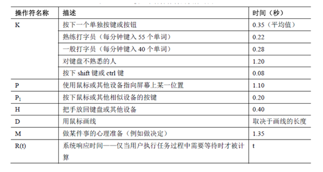

# 11-设计-交互设计模型

* 设计学科通常借助模型生成新的想法并对其测试

## 预测模型

* 在**无需实际用户测试**的情况下，预测用户的执行情况
* 适用场景：无法进行用户测试

## GOMS模型

* 关于人类如何**执行认知—动作型任务**以及如何**与系统交互**的理论模型
* **分而治之**：将任务分解为子任务，进行多层次细化
* 将所有操作用时相加，预测完成任务所需的总时间

### GOMS全称

* Goal 目标：用户要达到的目的
* Operators 操作：为达到目标而使用的认知过程和物理行为
  * **不能分解**的底层行为（如点击鼠标）
* Methods 方法：如何完成目标的过程
  * 对应目标的子目标序列和所需操作：`[移动鼠标，输入关键字，点击Go按钮]`
* Selection 选择规则：当有多种方法时选择哪种方法
  * GOMS 认为方法的选择不是随机的

## KLM 击键层次模型

* GOMS 的简化版本
* 对用户**执行任务的时间**进行量化预测

<figure><figcaption>
KLM 中的常用操作符
</figcaption></figure>

### 放置M操作符的启发规则

1. 在每一步需要访问长时记忆区的操作前放置 M
2. 在所有 K 和 P 之前放置 M：K -> MK; P -> MP
3. 删除键入单词或字符串之间的 M（连续的 K 只需一个 M）：MKMKMK -> MKKK
4. 删除复合操作之间的 M（连续的 P/P1 只需一个 M）：MPMP1 -> MPP1

### 例题

* DOS 环境下，执行 `ipconfig` 命令：M 9K\[ipconfig Enter] = 1.35 + 9 \* 0.28 = 3.87 秒
* 菜单选择修复网络：H\[鼠标]MP\[网络连接图标] P1\[右键]P\[修复] P1\[左键]
* 替换文本编辑器中长度为 5 个字符的单词：H M P P1 P P1 H M 5K
* 无标答，操作序列合理，且用时与操作序列一致即可

## Fitts 定律

* 预测**定位目标的耗时**
* 定位目标的耗时**与指向目标的距离成正比，与目标大小成反比**

### 轮流轻拍实验

* 尽可能准确而不是快速的轮流轻拍两个薄板，记录拍中和失误的情况
* 困难指数：$$ID = log_2\frac{2A}{W}$$
  * $$A$$：起始点到目标中心的距离
  * $$W$$：目标的宽度
* 运动时间：$$MT = a + b*ID$$，$$a$$和$$b$$为常数，根据实验素质拟合
* 性能指数：$$IP = \frac{ID}{MT}$$

### 改写版本

* $$ID = log_2(\frac{A}{W} + 1)$$
* 和最初版本不等价
* 但是和信息论中的香农公式一致：$$C = B*log_2(1 + \frac{S}{N})$$

## Hicks 定律

* $$RT = a + b*log_2(n + 1)$$
  * $$RT$$：反应时间
  * $$n$$：选择数
* 拥有选择越多，选择耗时越长 -> KISS，简化选项
