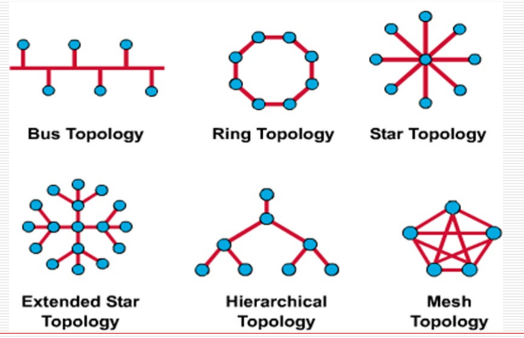
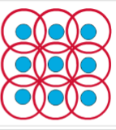

# 01-计算机网络及其参考模型

### 基本概念

|     | LAN 局域网  | WAN 广域网 |
| --- | -------- | ------- |
| 范围  | 小        | 大       |
| 性能  | 高        | 低       |
| 出错率 | 低        | 高       |
| 标准  | Ethernet | 复杂      |

#### ISP (Internet Service Providers)

* ISP：互联网服务提供商
* 多层次ISP结构：分流流量，在低层ISP能传输就不向上传递
* NAP(Network Access Point)：第一二层之间的接入点，也可以是google(大公司)直接和第一层ISP进行链接
* ICP(Internet Content Provider)：互联网内容提供商，不提供接入服务

#### 数据

* 按位发送
* 数据非信息本身，而是编码形式，编码成电/光信号以便传输（编码方式赋予0/1意义）

#### 数据包

* 将信息拆分成容易传输的小单元 PDUs(Packet Data Units)
* bits <- frames <- packets <- segments <- data
* 优点：解耦
  * 轮流发送数据包
  * 若数据丢失只需重传一小部分
  * 不同数据包可采用不同路由传输

| 层     | 单元英文     | 单元中文 |
| ----- | -------- | ---- |
| 数据链路层 | frames   | 帧    |
| 网络层   | packets  | 报文   |
| 传输层   | segments | 段    |

#### 协议

* 相同的规则，使得不同类型的计算机通信

#### 源地址和目标地址

* 源地址：发送数据包的计算机的标识。
* 目标地址：接收数据包的计算机的标识。

#### 传输介质

* 电缆方式
  * 铜轴有限方式
  * 双绞线方式
* 光缆方式：稳定
* 空气方式

#### 数据带宽 Bandwidth

* 衡量给定时间下信息传输的数量
* 传输能力的上限，理想
* 单位：bits/second bps **注意单位转换**

**通量 Thoughput**

* 在特定时间实际度量的带宽
* Throughput <= Bandwidth

### OSI(Open System Interconnection) Reference Model

* ISO提出
* 帮助网络建设者建设网络模型
* 描述信息/数据如何从一台计算机移动到另外一台
* **分层**通信：每一层有确定任务

| 层次    | 特点           | 关键字          | 备注   |
| ----- | ------------ | ------------ | ---- |
| 物理层   | 二进制传输        | 信号和介质        | 数据流层 |
| 数据链路层 | 介质访问         | 帧和介质访问控制     | 数据流层 |
| 网络层   | 路径选择         | 路径选择，最优路径    | 数据流层 |
| 传输层   | 终端到终端通信      | 可靠性，流控制，错误纠正 | 数据流层 |
| 会话层   | 进程之间通信如何用户交流 | 对话和交流        | 应用层  |
| 展示层   | 展示           | 标准           | 应用层  |
| 应用层   | 给用户展示交互接口    | 浏览           | 应用层  |

* 应用层：处理用户接口、数据格式、应用权限
  * 上3层
  * 软件
* 数据流层：控制着通过网络传输的数据信息
  * 下4层
  * 硬件+软件
* 下层为上层提供服务，上层向下层请求服务

#### Layer 1: Physical Layer 物理层

* 关键词：**信号 介质**
* 定义终端系统(包括媒体)之间链路的电气和功能规范(specifications)
* 定义物理属性：电压电平(voltage levels)、电压变化的定时(timing of voltage changes)、物理数据速率、最大传输距离、物理连接器……
* 特点：对于信号不管理，对于信号正确性不做判断，只传递信号。

#### Layer 2: Data Link Layer 数据链路层

* 关键词：**帧 介质访问控制**
* 通过物理链路提供**可靠**的数据传输
* **点对点**的连接
* 涉及物理（而不是逻辑）寻址、网络拓扑、网络访问、错误通知、帧的有序传递和流控制，调节链路使用
* 和第一层区别：需要检查电信号的正确性

#### Layer 3: Network Layer 网络层

* 关键词：**路由 地址**
* 在路由发生的两个终端系统之间提供连接和路径选择
* 设备位于地理上分离的网络上
* 和第二层区别：多链路而非点对点

#### Layer 4: Transport Layer 运输层

* 关键词：**可靠性 流控制 错误纠正**
* 将数据分段并重新组合为数据流
* 负责终端节点之间的**可靠**网络通信
* 为虚拟电路（端到端的信道）的建立、维护和终止、传输故障检测和恢复以及信息流控制提供机制

#### Layer 5: Session Layer 会话层

* 关键词：**对话 交流**
* 建立、管理和终止通信主机之间的会话
* 同步表示层实体之间的对话框并管理其数据交换
* 提供高效的数据传输、服务类别以及会话、表示和应用层问题的异常报告
* 管理表示层实体之间的数据交换

#### Layer 6: Presentation Layer 表示层

* 关键词：**标准**
* 确保一个系统的应用层发送的信息可以被另一个系统的应用层读取
* 使用通用数据表示格式在多个数据表示格式之间转换
* 关注数据结构和数据传输语法(syntax)
* 压缩和加密

#### Layer 7: Application Layer 应用层

* 关键词：**浏览**
* 最接近用户的一层
* 为用户应用程序提供网络服务
* 不向任何其他OSI层提供服务

#### 数据封装

* 五层划分：上三层、传输层、网络层、数据链路层、物理层
* 数据封装过程
  * 5->4：添加首部H5，应用程序数据作为数据部分
  * 4->3：添加首部H4，第五层的作为数据部分
  * 3->2：添加首部H3，第四层的作为数据部分
  * 2->1：添加首部H2和尾部T2(校验位)，第三层的作为数据部分
  * 1：转成比特流进行发送
* 不同层之间的数据无法互相解析

### TCP/IP Model

* 分层：四层
  * 应用层
  * 传输层
  * 互联网层
  * 网络接入层

#### 第四层：Application Layer 应用层

* 包含7层上三层：应用层、表示层、会话层的全部功能
* 处理高级协议、表示(representation)、编码(encoding)和会话控制(session control)问题
* 将所有与应用程序相关的问题合并到一个层中，并确保将这些数据正确打包到下一层。

#### 第三层：Transport Layer 传输层

* 处理服务质量的可靠性、流程控制和错误纠正问题。
* 将应用层信息打包成称为**段**的单元
* 对应OSI的第4层：传输层
* 协议：
  * TCP：可靠传输
  * UDP：速率

#### 第二层：Internet Layer 互联网层

* 目的：从互联网上的任何网络发送源包，使它们独立于路径和网络到达目的地
* 最佳路径确定和分组交换
* 对应OSI的第3层：网络层
* 协议：IP

#### 第一层：Network Access Layer 网络接入层

* 也称为主机到网络层
* 涉及IP数据包实际建立一个物理链路，然后再建立另一个物理链路所需的所有问题。
* 包括局域网和广域网的技术细节，以及OSI物理层和数据链路层的所有细节。
* 对应OSI下面两层：物理层和数据链路层
* 协议：Internet LAN WAN

### TCP/IP 模型 和 OSI 模型的异同

* 同
  * 都有分层
  * 都有应用层，实际内容不同
  * 都有相同的传输层和网络层
  * 假设采用分组交换（非电路交换）技术
  * 基于报文交换实现端到端通信
* 异
  * TCP/IP模型只有四层，而OSI模型有七层
  * TCP/IP模型将应用层、表示层和会话层合并为应用层
  * TCP/IP模型将数据链路层和物理层合并为网络接入层
  * TCP/IP模型是实际标准，OSI模型是理论标准

### 网络拓扑

* 定义网络结构
* 物理拓扑：导线/介质/节点的物理布局
* 逻辑拓扑：数据传输的真实路径
* [物理拓扑和逻辑拓扑不一定相同](https://blog.csdn.net/weixin_37171673/article/details/109558929)

<figure><figcaption>
常见的网络拓扑
</figcaption></figure>

#### Bus 总线型拓扑

* 物理角度：主机都连接到公用总线
  * 优点：所有主机都可以直接通信。
  * 缺点：电缆断开会使主机彼此断开连接。
* 逻辑角度：每个网络设备都可以看到来自所有其他设备的所有信号（广播式传播）
* 优点：简单
* 缺点:
  * 信号冲突，需要进行复杂的介质访问权限控制来保证通信正常
  * 如果一处断开，则全部无法进行网络传输

#### Ring 环形拓扑

* 物理角度
  * 所有的设备直接首尾相连，组成一个菊花链(daisy-chain)
  * 可以将信息传送给链上的所有的设备
  * 是固定顺时针或者逆时针进行传输
* 逻辑角度
  * 为了使信息流动，每个站点必须将信息传递给其相邻的站点。
  * 访问控制：是用token，防止很多设备同时使用环
* 缺点：环上只要有一个地方断开就会破坏整个环
* 令牌环拓扑主要用于控制领域，适用于**实时系统**

#### Dual Ring 双环拓扑

* 增加冗余环，提升可靠性
* 一次只使用一个

#### Star 星形拓扑

* 物理角度：所有链路从中心节点辐射出去
* 逻辑角度：所有信息的流动将通过一个设备。
* 优点：
  * 节点间可直接通信
  * 便于权限管理
* 缺点：
  * 都经过同一节点：负载大
  * 冲突
* 扩展星型拓扑：设置次级中心结点，类似于ISP

#### Tree 树形拓扑

* 树拓扑使用一个主干节点(Trunk Node)，从该节点分支到其他节点。
  * 二叉树：每个节点分成两个链接
  * 主干树：主干有分支节点
* 物理角度：主干是一条有几层分支的线
* 逻辑角度：层次性
* 在根一级数据结点可以对数据进行汇总和统计
* 当前节点不能处理的部分，则交给父结点处理
* 节点损坏不会影响全局

#### Complete/Mesh 渔网形拓扑

* 优点：最大的连接性和可靠性。
* 缺点：链接的媒体数量和到链接的连接数量变得非常庞大：添加合适的路由/选择机制
* 常使用在比较使用重要的情况下：Internet

#### Cellular 蜂窝形拓扑

<figure><figcaption></figcaption></figure>

* 物理角度：用于无线技术的拓扑结构
* 逻辑角度：节点之间直接通信，或者只与相邻的单元通信，**非常低效**
* 有时接收节点移动(如手机)，有时发送节点移动(如卫星)
* 每一个结点都是无线的连通方式：远结点需要进行转发
* 使用场景：无线电话、卫星
* AP：接入点，用于连接无线设备和有线网络

### 局域网设备


内容搬迁

为了让笔记结构更清晰，作者将局域网设备的内容搬迁到了各个网络层的笔记中，这里不再重复。


* 网络终端设备：位于网络边缘，直接与用户交互，比如打印机、计算机、服务器、传真机、复印机
* 网络中间设备：位于网络中的中间层，通常不直接与用户交互，而是负责网络的信号传输、数据转发和流量控制，属于OSI下3层
  * 物理层：介质、repeaters、hubs
  * 数据链路层：网桥、交换机、电路交换设备
  * 网络层：路由器
  * 高层设备可以识别低层设备的信号，低层设备不能识别高层设备的数据逻辑
