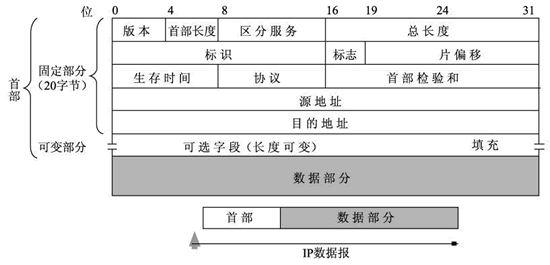
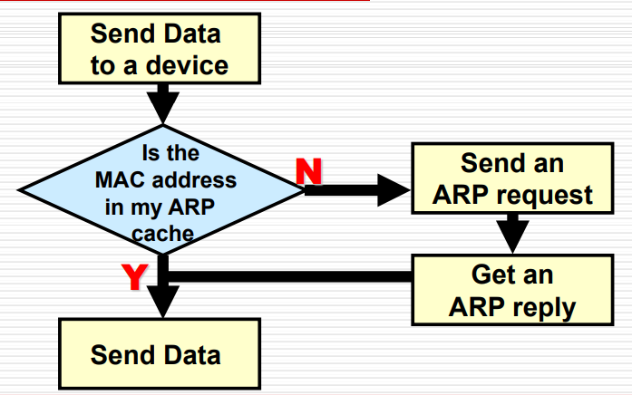

# 04-网络层

## 概览

* 在网络间传输数据包
* 为数据包选择路由
* 使用有层次的地址结构 与MAC相对
* 分割网络，控制流量
* 为网络提供拥塞控制
* 和其他网络层交互

## 报文

<figure><figcaption><p>IP 报文格式</p></figcaption></figure>

```plaintext
 0                   1                   2                   3
 0 1 2 3 4 5 6 7 8 9 0 1 2 3 4 5 6 7 8 9 0 1 2 3 4 5 6 7 8 9 0 1
 +-+-+-+-+-+-+-+-+-+-+-+-+-+-+-+-+-+-+-+-+-+-+-+-+-+-+-+-+-+-+-+-+
 |Version|  IHL  |Type of Service|          Total Length         |
 +-+-+-+-+-+-+-+-+-+-+-+-+-+-+-+-+-+-+-+-+-+-+-+-+-+-+-+-+-+-+-+-+
 |         Identification        |Flags|      Fragment Offset    |
 +-+-+-+-+-+-+-+-+-+-+-+-+-+-+-+-+-+-+-+-+-+-+-+-+-+-+-+-+-+-+-+-+
 |  Time to Live |    Protocol   |         Header Checksum       |
 +-+-+-+-+-+-+-+-+-+-+-+-+-+-+-+-+-+-+-+-+-+-+-+-+-+-+-+-+-+-+-+-+
 |                       Source Address                          |
 +-+-+-+-+-+-+-+-+-+-+-+-+-+-+-+-+-+-+-+-+-+-+-+-+-+-+-+-+-+-+-+-+
 |                    Destination Address                        |
 +-+-+-+-+-+-+-+-+-+-+-+-+-+-+-+-+-+-+-+-+-+-+-+-+-+-+-+-+-+-+-+-+
 |        Options (Variable length)              |    Padding    |
 +-+-+-+-+-+-+-+-+-+-+-+-+-+-+-+-+-+-+-+-+-+-+-+-+-+-+-+-+-+-+-+-+
 |                    Data (Variable length)                     |
 +-+-+-+-+-+-+-+-+-+-+-+-+-+-+-+-+-+-+-+-+-+-+-+-+-+-+-+-+-+-+-+-+
```

* 版本 4位 ipv4为4 ipv6为6
* 首部长度 4位
  * 单位：4 Bytes
  * 计算方法：`4 Bytes * 值`
  * 因此最大报头长度为`60 Bytes`
* 服务类型 8位
* 总长度 16位
  * 单位：字节
  * 包括首部和数据
  * 最大长度为`65535 Bytes`
* 标识 16位
  * 用于分片，被分片的数据包有相同标识
* 标志 3位
  * 第0位：始终为0
  * 第1位 `DF`：为`1`不分片
  * 第2位 `MF`：为`1`更多分片 为`0`最后一个分片
* 片偏移 13位
  * 单位：8 Bytes
  * 计算方法：`8 Bytes * 值`
  * 从原始数据包开始算
* 生存时间 8位 TTL
  * 单位：跳数
* 协议 8位
  * 区分 TCP/UDP等协议
  * 为传输层提供指示
* 首部校验和 16位
  * 仅校验首部
* 源地址 32位
* 目的地址 32位

## IP地址

* 逻辑地址
* 32位，网络地址+主机地址
* 网络的第一个地址为网络地址
  * 主机地址全为`0`
  * 用于标识网络
* 网络的最后一个地址为广播地址
  * 主机地址全为`1`
  * 用于向网络内所有主机发送数据
* IP耗尽的解决方案
  * NAT：网络地址转换
  * CIDR：无类别域间路由（通过子网掩码划分子网）
  * IPv6：128位地址
* 私有地址：`10.0.0.0/8` `172.16.0.0/12` `192.168.0.0/16`

### 分类

| 类别   | 网络地址 | 主机地址  | 主机数          | 范围        | 高位     |
| ---- | ---- | ----- | ------------ | --------- | ------ |
| A    | 0-7  | 8-31  | $$2^{24}-2$$ | 0 - 127   | `0`    |
| B    | 0-15 | 16-31 | $$2^{16}-2$$ | 128 - 191 | `10`   |
| C    | 0-23 | 24-31 | $$2^{8}-2$$  | 192 - 223 | `110`  |
| D 多播 |      |       |              | 224 - 239 | `1110` |
| E 保留 |      |       |              | 240 - 255 | `1111` |

### 子网

* 通过子网掩码划分子网
* `IP & 子网掩码 = 网络ID + 子网ID`
* IP格式：网络ID + 子网ID + 主机ID
* 子网内部通信不需要路由器
* 跨子网通信需要路由器或三层交换机
* 特点
  * 提供灵活性
  * 在本地分配地址
  * 减少广播域

**子网地址长度**


全 `0` 子网

* 传统来说，子网的主机地址（子网号）不能全`0`和全`1`，但是新标准支持
* 若题目中写`zero subnet permitted`，则子网号可以全`0` 也就是$$2^n -1$$个子网
* 在Cisco中
  * `ip subnet-zero`：允许使用全0子网
  * `no ip subnet-zero`：不允许使用全0子网


* 最大限制：确保主机地址剩下至少2位，以容纳网络地址和广播地址和至少一个主机地址
* 最小限制：子网地址至少2位，子网号不支持全0和全1（子网掩码最大为`/30`）
* 假设子网地址$$n$$位，主机地址$$m$$位，则有$$2^n-2$$个可用的子网，每个子网有$$2^m-2$$个可用的主机地址
* 可见当$$m=n$$时，IP地址利用率最高

#### 划分子网（期末必考）

* 若需要m个子网，每个子网n个主机，则
  * 子网地址长度：$$\lceil \log_2(m+2) \rceil$$
  * 主机地址长度：$$\lceil \log_2(n+2) \rceil$$
  * 子网掩码中1的个数为网络地址长度+子网地址长度
  * 子网地址=IP地址&子网掩码
* 先划分范围大的
* 一条网线两端的两个路由器端口需要分配`/30`的子网

### IP地址分配

* 静态分配
  * 由管理员手动分配
  * 不能出现重复
* 动态分配
  * DHCP：Dynamic Host Configuration Protocol
  * BOOTP：BOOTstrap Protocol
  * RARP: Reverse Address Resolution Protocol

## 路由器

* 互联网段/网络：把数据包从一个网络传到另一个网络
  * 每个网络有一个唯一的网络号码
  * 属于同一个网络的主机的IP地址的网络号码相同
* 根据目的地址选择路由，决定最佳路径
* 工作流程
  1. 解包帧的包头，得知目的IP地址
  2. 计算目的的网络号
  3. 查找路由表，找到下一跳
  4. 重新封装帧，发送到下一跳

## ARP Address Resolution Protocol 地址解析协议

<figure><figcaption><p>ARP 流程</p></figcaption></figure>

* 发送方需要知道目的主机的IP和MAC地址以通信
* ARP协议用于解析IP地址找到MAC地址

### 同网络间ARP

1. 广播ARP请求：包含发送方IP和MAC地址，目的IP地址
2. 目的主机收到ARP请求，其他主机仅记录发送方IP和MAC地址，不响应
3. 目的主机回应ARP请求
4. 发送方收到ARP响应并缓存

### 跨网络间ARP


不同网段之间的IP不经过路由器无法直接连通。


* 默认网关
  * 用于不同网络间通信
  * 为路由器接口的IP地址
  * 发送方发送ARP请求到默认网关
* Proxy ARP：路由器代替目的主机响应ARP请求，返回自己的MAC地址

## 网络层服务

* Connection-oriented：先建立连接再传输数据（传输层）
* Connectionless：直接传输数据，不需要建立连接，如IP
* Circuit-switched：建立固定信道/电路后**顺序**传输数据（物理层）
* Packet-switched：将数据分割成数据包传输，不需要固定信道，如IP

## 路由&路由协议

* 见第7-8章笔记

## VLSM Variable Length Subnet Mask 可变长子网掩码


VLSM 示例

`192.168.10.128/26`可以划分为

* `192.168.10.128/27`
* `192.168.10.160/27`
* `192.168.10.192/28`
* `192.168.10.208/28`
* `192.168.10.224/29`
* ……


* 传统的路由系统：子网掩码长度固定
* VLSM：子网掩码长度可变，进一步划分子网
* 优点
  * 提高IP地址利用率
  * 更好的路由聚合：构建超网
* 缺点：广播地址/网络号浪费

### 支持VLSM的路由协议

* RIP v2
* OSPF
* EIGRP
* Integrated IS-IS
* 静态路由

### Route Aggregation 路由聚合/超网

1. 确定IP的最大值和最小值
2. 把IP转换为2进制
3. 最大值和最小值的2进制从高到低进行比较，相同的位数保留，一旦出现不同则停止，将剩余位全部置0，得到聚合后的IP
4. 相同的位数是聚合后的IP的掩码的长度
5. 如果出现不连续的IP，不要管中间的空档，还是根据最大值最小值去计算


路由聚合 示例

有IP `200.199.48.0/24` `200.199.49.0/24` `200.199.50.0/24` `200.199.51.0/24`

可以合并为`200.199.48.0/22`


## ICMP Internet Control Message Protocol

* 用于网络设备之间传递错误信息
* IP层（网络层）的协议
* 两种报文
  * 差错报文：报告错误，多见
    * 目的站不可达：网络不可达、主机不可达、端口不可达、协议不可达、源路由选择不能完成、目的网络不可知、目的主机不可知
    * 源站抑制
    * 超时
    * 参数问题
    * 改变路由
  * 查询报文：请求网络信息
    * 回送请求/应答：`ping`
    * 时间戳请求/应答
    * 路由器询问/通告
    * 地址掩码请求/应答

### 报文格式

```plaintext
 +0------7-------15---------------31
 |  Type | Code  |    Checksum    |
 +--------------------------------+
 |     Varies to type and code    |
 +--------------------------------+
 |          Message Body          |
 |        (Variable length)       |
 +--------------------------------+
```

* 发送ICMP报文时，上面的报文作为IP报文的数据部分，与IP报文的报头组成IP数据报发送

**ICMP差错报告报文**

* IP报头+ICMP报文的前8字节+收到的IP数据报的报头+收到的ICMP报文的前8字节

### 不发送ICMP差错报文的情况

* ICMP差错报告报文本身
* 第一个分片后的分片
* 多播地址
* 特殊地址：`127.0.0.0` `0.0.0.0`

### PING Packet InterNet Groper

* 通过ICMP的`Echo Request`和`Echo Reply`报文测试网络连接
* 测试两个主机间的连通性
* 直接通过传输层的ICMP
* 不经过运输层的TCP/UDP
