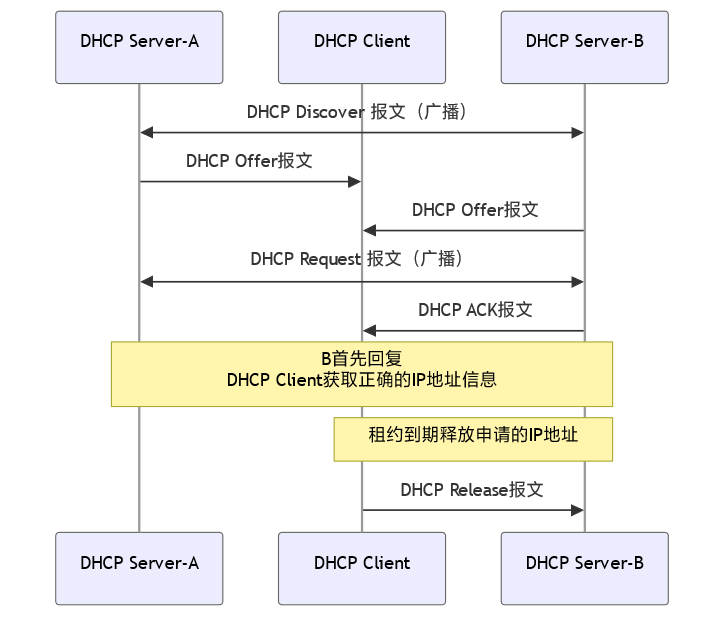

# 12-DHCP

* 用途：动态分配IP地址
* 服务：IP地址、子网掩码、默认网关、DNS服务器
* 局域网协议
* 基于UDP

## 工作流程

<figure><figcaption><p>DHCP 工作流程</p></figcaption></figure>


DHCP 中的 单播/广播

* Client 不知道 Server 的地址，因此**广播**
* Server 收到广播包后，知道了 Client 的MAC地址，因此**单播**


1. 发现阶段：Client 不知道 Server 的地址，因此**广播** `DHCP Discover` 包
2. 响应阶段：Server 收到 `DHCP Discover` 包后，向Client**单播** `DHCP Offer` 包，包含 IP 地址、子网掩码、租约时间等信息
3. 选择阶段：Client 收到 `DHCP Offer` 包后，选择一个 Server，广播 `DHCP Request` 包
4. 租约确认：Server 收到 `DHCP Request` 包后， 单播`DHCP Ack` 包，确认租约，若出错则发送 `DHCP Nak` 包
5. 租期续约：Client 在租期中，向提供 IP 地址的 Server `DHCP Request` 包，收到 Server 的 `DHCP Ack` 包后更新配置
6. 租期释放：Client 在租期中，向提供 IP 地址的 Server发送 `DHCP Release` 包，Server 收到后释放 IP 地址

## 报文结构

```plaintext
 0         7            15        23       31
 +------------------------------------------+
 |  Op (1) | Htype (1)  | Hlen (1)| Hops (1)|
 +------------------------------------------|
 |                    Xid (4)               |
 +------------------------------------------|
 |        Secs (2)      |      Flags (2)    |
 +------------------------------------------|
 |                 Ciaddr (4)               |
 +------------------------------------------|
 |                 Yiaddr (4)               |
 +------------------------------------------|
 |                 Siaddr (4)               |
 +------------------------------------------|
 |                 Giaddr (4)               |
 +------------------------------------------+
 |                 Chaddr (16)              |
 +------------------------------------------+
 |                 Sname (64)               |
 +------------------------------------------|
 |                 File (128)               |
 +------------------------------------------+
 |           Options(variable)              |
 +------------------------------------------+
```

## DHCP 欺骗

* 欺骗：伪造 DHCP Server，抢先回答，向 Client 发送虚假 IP 地址，进而导致数据窃听
* 实际应用的网络中采用 DHCP 中继，使得本网络的非授权 DHCP Server 快于其他网络的授权 DHCP Server，导致 DHCP 欺骗更容易完成
* 防范措施：DHCP Snooping，使用 DHCP Snooping 绑定表过滤不可信的信息

### 配置

```bash
 switch(config)# ip dhcp snooping
 switch(config)# ip dhcp snooping vlan 1
 switch(config)# interface GigabitEthernet 0/1
 switch(config-if)# ip dhcp snooping trust # 默认是非信任端口，需要改为确认
```
