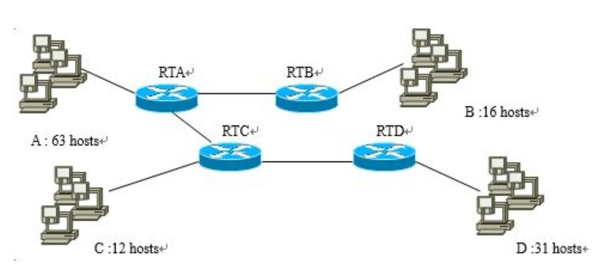
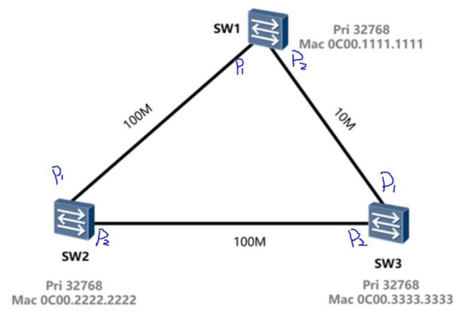
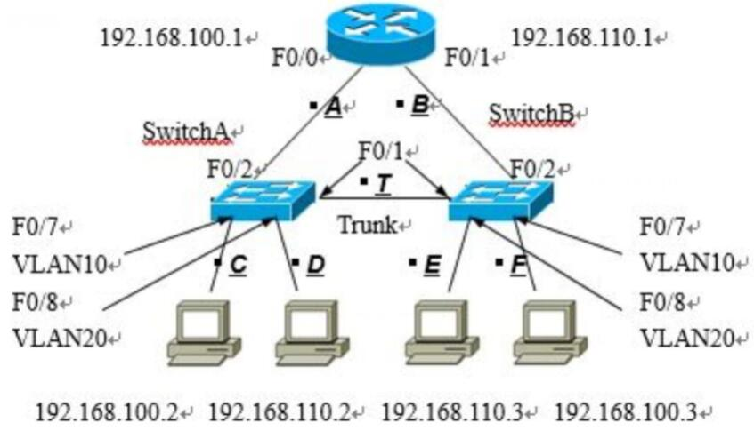
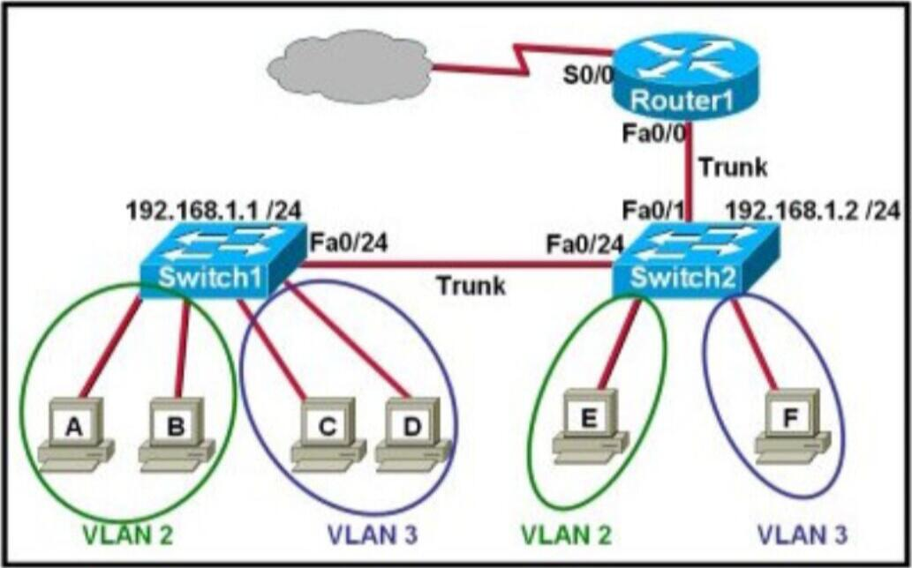

# 小测及答案

## Quiz 01 OSI基础知识

1（单选题）Which of the following is the only device that works on all layers of the OSI model?

* Network host
* Switch
* Router
* Bridge

2（单选题）Switches can break up \_\_\_, cannot break up\_\_\_.

* broadcast, broadcast
* collision, collision
* collision, broadcast
* broadcast, collision

3（单选题）Which is an example of a device that operates only at the physical layer.

* Hub
* Switch
* Router
* Bridge

4（单选题）What is the access point function (AP)?

* Monitoring and controlling incoming and outgoing network traffic.
* Automatically handle wireless access configuration.
* Allowing wireless devices to connect to a wireless network.
* Connecting networks and wisely choosing the best alternatives between networks.

### Quiz 01 Answers

* 1-4 ACAC

## Quiz 02 网络层

1（多选题）Which of the following is your private IP address?

* `12.0.0.1`
* `168.172.19.39`
* `172.20.14.36`
* `172.11.194.30`
* `192.168.24.43`

2（单选题）Which of the following is an example of a multicast address?

* `10.6.9.1`
* `192.168.10.6`
* `224.0.0.10`
* `172.16.9.5`

3（多选题）The IP address of Ethernet0 on the router is `172.16.2.1/23`. Which of the following can be a valid host ID on the LAN interface connected to the router?

* `172.16.0.5`
* `172.16.1.100`
* `172.16.1.198`
* `172.16.2.255`
* `172.16.3.0`
* `172.16.3.255`

4（单选题）I have a network in my data center that requires 310 hosts. Which mask should I use to minimize wasted addresses?

* `255.255.255.0`
* `255.255.254.0`
* `255.253.252.0`
* `255.255.248.0`

5（单选题）A network with 5 subnets, each with at least 16 hosts, should be split into 1 subnet. Which classic subnet mask do you use?

* `255.255.255.192`
* `255.255.255.224`
* `255.255.255.240`
* `255.255.255.248`

### Quiz 02 Answers

* 1 CE
* 2 C
* 3 DE
* 4-5 BB
  * 5 中的5个子网是多余数据

## Quiz 03 传输层

1（单选题）Which of the following layers of the OSI model is not involved in defining how the applications within the end stations will communicate with each other as well as with users?

* Transport
* Application
* Presentation
* Session

2（多选题）Which of the following correctly describe steps in the OSI data encapsulation process?

* The transport layer divides a data stream into segments and may add reliability and flow control information.
* The data link layer adds physical source and destination addresses and an FCS to the segment.
* Packets are created when the network layer encapsulates a frame with source and destination host addresses and protocol-related control information.
* Packets are created when the network layer adds Layer 3 addresses and control information to a segment.

3（单选题）Which layer of the OSI reference model uses flow control, sequencing, an acknowledgements to ensure that reliable networking occurs?

* data link
* network
* transport
* presentation

4（单选题）TCP传输中的协议规定，在确认信息中捎带（）的序号以减少通信量

* 上一个已接收的报文
* 下一个希望接收的报文
* 正在发送的报文
* 下一个将要发送的报文

5（单选题）TCP是互联网中的传输层协议，TCP协议进行流量控制的方式是\_\_?

* 使用停等ARQ协议
* 使用后退N帧ARQ协议
* 使用固定大小的滑动窗口协议
* 使用可变大小的滑动窗口协议

6（单选题）当TCP实体发出连接请求（SYN）后，等待对方\_\_\_响应。

* SYN
* FIN、ACK
* SYN、ACK
* RST

7（多选题）下列哪两项是用户数据报协议（UDP）的功能。

* 流量控制
* 系统开销低
* 无连接
* 面向连接
* 序列和确认

8（单选题）Web浏览器向侦听标准端口的Web服务器发出请求之后，正在服务器响应的TCP报头中，源端口号是多少?

* `13`
* `53`
* `80`
* `1024`

9（单选题）Which class of IP address provides a maximum of only 254 host addresses per network In?

* Class A
* Class B
* Class C
* Class D
* Class E

10（单选题）You need to configure a server that is on the `192.168.19.24/29` subnet. The router has an initially available host address. Which of the following should be assigned to the server?

* `192.168.19.0 255.255.255.0`
* `192.168.19.33 255.255.255.240`
* `192.168.19.25 255.255.255.248`
* `192,168.19.31 255.255.255.248`
* `192.168.19.34 255.255.255.240`

### Quiz 03 Answers

* 1 A
* 2 AD
* 3-6 CBDC
* 7 BC
* 8-10 CCC

## Quiz 04 传输层 & 应用层

1（单选题）一台主机希望解析域名 \<www.nankai.edu.cn>，如果这台主机配置的域名服务器为`202.120.66.68`，Internet根域名服务器为 `10.2.8.6`，而存储 \<www.nankai.edu.cn> 与其IP地址对应关系的域名服务器为 `202.113.16.10`，那么这台主机解析该域名通常先查询（）。

* 地址为 `10.2.6.8` 的域名服务器
* 地址为 `202.120.66.68` 的域名服务器
* 地址为 `202.113.16.10` 的域名服务器
* 不能确定，可以从这 3 个域名服务器任选一个

2（单选题）在使用浏览器打开某个网页时，用户输入网址后，浏览器首先要进行

* 域名到 IP 地址的解析
* 和服务器建立 TCP 连接
* 发送 UDP 分组到服务器
* 发出 `GET` 的 HTTP 命令来获得网页内容

3（单选题）在 TCP通信会话期间，如果数据包到达目的主机的顺序混乱，将对原始消息执行什么操作?

* 数据包将无法到达
* 将从源主机重新传送数据包
* 数据包将送达目的主机并重组
* 数据包将送达目的主机但并不重组

4（单选题）下列哪项由源主机在转发数据时动态选择?

* 目的逻辑地址
* 源物理地址
* 默认网关地址
* 源端口

5（单选题）TCP报头信息和 UDP 报头信息中都包含下列哪项信息?

* 定序
* 流量控制
* 确认
* 源和目的

6（单选题）What is the address range of a class B network address in binary format?

* `01xxxxxx...`
* `0xxxxxxx...`
* `10xxxxxx...`
* `110xxxxx...`

7（单选题）What is the subnet address of the host whose IP address is `200.10.5.68/28`?

* `200.10.5.56`
* `200.10.5.32`
* `200.10.5.64`
* `200.10.5.0`

8（多选题）Which of the two statements describes the IP address `10.16.3.65/23`?

* The subnet address is `10.16.3.0 255.255.254.0`
* The minimum host address in the subnet is `10.16.2.1 255.255.254.0`
* The last valid host address in the subnet is `10.16.2.254 255.255.254.0`
* The subnet's broadcast address is `10.16.3.255 255.255.254.0`
* The network is not subnetted

### Quiz 04 Answers

* 1-7 BACDD CC
  * 4 目的端口取决于网站，物理地址是硬件地址，默认网关地址是配置好的，只有源端口是动态选择的
* 8 BD
  * A 注意陷阱
  * E 未经过子网划分：子网掩码是默认值 (`/8`、`/16`、`/24`)

## Quiz 05 综合题

In the topology of a corporation (illustrated in figure). If you want to distribute `192.168.20.0/24` to these hosts and routers, and divide the network into subnets, please give the result (zero subnet permitted).（2020春.期末）

<figure><figcaption>
5
</figcaption></figure>

* Net A
* Net B
* Net C
* Net D
* Other Nets

### Quiz 05 Answers

* `192.168.20.0/25`
* `192.168.20.192/27`
* `192.168.20.224/28`
* `192.168.20.128/26`
* `ab∶ 192.168.20.240/30`
* `ac: 192.168.20.244/30`
* `cd: 192.168.20.248/30`
  * 路由器间的子网相当于2个接口，所以是`/30`子网

## Quiz 06 OSPF & VLAN

1（多选题）Which of the two statements about the OSPF router ID is correct?

* Identifies the source of Type 1 LSA.
* This should be the same for all routers in the OSPF routing instance.
* By default, the lowest IP address of the router is the OSPF router ID.
* The router automatically selects the loopback IP address as the OSPF router ID.
* Created using the MAC address of the loopback interface.

2（多选题）Which of the following must match for neighbors to occur between routers?

* Process ID
* Hello timer and dead timer
* Link cost
* Area
* IP address / subnet mask

3（多选题）Which of the following is a single-area OSPF network scalability issue?

* Routing table size
* OSPF database size
* Maximum hop count limit
* OSPF database recalculation

4（单选题）If the routers in a single area are configured with the same priority value and there is no loopback interface, what value does the router use for the OSPF router ID?

* Minimum IP address of the physical interface
* Maximum IP address of the physical interface
* Minimum IP address of any logical interface
* Maximum IP address of any logical interface

5（多选题）Which three statements are typical characteristics of VLAN arrangements? (Choose three.)

* New switch has no VLANs configured.
* Connectivity between VLANs requires a Layer 3 device
* VLANs typically decrease the number of collision domains
* Each VLAN uses a separate address space.
* A switch maintains a separate bridging table for each VLAN
* VLANs cannot span multiple switches.

### Quiz 06 Answers

* 1 AD
* 2 BDE
  * A Process ID 是本地配置，和对端无关
  * C Link cost 不影响邻居关系
* 3 ABD
* 4 B
* 5 BDE
* A. 新交换机都有一个默认vlan1因此错
* B. VLANs之间的联通的需求是一个三层设备。正确。
* C. VLANs 代表性的能降低冲突域的数量。错。冲突域和vlan没关系，vlan分割的是广播域， 一个交换机端口就是一个冲突域。
* D. 每个VLAN使用分离的地址空间。正确
* E.一个交换机在每个VLAN中保持存放一个分离的桥接表。命令 show mac-address-table vlan可以看见
* F. VLANs不能跨越多个交换机。错 trunk链路嘛

## Quiz 07 局域网交换

<figure><figcaption>
7
</figcaption></figure>

* 根交换机为?
* 根端口为?（如SW1.P1; SW1.P2......）
* 指定端口为?

### Quiz 07 Answers

* sw1
* sw2.p1 sw3.p2
* sw1.p1 sw1.p2 sw2.p2

## Quiz 08 VLAN

1.（填空题）Please give the order of links the packets passed when ping `192.168.110.2` from `192.168.100.3`. These links are labeled as 'A', 'B', and so on. (2022春.期末 考察)

<figure><figcaption>
8.1
</figcaption></figure>

2.（多选题）Refer to the exhibit. Which two statements are true about inter VLAN routing in the topology that is shown in the exhibit? (Choose two.)

<figure><figcaption>
8.2
</figcaption></figure>

* Host E and host F use the same IP gateway address.
* Router1 and Switch2 should be connected via a crossover cable.
* Router1 will not play a role in communications between host A and host D.
* The FastEthernet 0/0 interface on Router1 must be configured with subinterfaces.
* Router1 needs more LAN interfaces to accommodate the VLANs that are shown in the exhibit.
* The FastEthernet 0/0 interface on Router1 and Switch2 trunk ports must be configured using the same encapsulation type.

### Quiz 08 Answers

* 1 FTABTD
* 2 DF
  * Host E和Host F两台主机不再一个vlan，很显然网关也不同
  * 不同设备用直通线，所以此选项不对
  * A和D主机 不在一个vlan里面 他们通讯当然要通过路由器，此选项显然不对
  * 路由器不需要更多的接口，因为用的是子接口，没个逻辑的子接口对应一个vlan。
  * The FastEthernet O/0 interface on Router1 and Switch2 trunk ports must be configured using the same encapsulation type.
