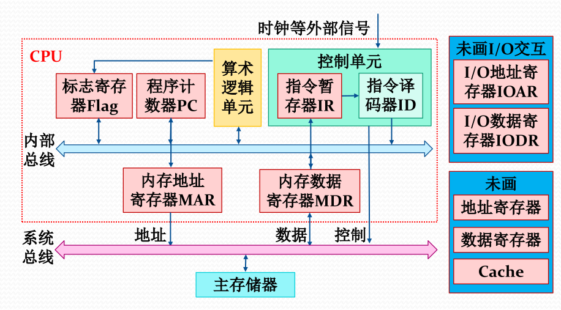

# 021-处理器

## 处理器部件

<figure><figcaption>
处理器部件
</figcaption></figure>

* 用户程序可见寄存器：应用程序、系统程序均可使用，减少主存访问次数，提高效率
  * 通用寄存器（数据寄存器）
  * 地址寄存器：索引、栈指针、段地址寄存器
* 控制与状态寄存器：被有特权的操作系统程序使用，控制程序执行
  * PC
  * IR 指令寄存器
  * CC 条件码：当前指令操作结果设置的位
    * 正、负、零、溢出
    * 中断位、中断允许、中断屏蔽、处理器模式、主存保护
* 程序状态字（PSW）：当前程序的状态，包含条件码、当前程序计数器、当前处理器模式、当前中断屏蔽位等信息

## 指令和处理器模式

* 内核态：处理器可以执行特权指令，如启动 I/O，设置PC，改变处理器状态
* 用户态：处理器只能执行用户指令，不能执行特权指令

| 处理器模式 | 特权级 | 说明                      |
| ----- | --- | ----------------------- |
| 内核级   | 0   | I/O 中断处理                |
| 系统调用级 | 1   | 执行文件系统调用、获得特定的和受保护的程序服务 |
| 共享库级  | 2   | 执行共享库函数，只读，可被多个进程共享     |
| 应用程序级 | 3   | 执行用户程序，不能执行特权指令         |

* 大部分 OS 只实现了 ring 0 和 ring 3
* 通过 PSW 中的处理器模式位来区分内核态和用户态
* 若在用户态执行特权指令，则会产生中断，进行异常处理

## 处理器状态转换

<figure><figcaption>
处理器状态转换
</figcaption></figure>
