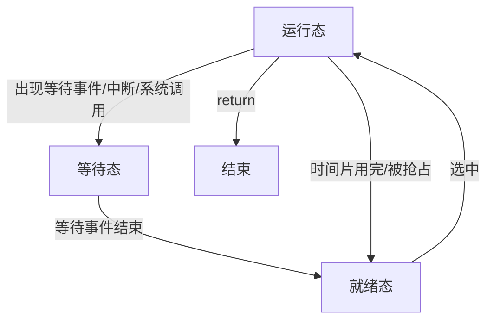
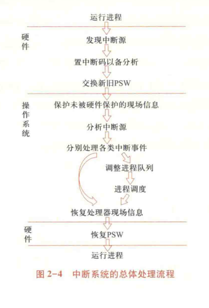

# 022-中断

* 在程序执行过程中遇到急需处理的事件时，暂时中止 CPU 上现行程序的运行，转去执行相应的事件处理程序，待处理完成后再返回原程序被中断处/调度其他程序执行
* 操作系统是**中断驱动**的：中断是激活操作系统的唯一方式

## 进程转换模型

## 中断的分类

| 类型   | 定义         | 示例                 |
| ---- | ---------- | ------------------ |
| 狭义中断 | 处理器外的中断事件  | I/O 中断、时钟中断、外部信号中断 |
| 异常   | 执行指令引起的中断  | 地址异常、算术异常、硬件异常     |
| 系统调用 | 触发系统调用引起中断 | 请求设备、请求 I/O、创建进程   |

## 中断源

| 事件          | 定义                | 处理流程                                                                                                   |
| ----------- | ----------------- | ------------------------------------------------------------------------------------------------------ |
| 处理器硬件故障中断事件 | 由处理器、主存、总线等硬件故障引起 | 保护现场、停止设备、停止 CPU、向操作员报告，等待人工干预（wtf？）                                                                   |
| 程序性中断事件     | 执行指令引起            | 
算术异常：简单处理，报告用户/用户编写中断续元程序 非法指令/地址越界/非法存取/用户态使用特权指令：终止进程 终止进程指令：终止进程 虚拟地址异常：调整内存，重新执行指令
 |
| 自愿性中断事件     | 执行系统调用请求 OS 服务    | 执行陷入，保护现场，根据功能号查入口并跳转服务程序                                                                              |
| I/O 中断事件    | 由 I/O 设备引起        | 
I/O 完成：调整进程状态，释放等待进程，加入就绪进程队列 I/O 出错/异常：等待人工干预
                                               |
| 外部中断事件      | 由 CPU 现场之外的信号引起   | 
时钟/间隔时钟中断：记时与时间片处理 设备报到与结束中断：调整设备表 键盘/鼠标信号中断：根据信号作出相应反应 关机/重启动中断：写回文件，停止设备与CPU
         |

## Linux 中的中断

* 同步中断（Exception 异常）：由 CPU 执行指令引起的中断，通常是异常或系统调用
* 异步中断（Interrupt 中断）：由外部设备引起的中断
* 可屏蔽中断（Maskable Interrupt）：可以通过 `IF` 标志（中断屏蔽标志）启用或屏蔽的中断，比如外部设备请求的中断。
* 非屏蔽中断（Non-maskable Interrupt, NMI）：无法屏蔽的高优先级中断，通常用于紧急情况，如硬件故障。

| 类别 | 原因                       | 异步/同步 | 返回行为       |
| -- | ------------------------ | ----- | ---------- |
| 中断 | 来自 I/O 设备的信号             | 异步    | 总是返回到下一条指令 |
| 陷阱 | 有意的异常，执行后不会影响后续指令（如系统调用） | 同步    | 总是返回到下一条指令 |
| 故障 | 潜在可恢复的错误（如缺页异常）          | 同步    | 返回到当前指令    |
| 终止 | 不可恢复的错误（如硬件故障）           | 同步    | 不会返回       |

## 中断系统

* 响应/处理中断的系统
  * 硬件子系统：中断响应（中断装置）
  * 软件子系统：中断处理（中断处理程序）
* 在指令周期最后增加微操作，检查并响应中断请求

### 中断响应分类

* 处理器外的中断：中断控制器发现响应
  * 中断控制器：中断逻辑线路 + 中断寄存器
  * 中断向量表：包含中断处理程序的地址的内存区域
  * 步骤
    1. 外部设备向中断控制器发出 **中断请求 IRQ**，在中断寄存器中设置已发生的中断
    2. 指令处理结束前**检查中断寄存器**，若有不被屏蔽的中断产生，改变处理器操作顺序，引出中断处理程序（查中断向量表）
* 处理器内的异常：指令控制逻辑发现、响应
* 系统陷阱：处理器执行陷入指令时直接触发

### 中断响应过程（陷阱机制）

1. 发现中断源，提出中断请求
   * 发现中断寄存器记录的中断
   * 决定这些中断是否被屏蔽
   * 当有多个中断源时，根据优先级选择
2. 中断当前程序执行：保存 PSW/PC 到核心栈
   * 用户栈：属于用户态的栈
   * 核心栈：属于内核态的栈，保存中断现场，保存操作系统程序/函数间相互调用的参数/返回值/返回点/程序局部变量
3. 切换到内核态，调出中断处理程序的 PSW/PC，转向中断处理程序
4. 调用中断返回指令，从内核态变为用户态

### 中断处理过程

* **保护**未被硬件保护的处理器状态
* **识别中断源**：通过分析被中断进程的 PSW 的中断码字段
* **处理中断**：查中断向量表、执行中断处理子程序
* **恢复正常**
  * 直接返回被中断的进程 或
  * 调整进程队列，启用进程调度，选择下一个执行的进程

### 总体流程

<figure><figcaption>
中断处理流程
</figcaption></figure>

## 多重中断处理

* 中断屏蔽：中断装置通过中断屏蔽位决定是否响应中断（有选择地）
* 中断优先级：同时检测到多个中断时响应中断的顺序（有优先级地）
* 中断嵌套：在响应中断时，允许响应更高优先级的中断，有层数限制
  * 可能改变中断处理顺序，先响应的后处理
