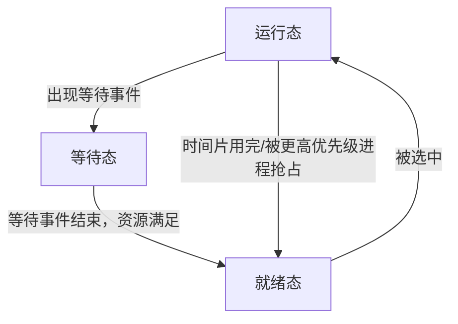
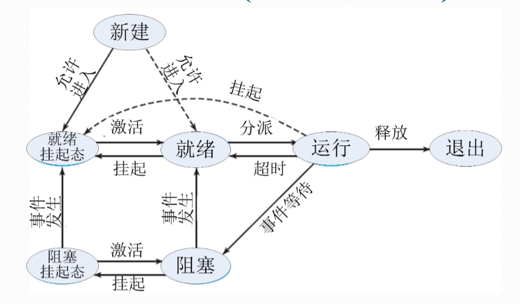
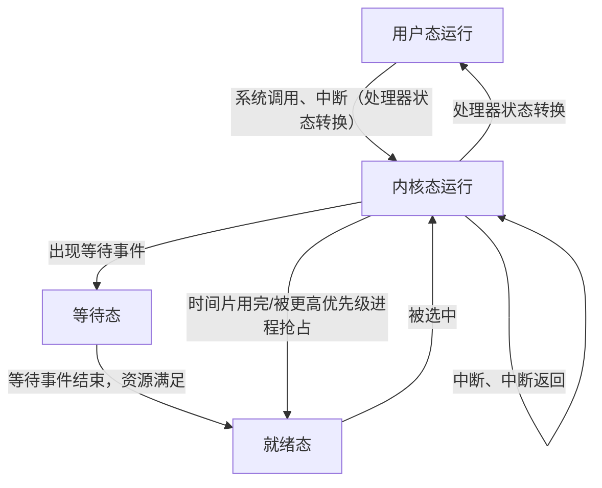
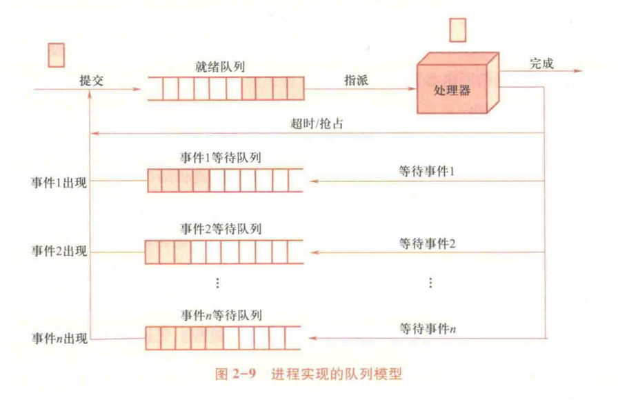

# 023-进程管理

> Copilot说：进程是正在执行的程序的一个实例，它不仅包含程序代码，还包括程序执行所需的各类资源和状态信息。
>
> ~~PPT 又在故弄玄虚，人为制造理解障碍（）~~

* 具有一定独立功能的程序关于某个数据集合的一次运行活动
* 操作系统进行资源分配和调度的一个独立单位

## 进程的形式化定义

* OS 管理运行程序的数据结构 P
* 运行程序的内存代码 C
* 运行程序的内存数据 D
* 运行程序的通用寄存器信息 R
* OS 控制程序运行的程序状态字信息 PSW

### 无关进程 & 交往进程

* 无关进程：在不同数据集上运行的进程（D1 != D2）
  * 共享代码的无关进程：在同一代码集上运行的进程（C1 == C2），共享的代码被成为**可再入程序**，是**纯代码**的
* 共享数据的交往进程：在同一数据集上运行的进程（D1 == D2）
* 两次运行同一程序为不同进程：程序和数据集均为外存级的，两者的 (P,C,D,R,PSW) 均不同

## 进程状态

* 运行态：进程占有处理器运行
* 就绪态：进程具备运行条件，等待处理器运行
* 等待态：进程不具备处理条件（等待：资源、I/O、信号）



* 等待态->就绪态，运行态->等待态都是单向的

### 进程挂起

* 挂起态：进程不在内存中，处于外存中
* 原因：资源不足、性能低/死锁
* 解决方法：剥夺某些进程的内存和资源，调入 OS 管理的对换区，不参与进程调度，适时再调入内存恢复运行
  * 也就是硬盘上的 SWAP 文件
* 和等待态的区别
  * 挂起态的进程不在内存中，未占用任何资源
  * 等待态的进程在内存中，占有已申请到的资源，处于等待
* 运行态可以进入挂起就绪态，但是挂起就绪态不能进入运行态
* 一般选择挂起就绪态进程予以恢复

<figure><figcaption><p>进程挂起状态图</p></figcaption></figure>

## 进程上下文切换和处理器状态切换



## 进程的数据描述

### 进程控制块 Process Control Block (PCB)

* 记录进程状态及环境信息的数据结构
* 标识信息
  * 进程标识：唯一标识进程信息
    * 系统分配的标识号、进程组标识号
    * 用户定义的进程名、进程组名
* 现场信息
  * 用户可见寄存器内容：数据寄存器、地址寄存器
  * 控制/状态寄存器内容：PC、IR、PSW
  * 用户/核心栈指针
* 控制信息
  * 调度相关信息：状态、等待时间/原因，优先级
  * 程序/数据地址：代码/数据地址、外存映像地址
  * 队列指引元（队列指针）：进程队列指针、父子兄弟进程指针
  * 通信相关信息：消息队列、信号量、锁
  * 处理器使用信息：占用的处理器、时间片、处理器使用时间/已执行总时间、记账信息
  * 特权信息：内存访问权限、处理器特权
  * 资源清单：正占有、已使用的资源

### 进程映像/进程的内存映像 Process Image

* 某一时刻进程的内容及其执行状态集合，内存级的物理实体
* 组成
  * PCB
  * 用户栈
  * 进程程序块
  * 进程数据块
  * 核心栈
  * 共享地址空间

### 进程上下文 Process Context

* 进程的运行环境，包括 CPU/Cache的执行信息，
* 刻画了进程的执行状况
* 组成
  * 用户级上下文：用户程序块、数据区、用户栈、用户共享内存
  * 寄存器上下文：PSW、栈指针、通用寄存器
  * 系统级上下文：PCB、内核栈、内存区表

## 进程管理程序

* 系统调用/中断/异常处理程序
* 队列管理模块
* 进程控制程序
* 进程调度程序
* 进程通信程序
* 外围程序：终端登录与作业控制程序、性能监控程序、升级程序

### 队列管理程序

* 围绕队列展开进程和资源调度
  * 就绪队列：一条
  * 等待队列：一个事件维护一条队列
* 当事件出现后，等待队列的进程可被提交到就绪队列（等待态->就绪态）
* 按需组织为先进先出队列/优先队列（优先级高的先执行）
* 通过 PCB 中的队列指针维护队列
  * 单向链表
  * 双向链表
  * 数组（索引链接）~~PPT又不讲人话~~

<figure><figcaption><p>进程实现的队列模型</p></figcaption></figure>

### 进程的控制和管理

* 原语 Primitive：不可分割的原子操作
  * 实现：关中断
* 进程控制、进程通信都需要原语

| 操作   | 行为                                           |
| ---- | -------------------------------------------- |
| 进程创建 | 增加进程表项，申请PCB并初始化，生成标识，建立映像，分配资源，移入就绪队列       |
| 进程撤销 | 从队列中移除，归还资源，撤销表示，释放 PCB，移除进程表项               |
| 进程阻塞 | 从就绪队列移除，加入等待队列，保存现场，修改 PCB，调度其他程序            |
| 进程唤醒 | 从等待队列移除，加入就绪队列，恢复现场，修改 PCB （若优先级高于运行进程则触发抢占） |
| 进程挂起 | 更改进程所在队列，修改状态，回收内存资源进入 SWAP                  |
| 进程恢复 | 从 SWAP 中调入内存，修改状态，更改进程所在队列                   |

## 进程切换

### 模式切换

* 用户态 <==> 内核态
* 正向模式切换：用户态 -> 内核态
  * 中断装置负责
  * 处理器模式转为内核态
  * 保存当前进程的 PC/PSW 到内核栈
  * 转向内核态的中断/异常/系统调用处理程序
* 逆向模式切换：内核态 -> 用户态
  * 中断返回指令负责
  * 弹出内核栈中的 PC/PSW
  * 处理器模式转为用户态

### 进程切换的发生时机

* 中断/异常/系统调用的处理过程中
* 常见情况：
  * 阻塞式系统调用/虚拟地址异常：被中断进程进入等待态
  * 时间片中断 I/O 中断：被中断进程进入就绪态
  * 终止用系统调用，不能继续执行的异常：被中断进程进入终止态

### 未引发进程切换的中断处理步骤

1. 触发正向模式切换，压入 PSW/PC
2. 保存被中断进程的现场信息
3. 处理具体中断/异常
4. 恢复被中断进程的现场信息
5. 触发逆向模式转换，弹出 PSW/PC

### 引发进程切换的中断处理步骤

1. 触发正向模式切换，压入 PSW/PC
2. 保存被中断进程的现场信息
3. 处理具体中断/异常
4. 把被中断进程的系统堆栈指针 SP 值保存到 PCB
5. 调整被中断进程的 PCB 信息，如进程状态
6. 把被中断进程的 PCB 加入相关队列
7. 选择下一个占用 CPU 运行的进程
8. 修改被选中进程的 PCB 信息，如进程状态
9. 设置被选中进程的地址空间，恢复存储管理信息
10. 恢复被选中进程的 SP 值到处理器寄存器 SP
11. 恢复被选中进程的现场信息进入处理器
12. 触发逆向模式转换，弹出 PSW/PC

> 例：运行以下程序，最多和产生多少进程？画出进程家族树
>
> ```c
> int main() {
>     fork();
>     fork();
>     fork();
>     return 0;
> }
> ```
>
> 8个进程。
>
> ```plaintext
> A
> ├── B
> │   ├── C
> │   │   └── E
> │   └── F
> ├─── D
> │    └── G
> └── H
> ```
