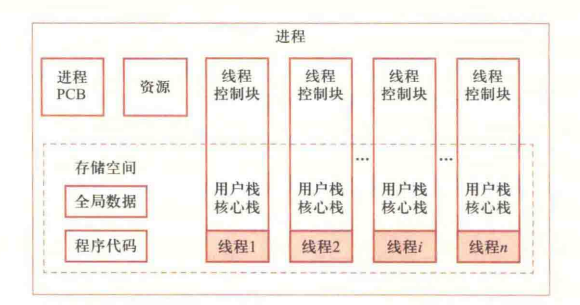
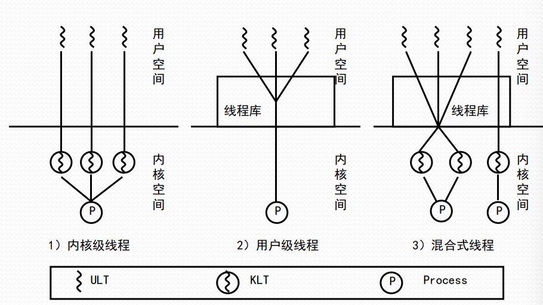
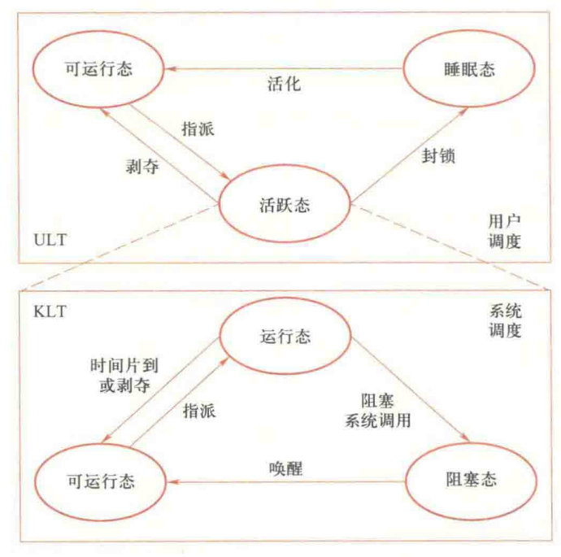

# 024-多线程

* 单线程的问题
  * 进程切换、通信开销大
  * 降低进程并发的粒度
  * 降低并行计算的效率
* 解决方法：将资源分配和调度执行解耦
  * 进程：资源分配、保护的单元，无需频繁切换
  * 线程：调度执行的基本单位，频繁切换
* 进程级别的资源：用户地址空间、进程控制块、数据区、代码区
* 线程级别的资源：线程控制块、用户栈、内核栈、上下文、PC、静态存储器……

<figure><figcaption>
多线程结构进程
</figcaption></figure>

## 线程状态

* 运行、就绪、睡眠（阻塞态）（线程无挂起，挂起是进程级别的）
* 线程操作
  * 孵化：创建线程
  * 封锁：运行态->阻塞态
  * 活化：阻塞态->就绪态
  * 剥夺（抢占）：运行态->就绪态，遇到更高级别的线程
  * 指派：就绪态->运行态，分配 CPU 资源
  * 结束：终止线程

## 线程调度

> 明明是 KLT 和 ULT 就能讲清楚的，非要在前面说个 OS 感知线程和 OS 不感知线程

### 内核级线程 Kernel-Level Thread (KLT)

* 操作系统内核直接管理、调度线程（OS 感知线程）
* 调度单位是线程
* 进程不具备传统意义的就绪、运行、阻塞，只有挂起与否的状态
* OS 提供接口给开发者使用 KLT
* 优点
  * 线程被阻塞时，内核可以调度其他线程运行
  * 多处理器系统中内核可调度进程并行
  * 内核可用多线程实现，提高效率
* 缺点：调度线程需进入内核态，开销大

### 用户级线程 User-Level Thread (ULT)

* 用户程序支持线程（OS 不感知线程）
* 调度单位是进程
* 用户自行实现线程调度
* 在用户空间运行线程库，程序通过线程库管理线程
* 优点
  * 自由度更高，用户可按需选择调度算法
  * 切换线程无需进入内核态，开销小
  * 可以在不支持线程的操作系统上实现多线程
* 缺点
  * 无法多线程并行执行
  * 阻塞一个线程会导致整个进程阻塞
* 解决方案
  * Jacketing 技术，将阻塞的系统调用替换为非阻塞的系统调用
  * 当遇到阻塞前进行检查，切换线程/传递控制权，让出 CPU

### KLT vs ULT

* ULT适用于解决逻辑并行性问题：在单核 CPU 上交替运行多个程序，模拟并行
* KLT适用于解决物理并行性问题：在多核 CPU 上真正并行程序

### 混合线程

<figure><figcaption>
混合线程
</figcaption></figure>

<figure><figcaption>
混合线程状态
</figcaption></figure>

* 在用户空间创建、调度线程
* 将线程库的多个 ULT 映射成 多个 KLT （KLT 数量小于 ULT）
* 由内核调度映射后的 KLT
* 若设计得当，调节两级线程数目可达到最佳效果
* 线程状态
  * KLT 三态：OS 负责
  * ULT 三态：用户负责
  * ULT 的活跃态绑定 KLT 的三态（ULT 活跃时，KLT 不一定运行）
  * 活跃态 ULT 运行时可激活用户调度
  * 非阻塞系统调用可使用 Jacketing 启动用户调度，调整活跃态ULT
