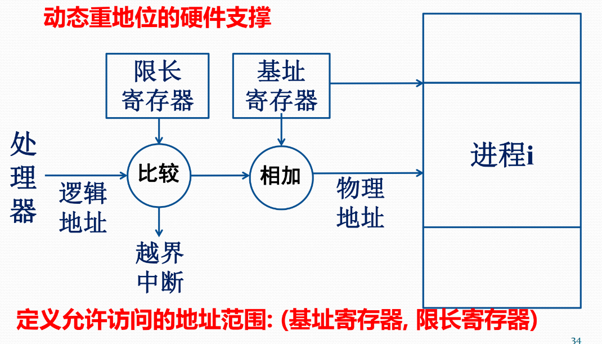
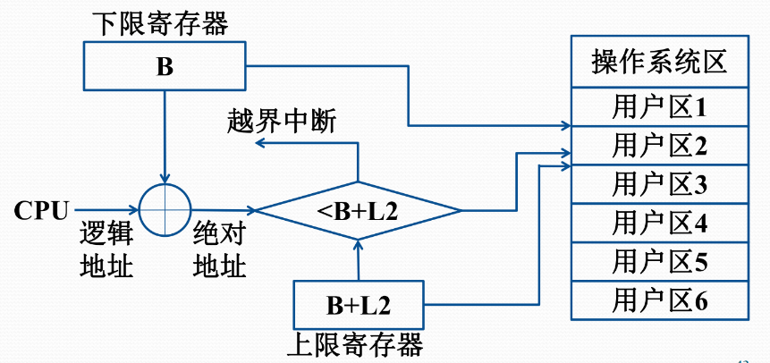

# 031-存储管理基础

## 基本概念

* 物理地址：CPU 访存时使用的地址
* 逻辑地址：相对地址，用户编程所用的地址空间
  * 一维逻辑地址
  * 二维逻辑地址：段号 + 段内地址
* 段式程序设计：将程序分为代码段、数据段、堆栈段
  * 按需调入段，节约内存，扩充主存
* 主存复用
  * 分区复用
    * 固定/可变尺寸
    * 一个程序（段）占用一个分区
    * 寻址：起始地址 + 偏移量
  * 分页
    * 固定尺寸
    * 一个程序占多个页
    * 通过页表进行映射
* 存储管理模式
  * 单连续存储管理：一维地址
  * 段式存储管理：二维地址，查段表
  * 页式存储管理：一维地址，查页表（现代操作系统多采用）
  * 段页式存储管理：二维地址，查段表和页表

## 功能

* 地址转换：逻辑地址 -> 物理地址
  * 静态重定位：在程序进入内存时转换
  * 动态重定位：在程序运行时转换
* 分配/去配
* 主存空间共享
  * 多个进程共享主存资源
  * 多个进程共享主存的某些区域
* 存储保护：防止干扰
  * 私有主存区：可读可写
  * 公共区：根据授权
  * 非本进程区：不可读写
  * 软硬件协同完成，不允许时产生**地址保护异常**，交 OS 处理
* 主存扩充
  * 交换：调出不运行的进程
  * 虚拟：只调入进程部分内容
  * 软硬件协同完成，当 CPU 访问不在主存中的地址时，产生**缺页异常**，交 OS 调入并重新执行

> - 缺页异常：访问的页面不在主存中
> - 虚拟地址异常：访问的地址不在虚拟地址空间中（越界非法访问）
> - 所以 PPT 又在扯淡

## 存储器逻辑层次

* Cache：高速存储器 + 联想存储器 + 地址转换部件 + 替换逻辑
  * 联想存储器：CAM，通过内容反查存储地址，用于 Cache 中检测命中
  * L1：内置，分离数据和指令
  * L2：内置或外置
  * L3：外置，总线改善较设置 L3 更能提升性能
* 虚拟存储器
  * 基本思想：请求分页，随用随调，主存不足时调出
  * 硬件完成的部分：动态重定位（将虚拟地址转换为物理地址）、存储保护、虚拟地址中断、页面替换

<figure><figcaption>
地址转换的硬件支撑
</figcaption></figure>

## 单连续分区存储管理

* 每个进程占用物理上完全连续的存储区域

### 单用户连续分区存储管理

* 主存划分为系统区和用户区
* 栅栏寄存器：区分两块区域，进行存储保护
* 静态重定位，硬件实现代价低
* 适用于单用户单任务操作系统（如 DOS）

## 固定分区存储管理

* 支持多个分区
* 分区数量、大小固定
* 静态重定位，硬件实现代价低
* 早期 OS 采用
* 维护主存分配表：`分区号|起始地址|长度|占用标志`

<figure><figcaption>
固定分区存储管理
</figcaption></figure>

## 可变分区存储管理

* 固定分区下内存存在浪费
* 可变分区：根据进程需求动态划分
* 创建进程时查看是否有足够的空闲分区
  * 若有：分配
  * 若无：等待释放
* 主存分配表：已分配区情况表&空闲区情况表，`起址|长度|标志`

### 内存分配算法

* 最先适应 First Fit：从头开始，找到第一个满足条件的分区
* 邻近适应 Next Fit：从上次分配的分区开始，找到第一个满足条件的分区
* 最优适应 Best Fit：从头开始，找到最小的满足条件的分区
* 最差适应 Worst Fit：从头开始，找到最大的满足条件的分区

### 内存零头

* 内存内零头：固定分区
* 内存外零头：可变分区，在分配中产生不可用的小分区
* 最优适应算法：最容易产生内存外零头
* 任何算法都可能产生内存外零头

