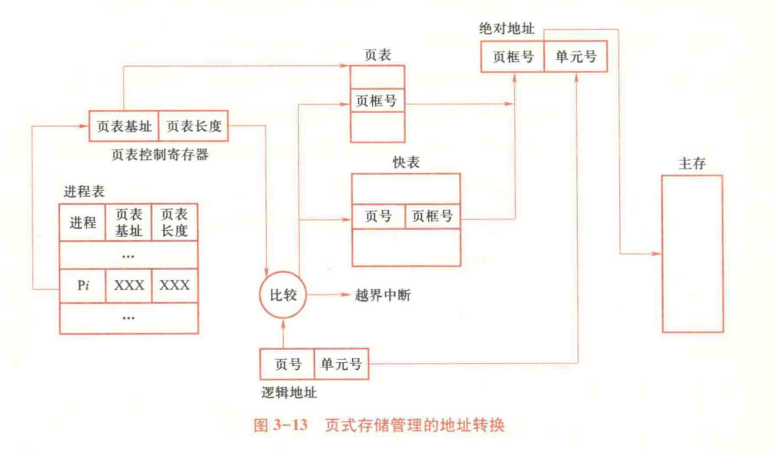
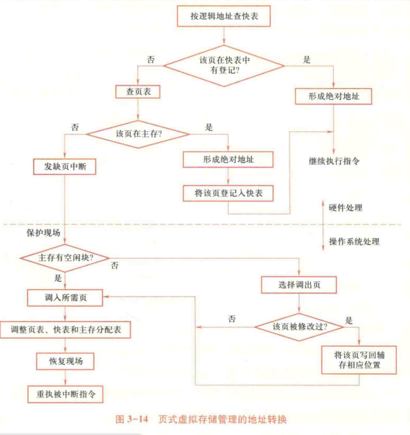

# 032-页式存储管理

* 页框：物理层面
* 页：逻辑层面，程序的地址
* 不同的页可以放在不同的页框中
* 页表：`页框号（块号）`，以页号为索引
* 虚拟地址：页号+偏移量
* 实际地址：页表映射的页框号+偏移量
* 寻址计算：把页号部分替换成页框号
* 快表：页表的 Cache（硬件层面）
  * 表项：页号、页框号
  * 使用 CAM 实现，根据内容寻址
* 进程表：`进程名|页表始址|页表长度`
* 进程占有处理器运行时，其页表起始地址和长度送入页表控制寄存器
* 使用位示图记录主存分配情况

<figure><figcaption>
页式存储管理的地址转换
</figcaption></figure>

## 页的共享

* 在页表中映射到同一个页框
  * 页表中设置适当的读写权限
* 程序共享：共享代码页，页号必须相同
* 数据共享：共享数据页，页号可以不同

## 页式虚存管理

* 基本思想：将进程的全部页面装入虚存（位于 Swap）中，动态向主存调入所需页面
* 请求页式存储管理：只把第一页信息调入主存
* 页表：`标志位|页框号|辅存地址`，以页号为索引
  * 标志位：驻留标志、写回标志、保护标志、引用标志、可移动标志
  * 辅存地址：仅限调出的页，记录调出的页在交换区中的位置
* CPU 处理地址
  * 查页表，若页驻留，获得块号、形成绝对地址
  * 若页不在内存，发出缺页中断
* OS 处理缺页中断
  * 若有空闲页框，根据辅存地址调入页，更新页表/快表
  * 若无空闲页框，决定淘汰页，调出已修改页，再直接调入并更新

<figure><figcaption>
页式虚拟存储管理的地址转换
</figcaption></figure>

## 页面调度

* 抖动：页面被频繁调入调出，产生额外开销
  * 利用局部性消除抖动
* 缺页中断率：缺页中断次数/总内存访问次数
  * 影响因素
    * 页框数：越多越好
    * 页面大小：越大越好
    * 用户编程能力：是否能利用局部性
* 根据缺页错误率，动态调整进程的页框数

### 页面置换算法

* OPT：最优置换算法，淘汰不再使用的页面后，再淘汰最远使用的页面
  * 理想算法，需事先直到未来所需的页面，无法实现
* 局部最佳置换算法
  * 设置一个时间间隔$$\tau$$
  * 每一个时刻，查看$$[t,t+\tau]$$时间段内页面是否使用，若不使用则淘汰
* 工作集：在时间段$$\Delta$$内使用的页面集合
  * 每一个时刻，查看$$[t-\Delta,t]$$时间段内页面是否使用，若不使用则淘汰
  * 通过工作集确定驻留集大小
  * 监视每个进程的工作集，只有属于工作集的页面才能留在主存；
  * 定期地从进程驻留集中删去那些不在工作集中的页面
* 仅当一个进程的工作集在主存时，进程才能执行。
* FIFO：先进先出，淘汰最早调入的页面（只考虑了顺序性）
* LRU：最近最少使用，淘汰最长时间未使用的页面（顺序+循环）
  * 实现复杂：定期中断，将 Flag 置为 0，访问时置为 1，选取 Flag 为 0 的页面随机替换
* LFU：最少使用，淘汰使用次数最少的页面（性能更好）
  * 定期中断，将计数器置为 0，访问时 +1，选取计数器最小的页面随机替换
* CLOCK：时钟算法，维护循环队列
  * 维护一个指针，指向下一个要淘汰的页面（新调入的页面位置）
  * 调入/访问时，设置标志位为 1
  * 调出页面时，开始扫描循环队列
    * 当指针指向的页面标志位为 1 时，将标志位置为 0，指针后移一格
    * 当指针指向的页面标志位为 0 时，淘汰该页面
    * 若扫描完一圈全为 1，此时所有标志位都置为 0，淘汰最初位置上的页面
    * 指针移动到淘汰页面的下一个页面

## 页的大小设计

* 页越小，零头越小，所需页框数越多，页表占用空间越多
* 硬件传输大数据块效率高 => 页大更好

## 伙伴系统

* 分配时对半分，直到分区大小满足要求
* `memmap[]`：存放页框状态
* `free_area[]`：存放空闲页框的链表数组，数组大小为 `log2(n)`，`n` 为页框数

### 基于伙伴的 slab 分配器

* 为小对象建立缓存，提高效率
* 结构：Cache、Slab、Object

## 多级页表

* 解决问题：单级页表过大，内存浪费
* 逻辑地址：`页目录|页表页|偏移`
  * 页目录：页表所在的内存地址
* 权衡：多级查询的时间开销和页表的空间开销

## 反置页表 Inverted Page Table

* 以**物理页框**为顺序建表，节省空间（行数为物理页框数）
* 表项：`进程号|页号|特征位|哈希链指针`
* 地址转换流程
  1. 根据进程标识和虚页号计算哈希值，指向 IPT 中的某个位置
  2. 遍历哈希链，匹配虚页号
  3. 若遍历完仍未找到，则缺页中断
