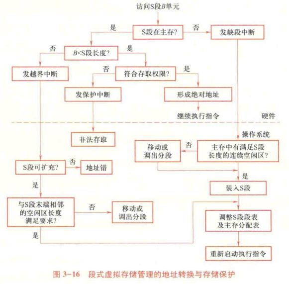

# 033-段式存储管理

* 每个程序由若干段组成，每一段从`0`开始编号
* 逻辑地址：`段号|段内地址`
* 硬件需增加用户可见的段地址寄存器（代码段、数据段、堆栈段、附加段）
* 存储管理需增加段表：`段基址|段限长|标志位`
* 段的共享：将段表中的段基址设置为同一物理地址
* 计算物理地址：`物理地址 = 段基址 + 段内地址`

## 段式虚拟存储管理

* OS 自动实现
* 扩充段表
  * 特征位：是否共享，是否在内存中
  * 存取权限：rwx
  * 扩充位：定长/可扩充
  * 标志位：是否修改、可移动

<figure><figcaption>
段式虚拟存储管理
</figcaption></figure>

* 越界：越界中断
* 存取权限不符：保护中断

## 段页式存储管理

* 将数据分段，段内再分页，页间不连续，可装入部分页
* 段表：`标志|页表长|页表基址`
* 页表：`标志|块号`

## 分段和分页的比较

| 比较维度    | 分段（Segmentation）       | 分页（Paging）                |
| ------- | ---------------------- | ------------------------- |
| 单位性质    | 逻辑单位（如代码段、数据段、栈段）      | 物理单位（与逻辑结构无关）             |
| 与程序结构关系 | 与源程序逻辑结构相关，用户可见        | 与程序结构无关，用户不可见             |
| 长度      | 段长可变，由用户或编译器决定         | 页长固定，由系统预先设定              |
| 起始地址    | 段可以从主存任意地址开始           | 页面必须从页大小的整倍数地址开始          |
| 地址结构    | 二维结构（段号，段内位移），连结后仍保持二维 | 一维结构（页号，页内位移），连结后变为线性地址结构 |
