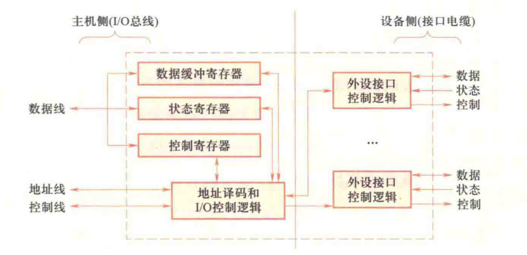
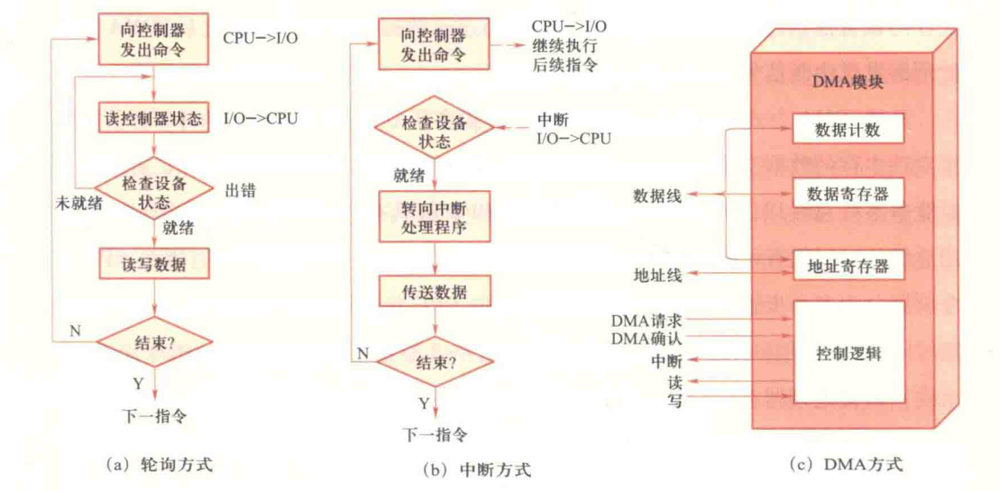

# 041-设备管理

## I/O

* I/O 设备
* I/O 操作
* I/O 设备的分类
  * 信息传输视角：输入设备、输出设备、输入输出设备
  * 交互功能视角：人机交互设备、存储设备、机机通信设备
  * 设备管理
    * 字符设备：以字符为单位进行数据传输的设备，顺序访问，鼠标、显示器
    * 块设备：以块为单位进行数据传输的设备，随机访问，硬盘、光盘
    * 网络设备：网卡、路由器
* 设备管理的目标
  * 解决设备与 CPU 之间的速度差异，提升 CPU 的利用率
  * 屏蔽设备的异构性，提供统一的接口
* 设备管理的功能：设备中断管理、缓冲区管理、设备分配/去配、设备驱动调度、虚拟设备实现
* 设备管理实现层次
  * I/O 硬件：设备、接口线路、控制部件、通道
  * I/O 软件：系统、用户

### 设备控制器

* 设备：机械部件（设备本身）+ 电子部件（控制器）
* 系统（CPU）与控制器交互，不直接与设备交互
* 控制器控制设备
* 功能
  * 接受/识别 CPU 或通道发来的命令
  * 实现数据交换
  * 发现/记录设备及自身的状态信息，供系统查询（CrystalDiskInfo）
  * 连接多台设备时，识别设备地址

<figure><figcaption>
设备控制器的组成
</figcaption></figure>

* 设备侧的外设接口
  * 数据：双向
  * 状态：设备 -> 控制器
  * 控制：控制器 -> 设备
* 主机侧
  * 数据缓冲寄存器 & 状态/控制寄存器 <-> 数据线
  * 地址译码和 I/O 控制逻辑 <-> 地址线 控制线

## I/O 控制方式

<figure><figcaption>
I/O 控制方式
</figcaption></figure>

### 轮询

1. 处理器向控制器发送 I/O 命令，轮询结果
2. 若未就绪则重复测试，直至就绪
3. 执行内存数据交换
4. 待 I/O 完成后，处理器继续其他操作

### 中断：减少 CPU 等待 I/O 的时间

1. 处理器向控制器发送 I/O 命令
   * 若进程支持异步 I/O，则继续执行该进程其他指令
   * 否则将进程在该中断上挂起，处理器执行其他工作
2. 控制器检查设备状态，就绪后发出中断
3. CPU 响应中断，进行中断处理
4. 中断处理程序执行内存数据交换

### DMA：减轻 CPU 处理 I/O 的负担

1. 处理器向 DMA 控制器发送 I/O 命令
2. 处理器继续执行其他指令，DMA 模块传送全部数据
3. 数据传送结束后，DMA 中断处理器


周期窃取

CPU 将总线的占有权交给 DMA 控制器几个周期，进行访存

影响不大：CPU 访存次数少，和 Cache 交换多


| 控制方式 | CPU 等待 | 数据经过CPU |
| ---- | ------ | ------- |
| 轮询   | 是      | 是       |
| 中断   | 否      | 是       |
| DMA  | 否      | 否       |

### I/O 通道

> 出现于 1950s 的大型机（PPT 太古早了），复杂度较 DMA 更高，可并行处理多个 I/O 任务

* 四级连接：CPU -> I/O 通道 -> 控制器 -> 设备
* 工作流程
  1. 启动：CPU 遇 I/O 任务时组织通道程序，将其地址写入通道程序地址字 CAW，启动通道
  2. 执行：通道从 CAW 获取程序，进行 I/O 操作，CPU 继续执行其他任务
  3. 完成：通道完成 I/O 操作后，向 CPU 发送中断请求，从通道程序状态字 CSW 中获取执行情况，处理 I/O 操作

## 总线

### 单总线结构模型

* 将 CPU、内存、I/O 设备连接在同一条总线上
* 优点：结构简单
* 缺点：慢速设备挤占带宽

### 三级总线模型

* 局部总线：CPU、Cache、局部 I/O 控制器
* 主存总线：Cache、主存、拓展总线接口
* 拓展总线：拓展总线接口、各类设备
* 优点：分离 CPU 访存和设备访问
* 缺点：不适用于 I/O 设备速率相差太大的情形

### 南桥/北桥

> ppt 上面的太老了，现在都没北桥了
>
> 大学四年就被这些内容浪费，希望学弟学妹们能找到点好用的自学课程吧。。。

* 北桥：连接CPU、主存、显卡
* 南桥：连接 I/O 设备

### 基于通道的服务器总线模型

* 四级连接：CPU -> I/O 通道 -> 控制器 -> 设备
* 树状结构，下层节点的设备进行传输无需经过上层设备

## I/O 软件

| 层次            | 功能说明                              |
| ------------- | --------------------------------- |
| 用户空间的 I/O 软件  | I/O 系统调用，I/O 格式化，SPOOLing         |
| 独立于设备的 I/O 软件 | 设备的命名、保护、阻塞、缓冲、分配、跟踪              |
| I/O 设备驱动程序    | 设备寄存器初始化，启动 I/O 操作，检查 I/O 状态      |
| I/O 中断处理程序    | 处理 I/O 中断，报告 I/O 错误，唤醒 I/O 设备驱动程序 |
| I/O 硬件        | 执行 I/O 操作                         |

* 设计目标：高效率、通用性
* 要考虑的问题
  * 设备无关性
  * 错误处理
  * 传输模式
    * 同步：阻塞进程，等待 I/O 完成
    * 异步：中断驱动
  * 缓冲技术
* I/O 软件的层次结构：请求由高向低，应答由低向高
  * 用户空间 I/O 软件：库函数、虚拟设备软件、系统调用、I/O 格式化、Spooling
  * 独立于设备的 I/O 软件（与设备种类、型号无关）
    * 设备命名：通过路径名寻址设备
    * 设备保护：权限控制
    * 提供与设备无关的数据单位：字符/块
    * 缓冲技术
    * 分配/状态跟踪
    * 错误管理 & 报告
  * I/O 设备驱动程序：与设备密切相关的部分，将逻辑请求转化为物理操作
    * 设备初始化
    * 启动 I/O 操作，组织通道程序，启动通道工作
    * 检查 I/O 状态，处理中断，纠错
    * 层次化：高层（类设备），低层（具体设备），建立栈进行调用
  * I/O 中断处理程序：与硬件相关，在数据完成传输，产生中断后转入此地
    * 检查寄存器，判断中断原因
      * 若出错：向上层软件报告出错信息，重新执行
      * 正常结束：唤醒等待传输的进程，使其转为就绪态
      * 若有等待传输的 I/O 命令，继续启动下一个 I/O 请求
  * I/O 硬件

### I/O 操作执行步骤

1. 进程对已打开文件的文件描述符执行`read`或`write`库函数
2. 独立于设备的 I/O 软件检查 Cache 中是否存在信息
   * 若存在则直接返回
   * 若不存在执行物理 I/O，将设备逻辑名转为物理名，检查权限，排队 I/O 请求，阻塞进程等待 I/O 完成
3. 内核启动驱动程序，分配读出块的缓冲区，准备接收数据，向设备控制寄存器发启动命令/建立 DMA 传输，启动 I/O 操作
4. 设备控制器操作设备，执行数据传输/ DMA 操作完成，向 CPU 发送中断请求
5. CPU 响应中断，执行中断处理程序，待应用进程调起时继续执行

### I/O 缓冲

* 内存中开辟的缓冲区，存放临时数据，读写均经由缓冲区
* 作用：提高效率、减少中断次数，屏蔽设备速度差异，提高并行性……
* 分类
  * 单缓冲：当用户进程和设备无法同时操作缓冲区
  * 双缓冲：两个缓冲区，相同时间内硬件和用户进程各和一个缓冲区交互，待数据传输后切换
  * 循环缓冲：多个缓冲区，每个缓冲区有指向下一个缓冲区的指针，形成环形队列
