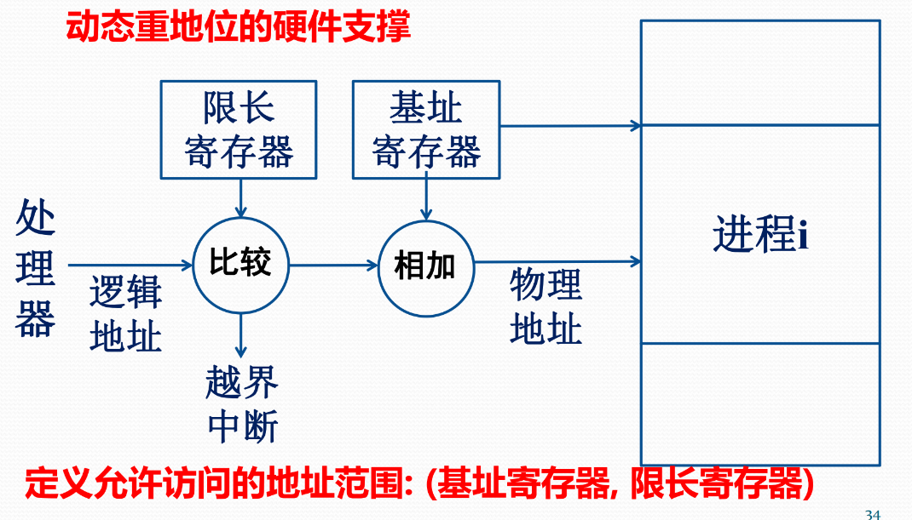
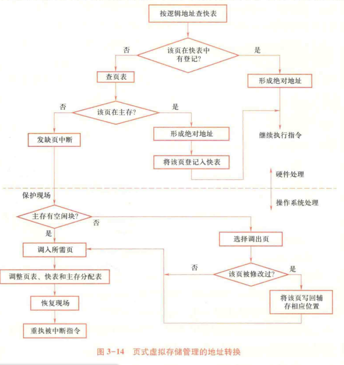
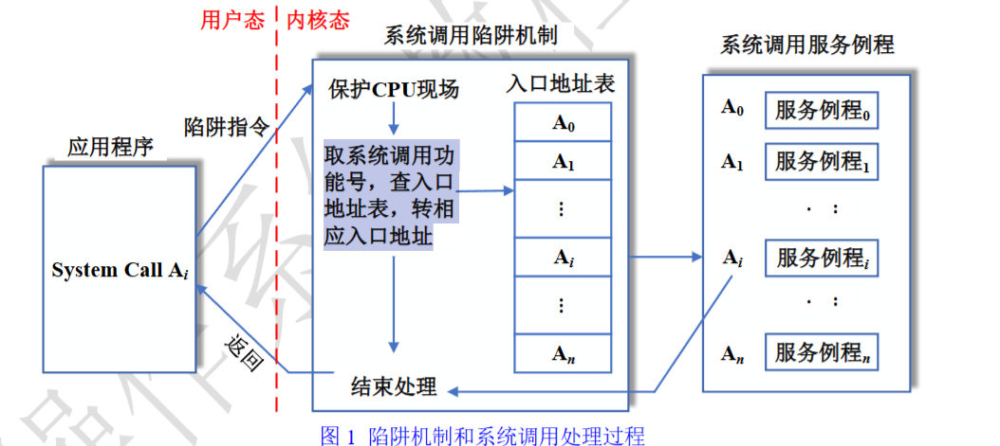
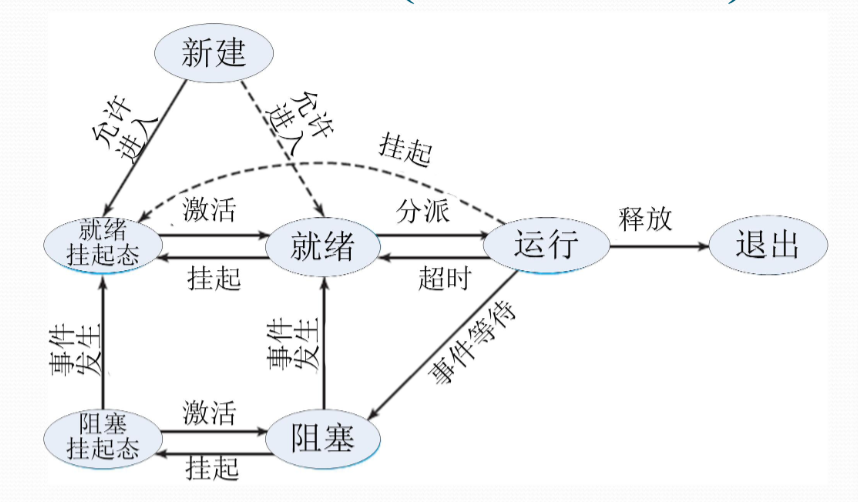

# 90-期末复习

## OS 基础知识

### 实时 & 分时

* 多道批处理操作系统：脱机控制方式
* 分时操作系统：多个用户可以同时使用计算机，每个用户分配一个时间片
* 实时操作系统：计算机对输入信息进行即时处理，并在严格的时间约束下给出结果
* Unix Windows 是分时操作系统

### 内核

* 单内核：内核中各部件混居，广泛使用，Windows、Linux
* 微内核：结构性部件和功能性部件分离
* 混合内核：单内核和微内核的折中，将组件移入核心态获取更快的性能
* 外内核：将操作系统的管理功能最小化，尽可能地将资源管理权交给用户级应用程序

## 进程

* 程序状态字（PSW）：当前程序的状态，包含条件码、当前程序计数器、当前处理器模式、当前中断屏蔽位等信息
* 系统调用在内核态执行
  * 用户态/用户空间/目态：用户程序运行
  * 内核态/核心空间/管态：操作系统运行
  * 操作系统是**中断驱动**的：中断是激活操作系统的唯一方式
* 实现机制：陷入处理机制
  * 使用陷入指令，含有编号，寄存器内有参数
  * 用户态程序执行系统调用时，CPU 产生中断，进入内核态
  * 内核态执行系统调用，完成后返回用户态
  * 实现要点
    * 编写系统调用处理程序
    * 维护系统调用入口地址表：包含处理程序的入口地址、参数个数，**表驱动机制**
    * 开辟现场保护区：保护用户态程序的现场

## 中断

### 中断分类

| 类型   | 定义         | 示例                 |
| ---- | ---------- | ------------------ |
| 狭义中断 | 处理器外的中断事件  | I/O 中断、时钟中断、外部信号中断 |
| 异常   | 执行指令引起的中断  | 地址异常、算术异常、硬件异常     |
| 系统调用 | 触发系统调用引起中断 | 请求设备、请求 I/O、创建进程   |

### 中断响应过程

1. 发现中断源
2. 中断当前程序执行，置中断码，保存 PSW/PC 到核心栈
3. 切换到内核态，调出中断处理程序的 PSW/PC，转向中断处理程序（操作系统执行）
   * **保护中断现场**
   * **分析中断源**
   * **处理中断**：查中断向量表、执行中断处理子程序
   * 根据需要创建处理中断事件的进程，调整进程队列并调度
4. 调用中断返回指令，从内核态变为用户态，继续运行进程

## 线程调度

* 将资源分配和调度执行解耦
  * 进程：资源分配、保护的单元，无需频繁切换
  * 线程：调度执行的基本单位，频繁切换
* 进程级别的资源：用户地址空间、进程控制块、数据区、代码区
* 线程级别的资源：线程控制块、用户栈、内核栈、上下文、PC、静态存储器……

### 内核级线程 Kernel-Level Thread (KLT)

* 操作系统内核直接管理、调度线程（OS 感知线程）
* 调度单位是线程
* 进程不具备传统意义的就绪、运行、阻塞，只有挂起与否的状态

### 用户级线程 User-Level Thread (ULT)

* 用户程序支持线程（OS 不感知线程）
* 调度单位是进程
* 用户自行实现线程调度
* 在用户空间运行线程库，程序通过线程库管理线程

### KLT vs ULT

* ULT适用于解决逻辑并行性问题：在单核 CPU 上交替运行多个程序，模拟并行
* KLT适用于解决物理并行性问题：在多核 CPU 上真正并行程序
* Solaris 多线程实现方式：混合式

### 调度算法


* 同时支持 x 道程序指的是多少个程序能进入可以抢占的队列中，一次还是只能执行一个
* 作业周转时间=完成时间-提交时间（不是开始执行时间）
* 时间片轮转中若进程提前结束，则不需要等待时间片到达，直接切换


* 非抢占式
  * FCFS 先来先服务
  * SPN 最短进程优先
  * HRRN 响应比高者优先，响应比 = (等待时间 + 估计服务时间) / 估计服务时间
* 抢占式
  * SRT 最短剩余时间优先，每个时间片后，选择剩余时间最短的进程执行
  * RR 时间片轮转调度算法
    * 每个进程有占用时间上限，超过时间片需让出 CPU
    * CPU 在时间片到达时产生中断，将正在执行的进程放回就绪队列（该进程的入队时间变成当前时间），基于 **FCFS** 调度下一个进程
  * Feedback 分级调度算法/多级反馈调度
    * 根据优先级建立多级队列，高优先级队列时间片短
    * 步骤
      * 进程第一次进入就绪队列时，分配高优先级队列
      * 当被抢占，返回就绪态后，降低一级优先级
      * 基于 **FCFS** 和队列优先级调度下一个进程
    * 短进程会在高优先级队列中很快执行

## 存储管理

<figure><figcaption>
地址转换的硬件支撑
</figcaption></figure>

### 页的共享

* 在页表中映射到同一个页框
  * 页表中设置适当的读写权限
* 程序共享：共享代码页，页号必须相同
* 数据共享：共享数据页，页号可以不同

### 页式虚存管理

* 基本思想：将进程的全部页面装入虚存（位于 Swap）中，动态向主存调入所需页面
* 请求页式存储管理：只把第一页信息调入主存
* 页表：`标志位|页框号|辅存地址`，以页号为索引
  * 标志位：驻留标志、写回标志、保护标志、引用标志、可移动标志
  * 辅存地址：仅限调出的页，记录调出的页在交换区中的位置

<figure><figcaption>
页式虚拟存储管理的地址转换
</figcaption></figure>

### 内存分配算法

* 最先适应 First Fit：从头开始，找到第一个满足条件的分区
* 邻近适应 Next Fit：从上次分配的分区开始，找到第一个满足条件的分区
* 最优适应 Best Fit：从头开始，找到最小的满足条件的分区
* 最差适应 Worst Fit：从头开始，找到最大的满足条件的分区

### 页面调度

* 抖动：页面被频繁调入调出，产生额外开销
* 缺页中断率：缺页中断次数/总内存访问次数

### 页面置换算法

* OPT：最优置换算法，淘汰不再使用的页面后，再淘汰最远使用的页面
  * 理想算法，需事先直到未来所需的页面，无法实现
* 局部最佳置换算法
  * 设置一个时间间隔$$\tau$$
  * 每一个时刻，查看$$[t,t+\tau]$$时间段内页面是否使用，若不使用则淘汰
* 工作集：在时间段$$\Delta$$内使用的页面集合
  * 每一个时刻，查看$$[t-\Delta,t]$$时间段内页面是否使用，若不使用则淘汰
* 仅当一个进程的工作集在主存时，进程才能执行。
* FIFO：先进先出，淘汰最早调入的页面（只考虑了顺序性）**产生 Belady 异常**
* LRU：最近最少使用，淘汰最长时间未使用的页面（顺序+循环）
* LFU：最少使用，淘汰使用次数最少的页面（性能更好）
* CLOCK：时钟算法，维护循环队列
  * 维护一个指针，指向下一个要淘汰的页面（新调入的页面位置）
  * 调入/访问时，设置标志位为 1
  * 调出页面时，开始扫描循环队列
    * **当指针指向的页面标志位为 1 时，将标志位置为 0，指针后移一格**
    * 当指针指向的页面标志位为 0 时，淘汰该页面
    * 若扫描完一圈全为 1，此时所有标志位都置为 0，淘汰最初位置上的页面
    * 指针移动到淘汰页面的下一个页面

### 多级页表

* 解决问题：单级页表过大，内存浪费
* 逻辑地址：`页目录|页表页|偏移`
  * 页目录：页表所在的内存地址

### 反置页表 Inverted Page Table

* 以**物理页框**为顺序建表，节省空间（行数为物理页框数）
* 表项：`进程号|页号|特征位|哈希链指针`
* 地址转换流程
  1. 根据进程标识和虚页号计算哈希值，指向 IPT 中的某个位置
  2. 遍历哈希链，匹配虚页号
  3. 若遍历完仍未找到，则缺页中断

## 设备管理

### 分类

* 字符设备：以字符为单位进行数据传输的设备，顺序访问，鼠标、显示器
* 块设备：以块为单位进行数据传输的设备，随机访问，硬盘、光盘
* 网络设备：网卡、路由器

### I/O 控制方式

#### 轮询

1. 处理器向控制器发送 I/O 命令，轮询结果
2. 若未就绪则重复测试，直至就绪
3. 执行内存数据交换
4. 待 I/O 完成后，处理器继续其他操作

#### 中断：减少 CPU 等待 I/O 的时间

1. 处理器向控制器发送 I/O 命令
2. 控制器检查设备状态，就绪后发出中断
3. CPU 响应中断，进行中断处理
4. 中断处理程序执行内存数据交换

#### DMA：减轻 CPU 处理 I/O 的负担

1. 处理器向 DMA 控制器发送 I/O 命令
2. 处理器继续执行其他指令，DMA 模块传送全部数据
3. 数据传送结束后，DMA 中断处理器


周期窃取\
CPU 将总线的占有权交给 DMA 控制器几个周期，进行访存\
影响不大：CPU 访存次数少，和 Cache 交换多


| 控制方式 | CPU 等待 | 数据经过CPU |
| ---- | ------ | ------- |
| 轮询   | 是      | 是       |
| 中断   | 否      | 是       |
| DMA  | 否      | 否       |

### I/O 缓冲

* 内存中开辟的缓冲区，存放临时数据，读写均经由缓冲区
* 分类
  * 单缓冲：当用户进程和设备无法同时操作缓冲区
  * 双缓冲：两个缓冲区，相同时间内硬件和用户进程各和一个缓冲区交互，待数据传输后切换
  * 循环缓冲：多个缓冲区，每个缓冲区有指向下一个缓冲区的指针，形成环形队列

### 磁盘

* 盘片 -> 盘面 -> 磁道 -> 扇区
* 一张盘片两个盘面
* 柱面：不同盘片位于相同位置的磁道
* 簇：相邻的扇区
* 物理块地址
  * 柱面号 + 磁头号 + 扇区号
  * 盘面号 + 磁道号 + 扇区号
* 读写方式：寻道（移臂） -> 旋转 -> 读写

#### 移臂调度算法

* 先进先出：移臂距离大，性能不好
* 优先级：与硬件本身无关，操作系统定义
* 后进先出：提高吞吐量，利用局部性，但可能导致饥饿
* 最短寻道时间优先：性能好，但可能导致饥饿
* 扫描
  * C-SCAN 单向扫描：沿一个方向扫描到底，随后回到另一端继续扫描，折返时不提供服务
  * SCAN 双向扫描：沿一个方向扫描到底，折返后扫描到另一端
  * N-step 扫描：将请求分为多组**长度为 N** 的队列，每次处理一组队列，处理队列时的其他请求加入另一个队列（`N=1`时退化为 FIFO）
  * FSCAN：将请求分为两组，处理一组时将请求加入另一组，交替处理
* 电梯：不在末端折返，前方无访问请求即可折返，双向扫描
* 旋转调度：优化 I/O 请求的排序，减少旋转圈数

### SPOOLing

* 虚拟设备
  * 使用一类物理设备模拟另一类物理设备的技术
  * 通常是使用共享型外围设备模拟独占型外围设备
* 解决问题：慢速设备和快速设备之间交换信息时的速度差异
* 方案：使用磁盘作为井（一种 Buffer），交换的数据都经过磁盘中转
* 软件组成
  * 预输入程序：输入设备 -> 输入井
  * 缓输出程序：输出井 -> 输出设备
  * 井管理程序：控制进程和 Buffer 之间的交换

### 计算题

* 装入主存时间：有空闲位置，且磁带机数量足够就能装入，根据顺序（先来先服务，响应比等）装入尽可能多的进程
* 磁带机数量不足时，转入所需磁带机数量少的任务

## 文件

### 文件存储

* 卷：存储介质的物理单位，一盘磁带、一个磁盘分区
* 块：介质上连续信息组成的区域，也叫做物理记录，主存和外存**以块为单位**交换信息
* 顺序存取：严格按照信息的物理位置进行定位、存取，磁带，光盘
* 直接/随机存取：定位信息的时间不依赖于物理位置，磁盘

### 文件的逻辑结构

* 流式文件：无结构，无固定分界，通过长度/分界符读取信息
* 记录文件：有结构，以记录为基本单位

### 文件的物理结构

| 结构种类 | 定义                  | 优点         | 缺点          |
| ---- | ------------------- | ---------- | ----------- |
| 顺序文件 | 物理记录按顺序存储           | 存取速度快      | 修改、插入、增加困难  |
| 连接文件 | 物理记录不连续，块末有连接字指向下一块 | 插入、删除、修改方便 | 存取速度慢，连接字开销 |
| 直接文件 | 根据关键字 Hash 计算物理地址   | 存取速度快      | 冲突处理复杂      |

### inode & dentry

* inode：`inode号|文件类型|权限|拥有者|大小|数据块地址指针|创建/修改时间|inode引用数|所在设备|...`
* dentry 目录项：`文件名|inode号`

### 用户打开文件表

* 用户&进程级，记录当前进程的文件，位于`PCB`中
* 表项：`文件描述符`，指向系统打开文件表内的对应表项
* 文件描述符为`int`类型，实现按号存取

### 系统打开文件表

* 内核级，记录系统中所有已打开的文件
* 表项：`文件指针|偏移量|f_count|访问模式|inode表指针`

### 活动 inode 表

* 内存区开辟，硬盘目录项的 Cache
* 若访问文件时，inode不在内存中，在活动表中开辟一个 inode 结构，读入磁盘中的 inode
* 关闭文件时：释放 inode 结构，写回磁盘
* 多用户同时使用文件：对当前使用用户数进行引用计数，若为 0 则写回
* 路径解析、`ls`、`stat` 会加载 inode，此时用户打开文件表无信息，只有活动 inode 表有信息

### 总体关系

* 文件描述符 `fd` -> 用户打开文件表项 -> 系统打开文件表项 -> 活动 inode 表项 -> 磁盘上的 inode 表项 -> 物理块

### 文件的动态共享

* 每个进程分别设置读、写指针

### 虚拟文件系统

* 屏蔽不同文件系统，本地/远程文件系统的差异，统一接口
* 层次
  * 应用层：系统调用，`open()`、`read()`、`write()`、`close()`
  * 虚拟层：虚拟文件系统，`sys_open()`、`sys_read()`、`sys_write()`、`sys_close()`
  * 实现层：具体的文件系统实现

## 并发

### 进程通信

* 直接通信：发送双方必须知道彼此
  * 发送者 -> 内核 -> 接收者
  * `send(P, msg)`：向进程 `P` 发送消息 `msg`
  * `receive(P, msg)`：从进程 `P` 接收消息 `msg`
* 间接通信：发送双方只需共用同一队列即可
  * 发送者 -> 内核 -> 消息队列 -> 接收者
  * `send(Q, msg)`：向消息队列 `Q` 发送消息 `msg`
  * `receive(Q, msg)`：从消息队列 `Q` 接收消息 `msg`

### 死锁的条件

* 互斥：系统中存在临界资源
* 占有且等待：一个进程持有资源并等待其他资源
* 不剥夺/不可抢占：资源不能被强制剥夺
* 循环等待：存在一个进程等待链，链中每个进程都在等待下一个进程持有的资源

### 银行家算法

* 核心思想：仅当剩余资源足够满足所有进程的最大需求时，才允许新进程进入系统
* 画表：`CurrentAvil|Cki-Aki|Alloc|CurAvil+Alloc|Possible`

## 选择题错题

### 进程

* 实时操作系统必须在**规定时间**内处理外部事件
* 多道程序设计的前提是**中断功能**
* 进程被唤醒意味着进程变为就绪状态
* 进程是指令的集合：错误
* 并发性指的是若干进程在同已时间间隔内发生
* 创建进程后，分配 CPU 不是必须的（可能在等待队列中）
* 引入线程的操作系统中，资源分配的基本单位是**进程**，调度的基本单位是**线程**
* 可重入程序是线程安全或中断安全的：
  * 多个线程或多个进程可以同时调用它，而不会互相干扰；
  * 在执行过程中如果被中断（比如进入一个中断服务程序），中断返回后能继续正常执行。
  * 不依赖共享的、可变的全局数据；
  * 不修改自身代码（即代码段是只读的）；
  * 使用的局部数据存储在栈中或寄存器中；
  * 调用时不会保存状态在共享区域中。
* Solaris 多线程实现方式：混合式

### 存储

* 静态重定位的时机：程序装入时
* 能装入任何位置的代码程序必须是**可动态链接的**
* 交换技术的目的：减少程序占用的主存空间
* 分段不会产生内部碎片，分页不会产生外部碎片
* 缺页中断后，跳到**被中断的指令**
* 缺页中断属于**I/O中断**（wtf！？）
* LRU：在最近的过去很久未使用的在最近的将来也不会使用;
* Clock 算法中访问时也要置为 1

### I/O

* 通道实现内存和外设的数据传输，绕开 CPU，硬件机制
* 实现多个进程 I/O 用缓冲池
* I/O 中断可能指数据传输结束/设备出错
* 大多数低速设备属于独享设备
* Spooling 中磁盘用以代替打印机的部分是虚拟设备
* 设备驱动程序把逻辑 I/O 转换为物理 I/O

### 文件

* inode 存放文件索引结构
* 目录项实现按名存取
* 注意物理文件和逻辑文件的概念差别
* 索引结构具有直接读写文件任意记录的能力
* 文件使用目录组织，按路径区分
* 无结构文件指的是**流式文件**

## 往年题背诵

### Feedback 算法

> 多级反馈队列的模型图、阐述多级反馈的原理，比RR的优点、缺陷、以及改进方法 2021/2022

* 原理
  * 建立多个优先级队列
  * 高优先级队列时间片短，低优先级队列时间片长
  * 当进程被抢占后，降级至下一队列
* 优点
  * 支持优先级动态调整，响应更灵活；
  * 短任务响应更快
* 缺点
  * 实现复杂
  * 优先级低的任务可能会产生饥饿
* 改进方法
  * 设置动态提升机制
  * 历史行为预测

### 文件操作

| 操作             | 参数                                   | 流程                                                                                                                                                                                                                                 | 备注                                          |
| -------------- | ------------------------------------ | ---------------------------------------------------------------------------------------------------------------------------------------------------------------------------------------------------------------------------------- | ------------------------------------------- |
| 建立文件           | 文件名、设备类/号、文件属性、存取控制信息                | 
为新文件分配索引节点和活动索引节点，并把索引节点编号与文件分量名组成新目录项，记到目录中。 在新文件所对应的活动索引节点中置初值，如置存取权限<code>i_mode</code>，连接计数<code>i_nlink</code>等。 分配用户打开文件表项和系统打开文件表项，置表项初值，读写位移<code>f_offset</code>清零。 把各表项及文件对应的活动索引节点用指针连接起来，把文件描述字返回给调用者。
 | `int create(char *filename, int mode)`      |
| 撤销文件（删除）       | 文件名，设备类/号                            | 
在目录文件中删去相应目录项； 将引用计数减1，若减为0则释放文件占用的文件存储空间
                                                                                                                                                                                | `int delete(char *filename)`                |
| 打开文件           | 文件名，设备类/号，打开方式                       | 
检查目录，把外存索引节点复制到 活动 inode表 检查权限 分配并初始化用户打开文件表项、系统打开文件表项 返回文件描述符
                                                                                                                                                     | `int open(char *filename, int mode)`        |
| 关闭文件           | 文件句柄                                 | 
根据<code>fd</code>找到用户打开文件表项，再找到系统打开文件表项，释放用户打开文件表项 在 活动 inode 表 中将对应的<code>i_count</code>减 1，若减为 0 则写回并释放 inode； 在系统打开文件表将对应的<code>f_count</code>减 1，若减为 0 则释放表项，完成“延迟写”; 若目录项修改则写入目录文件
                            | `void close(int fd)`                        |
| 读取文件           | 文件句柄，用户数据区地址，长度                      | 
检查权限； 将逻辑地址转换为物理地址，根据<code>f_offset</code>和<code>len</code>找到读入位置 从磁盘读数据到内核缓冲区； 将数据从内核缓冲区复制到用户数据区并返回结果
                                                                                                             | `int read(int fd, char *buf, int len)`      |
| 写入文件           | 文件句柄，用户数据区地址，长度                      | 
检查权限； 将逻辑地址转换为物理地址，根据<code>f_offset</code>和<code>len</code>找到写入位置 将数据从用户数据区复制到内核缓冲区； 将数据从内核缓冲区写入磁盘
                                                                                                                 | `int write(int fd, char *buf, int len)`     |
| 定位文件（调整读写指针位置） | 文件句柄，偏移量，`whence`：0-从文件头开始，1-从当前位置开始 | 根据偏移量调整读写指针位置                                                                                                                                                                                                                      | `int lseek(int fd, int offset, int whence)` |

### 系统调用

> 试述系统调用的实现原理，陷阱机制和绘制系统调用的处理过程，并阐述系统调用的处理逻辑 2020 作业1

* 由于系统调用而引起处理器中断的机器指令称为陷入指令，在用户态下执行时会产生 CPU 模式切换，即由用户态转换到内核态。

#### 实现要点

* 一是编写系统调用服务例程；
* 二是设计系统调用入口地址表，每个入口地址都指向一个系统调用的服务例程，有些还包含系统调用自带参数的个数；
* 三是陷阱处理机制，需要开辟现场保护区，以保存发生系统调用时应用程序的处理器现场。

#### 系统调用处理流程

### Feedback 算法

> 多级反馈队列的模型图、阐述多级反馈的原理，比RR的优点、缺陷、以及改进方法 2021/2022

* 原理
  * 建立多个优先级队列
  * 高优先级队列时间片短，低优先级队列时间片长
  * 当进程被抢占后，降级至下一队列
* 优点
  * 支持优先级动态调整，响应更灵活；
  * 短任务响应更快
* 缺点
  * 实现复杂
  * 优先级低的任务可能会产生饥饿
* 改进方法
  * 设置动态提升机制
  * 历史行为预测

### 文件操作

| 操作             | 参数                                   | 流程                                                                                                                                                                                                                                 | 备注                                          |
| -------------- | ------------------------------------ | ---------------------------------------------------------------------------------------------------------------------------------------------------------------------------------------------------------------------------------- | ------------------------------------------- |
| 建立文件           | 文件名、设备类/号、文件属性、存取控制信息                | 
为新文件分配索引节点和活动索引节点，并把索引节点编号与文件分量名组成新目录项，记到目录中。 在新文件所对应的活动索引节点中置初值，如置存取权限<code>i_mode</code>，连接计数<code>i_nlink</code>等。 分配用户打开文件表项和系统打开文件表项，置表项初值，读写位移<code>f_offset</code>清零。 把各表项及文件对应的活动索引节点用指针连接起来，把文件描述字返回给调用者。
 | `int create(char *filename, int mode)`      |
| 撤销文件（删除）       | 文件名，设备类/号                            | 
在目录文件中删去相应目录项； 将引用计数减1，若减为0则释放文件占用的文件存储空间
                                                                                                                                                                                | `int delete(char *filename)`                |
| 打开文件           | 文件名，设备类/号，打开方式                       | 
检查目录，把外存索引节点复制到 活动 inode表 检查权限 分配并初始化用户打开文件表项、系统打开文件表项 返回文件描述符
                                                                                                                                                     | `int open(char *filename, int mode)`        |
| 关闭文件           | 文件句柄                                 | 
根据<code>fd</code>找到用户打开文件表项，再找到系统打开文件表项，释放用户打开文件表项 在 活动 inode 表 中将对应的<code>i_count</code>减 1，若减为 0 则写回并释放 inode； 在系统打开文件表将对应的<code>f_count</code>减 1，若减为 0 则释放表项，完成“延迟写”; 若目录项修改则写入目录文件
                            | `void close(int fd)`                        |
| 读取文件           | 文件句柄，用户数据区地址，长度                      | 
检查权限； 将逻辑地址转换为物理地址，根据<code>f_offset</code>和<code>len</code>找到读入位置 从磁盘读数据到内核缓冲区； 将数据从内核缓冲区复制到用户数据区并返回结果
                                                                                                             | `int read(int fd, char *buf, int len)`      |
| 写入文件           | 文件句柄，用户数据区地址，长度                      | 
检查权限； 将逻辑地址转换为物理地址，根据<code>f_offset</code>和<code>len</code>找到写入位置 将数据从用户数据区复制到内核缓冲区； 将数据从内核缓冲区写入磁盘
                                                                                                                 | `int write(int fd, char *buf, int len)`     |
| 定位文件（调整读写指针位置） | 文件句柄，偏移量，`whence`：0-从文件头开始，1-从当前位置开始 | 根据偏移量调整读写指针位置                                                                                                                                                                                                                      | `int lseek(int fd, int offset, int whence)` |

### 系统调用

> 试述系统调用的实现原理，陷阱机制和绘制系统调用的处理过程，并阐述系统调用的处理逻辑 2020 作业1

* 由于系统调用而引起处理器中断的机器指令称为陷入指令，在用户态下执行时会产生 CPU 模式切换，即由用户态转换到内核态。

#### 实现要点

* 一是编写系统调用服务例程；
* 二是设计系统调用入口地址表，每个入口地址都指向一个系统调用的服务例程，有些还包含系统调用自带参数的个数；
* 三是陷阱处理机制，需要开辟现场保护区，以保存发生系统调用时应用程序的处理器现场。

#### 系统调用处理流程

<figure><figcaption></figcaption></figure>

#### 中断响应过程

1. 发现中断源
2. 中断当前程序执行，置中断码，保存 PSW/PC 到核心栈
3. 切换到内核态，调出中断处理程序的 PSW/PC，转向中断处理程序（操作系统执行）
   * **保护中断现场**
   * **分析中断源**
   * **处理中断**：查中断向量表、执行中断处理子程序
   * 根据需要创建处理中断事件的进程，调整进程队列并调度
4. 调用中断返回指令，从内核态变为用户态，继续运行进程

### 进程转换

> 请画出经典的五状态进程模型及其状态转换图 2013
>
> 请画出经典的三状态进程模型及其状态转换图，并简述状态之间各转换关系的含义 2016
>
> 结合进程状态转换模型，解释操作系统是中断驱动的 2020 MOOC

操作系统通过中断感知外部事件，进而决定是否切换进程，整个系统运行是“中断驱动”的。

<figure><figcaption>
进程挂起状态图
</figcaption></figure>

### I/O 软件

> 自顶向下简述I/O软件的四个层次 2019 MOOC

| 层次            | 功能说明                              |
| ------------- | --------------------------------- |
| 用户空间的 I/O 软件  | I/O 系统调用，I/O 格式化，SPOOLing         |
| 独立于设备的 I/O 软件 | 设备的命名、保护、阻塞、缓冲、分配、跟踪              |
| I/O 设备驱动程序    | 设备寄存器初始化，启动 I/O 操作，检查 I/O 状态      |
| I/O 中断处理程序    | 处理 I/O 中断，报告 I/O 错误，唤醒 I/O 设备驱动程序 |

### 页式虚存

> 简述虚存分⻚的原理，并画出流程图 2019

* 分页：逻辑地址：`页号|页内地址` => 物理地址：`页框号|页内地址`
* 虚存：仅将使用的页调入内存，否则放在硬盘的交换区内

<figure><figcaption>
页式虚拟存储管理的地址转换
</figcaption></figure>

### 进程组成

> 试写出进程映像包括哪些组成部分 2013 2016 MOOC

* 进程控制块 PCB、用户栈、程序块、数据块、核心栈、共享地址空间

### 抽象

> 试述操作系统中三个最基础的抽象，并回答为什么要引入它们? 2014

* 进程抽象：抽象出资源分配和调度执行的最小单位
* 虚存抽象：抽象出连续且独占的内存
* 文件抽象：抽象出数据的存取方式，统一管理各类存储资源

#### 中断响应过程

1. 发现中断源
2. 中断当前程序执行，置中断码，保存 PSW/PC 到核心栈
3. 切换到内核态，调出中断处理程序的 PSW/PC，转向中断处理程序（操作系统执行）
   * **保护中断现场**
   * **分析中断源**
   * **处理中断**：查中断向量表、执行中断处理子程序
   * 根据需要创建处理中断事件的进程，调整进程队列并调度
4. 调用中断返回指令，从内核态变为用户态，继续运行进程

### 进程转换

> 请画出经典的五状态进程模型及其状态转换图 2013
>
> 请画出经典的三状态进程模型及其状态转换图，并简述状态之间各转换关系的含义 2016
>
> 结合进程状态转换模型，解释操作系统是中断驱动的 2020 MOOC

操作系统通过中断感知外部事件，进而决定是否切换进程，整个系统运行是“中断驱动”的。

### I/O 软件

> 自顶向下简述I/O软件的四个层次 2019 MOOC

| 层次            | 功能说明                              |
| ------------- | --------------------------------- |
| 用户空间的 I/O 软件  | I/O 系统调用，I/O 格式化，SPOOLing         |
| 独立于设备的 I/O 软件 | 设备的命名、保护、阻塞、缓冲、分配、跟踪              |
| I/O 设备驱动程序    | 设备寄存器初始化，启动 I/O 操作，检查 I/O 状态      |
| I/O 中断处理程序    | 处理 I/O 中断，报告 I/O 错误，唤醒 I/O 设备驱动程序 |

### 页式虚存

> 简述虚存分⻚的原理，并画出流程图 2019

* 分页：逻辑地址：`页号|页内地址` => 物理地址：`页框号|页内地址`
* 虚存：仅将使用的页调入内存，否则放在硬盘的交换区内

### 进程组成

> 试写出进程映像包括哪些组成部分 2013 2016 MOOC

* 进程控制块 PCB、用户栈、程序块、数据块、核心栈、共享地址空间

### 抽象

> 试述操作系统中三个最基础的抽象，并回答为什么要引入它们? 2014

* 进程抽象：抽象出资源分配和调度执行的最小单位
* 虚存抽象：抽象出连续且独占的内存
* 文件抽象：抽象出数据的存取方式，统一管理各类存储资源
