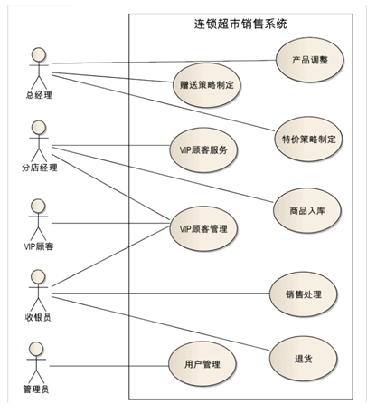
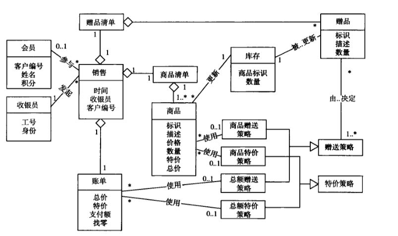
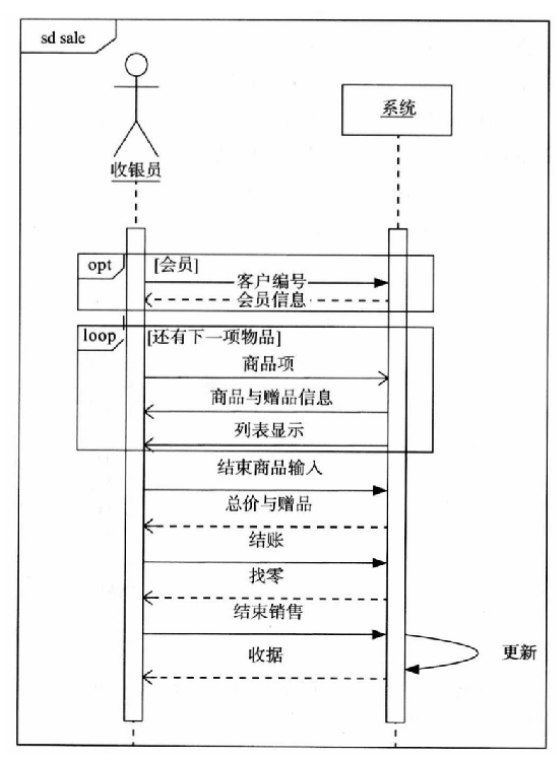
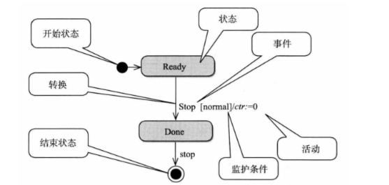

# 02\~04-需求

## 需求基础知识

### 需求定义

1. **用户为了解决问题或达到某些目标**所需要的条件或能力;
2. **系统或系统部件**为了满足合同、标准、规范或其它正式文档所规定的要求而需要**具备的条件或能力**;
3. 对 1 或 2 中条件或能力的文档化表述。

### 需求层次

| 需求层次  | 定义                                                               | 描述重点         | 示例                                         |
| ----- | ---------------------------------------------------------------- | ------------ | ------------------------------------------ |
| 业务需求  | 高层次的解决方案和系统特性、系统开发的**战略出发点**、高层次的需求                              | 描述为什么要开发系统   | 在系统使用3个月后，销售额度应该提高20%（期望，没有从软件角度进行描述，业务需求） |
| 用户需求  | 执行具体任务的**用户对系统所能完成任务的期望**                                        | 描述了系统能帮用户做什么 | 系统要帮助收银员完成销售处理                             |
| 系统级需求 | 需求分析模型：用户对**系统行为的期望**，每个系统级需求反映了**一次外界与系统的交互行为**，或者**系统的一个实现细节** |              | 在接到客户经理的请求后，系统应该为客户经理提供所有会员的个人信息           |

### 需求分类

| 需求分类    | 定义             | 示例                   |
| ------- | -------------- | -------------------- |
| 项目需求    | 对项目的期望         | 项目需要在6个月内完成/成本在xx元以下 |
| 过程需求    | 对开发过程的期望       | 需要提供规格文档/使用持续集成方法开发  |
| 系统需求    | 软件需求、硬件需求、其他需求 | 其他需求：需要提供培训          |
| 不切实际的期望 |                |                      |

### 软件需求分类

| 软件需求分类 | 定义                             | 具体内容                                 |
| ------ | ------------------------------ | ------------------------------------ |
| 功能需求   | 用户希望系统所能够执行的活动                 | 系统和环境之间的行为交互                         |
| 数据需求   | 功能需求的补充，需要在数据库、文件或其他介质中存储的数据描述 | 数据信息、使用频率、可访问性要求、数据实体关系、完整性约束、数据保持要求 |
| 性能需求   |                                | 速度、容量、吞吐量、负载、实时性                     |
| 质量需求   |                                | 可靠性、可用性、安全性、可维护性、可移植性、易用性            |
| 对外接口   |                                | 接口用途、输入输出、数据格式、命令格式、异常处理要求           |
| 约束     |                                | 开发运行环境、相关标准、商业规则                     |

## 需求分析

### 用例图

<figure><figcaption>
用例图
</figcaption></figure>

#### 用例图元素

* 参与者：小人，但是不一定是真的人
* 用例：椭圆形，动宾短语
* 系统边界：矩形，包含用例，左上角标注系统名称
* 参与者和用例之间使用实线连接
* `<<include>>`：包含关系，**虚线箭头**由主用例指向被包含的用例
* `<<extend>>`：扩展关系，**虚线箭头**由拓展用例指向主用例

#### 常见错误

* 不要将用例细化为单个操作：把增删改合并为管理xx
* 不要把同一个业务目标细化为不同用例：合并
* 不要把没有业务价值的内容作为用例：登录、数据验证、连接数据库……

### 分析类图/概念类图/领域模型 （只有属性，没有方法）

<figure><figcaption>
概念类图
</figcaption></figure>

#### 概念类图元素

* 类：只有属性，没有方法
* 对象间关系：实线两端写上数量
  * 依赖：无需画出
  * 关联：实线连接，实线中间写上具体的关系
  * 聚合：空心菱形连接，菱形在“拥有者”那边，无需箭头
  * 组合：实心菱形连接，菱形在“拥有者”那边，无需箭头
* 类间关系：实线连接
  * 继承：空心三角形箭头指向父类
  * 实现：虚线空心三角形箭头指向接口

#### 概念类图构建流程

1. 根据用例文本，找出其中名词作为候选类
2. 将候选类转化为概念类
   * 候选类有状态有行为：直接变为概念类
   * 候选类有状态无行为：变为概念类的属性
   * 候选类无状态有行为：将行为转交给其他类处理
   * 候选类无状态无行为：剔除
3. 识别类间关联和重要属性

### 顺序图

<figure><figcaption>
顺序图
</figcaption></figure>

#### 消息类型

| 消息类型 | 定义                         | 箭头       |
| ---- | -------------------------- | -------- |
| 同步消息 | 需要等接受者处理完毕并返回              | `-----▶` |
| 异步消息 | 无需接受者完毕即可继续（比如返回为`void`的方法 | `----->` |
| 返回消息 | 返回值（不一定每个请求都有返回）           | `<- - -` |

#### 块类型

* 块左上角标注块类型
* 块顶标注循环条件

| 块类型  | 定义     |
| ---- | ------ |
| opt  | 可选项    |
| alt  | 分支，多选一 |
| loop | 循环     |

### 状态图

<figure><figcaption>
状态图
</figcaption></figure>

#### 状态图元素

* 开始状态：黑色实心圆
* 结束状态：黑色实心圆外有一个白色圆圈（不一定存在结束状态）
* 状态：圆角矩形
* 转移：箭头，上标注
  * 事件
  * 监护条件（用`[]`括起来）
  * 动作（用`/`分隔）

## 需求规格说明

### 为什么需要需求规格说明

* 便于沟通：软件开发的子任务和人员间关系错综复杂，存在大量沟通交流，针对需要交流的内容编写文档，减少沟通成本
* 跟踪和度量：在软件产品的角度以系统级需求列表的方式描述软件系统解决方案，建立管理控制的基线，方便任务分配，制定工作计划，进行跟踪度量
* 过程管理：把问题域的问题和分析模型的成果转化为系统级需求，方便小组成员真正明确需求

### 修正错误

#### 技术文档写作要点

* 简洁
* 精确：避免出现模糊/歧义词汇
* 易读：使用引言/目录/索引；增加图表/编号等系统化方式
* 易修改：用引用代替重复

#### 需求书写要点

* 使用用户术语：不出现计算机专业名词
* 可验证：量化评判标准
* 可行性：7\*24 小时可用是不可行的
