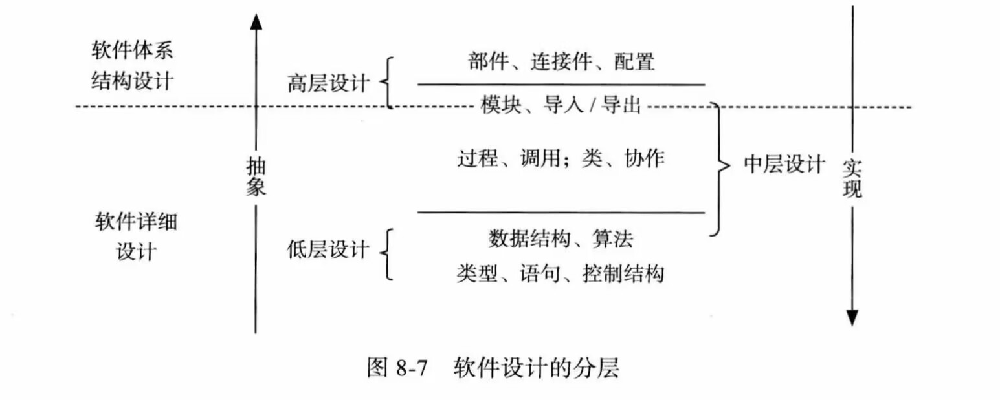
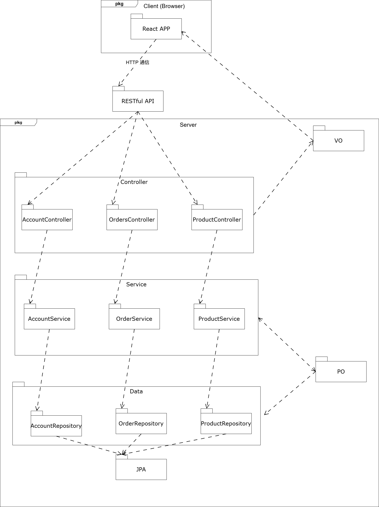

# 05\~07-软件体系结构设计

### 软件设计定义

* 软件设计是关于软件对象的设计，是一种设计活动。
* 软件设计既指软件对象实现的规格说明，又指规格说明产生的过程。
* 软件设计活动以需求规格说明和分析模型为基础，构建软件设计方案描述和原型，为后期的构造活动提供规划或蓝图。
* 软件设计特性：工程性、艺术性、演化性、决策性。

### 软件设计核心思想

* 分解：横向上将系统分割为相对简单的子系统
* 抽象：纵向上将系统分割为不同的层次，分离接口和实现

### 软件设计层次

<figure><figcaption><p>软件设计层次</p></figcaption></figure>

## 软件体系结构

* 软件体系结构：规定了系统的计算部件与部件之间的交互
  * 体系结构 = 部件 + 连接件 + 配置

### 体系结构的⻛格的优缺点

| 风格        | 定义                                                         | 优点                                                 | 缺点                                                         |
| --------- | ---------------------------------------------------------- | -------------------------------------------------- | ---------------------------------------------------------- |
| 主程序-子程序风格 | 将系统功能依层次分解为多个顺序执行的步骤，主程序通过调用子程序完成任务                        | <p>1. 流程清晰，易于理解<br>2. 强控制性</p>                     | <p>1. 强耦合，依赖接口，难以修改<br>2. 数据交互受限，可能引发公共耦合</p>              |
| 面向对象风格    | 基于对象封装与消息传递组织系统，强调对象内部实现的隐藏与模块复用                           | <p>1. 可修改性强（封装）<br>2. 易开发、易理解、易复用，契合模块化思想</p>      | <p>1. 接口耦合性<br>2. 标识耦合性（对象识别）<br>3. 可能引发副作用（状态不一致）</p>     |
| 分层风格      | 将系统划分为若干层，每层提供对下一层的服务，上层只能通过下层接口与底层交互，常见分层：展示层、业务逻辑层、数据访问层 | <p>1. 层次清晰，易理解<br>2. 支持并行开发<br>3. 良好的复用性与可修改性</p>  | <p>1. 接口/协议难以修改（强耦合）<br>2. 性能损失（禁止跨层调用）<br>3. 难确定层数与粒度</p> |
| MVC风格     | 将系统划分为模型(Model)、视图(View)、控制器(Controller) 三部分的架构模式          | <p>1. 易开发<br>2. 视图和控制可独立修改<br>3. 支持多视图，适用于网络系统</p> | <p>1. 结构复杂，难理解<br>2. 模型修改困难</p>                            |

### 包的原则

#### 内聚相关

* 共同封闭原则 CCP：包内的类对于同一性质的变化封闭，一个变化若对一个包产生影响，则对该包中的所有类产生影响，而对于其他包不造成任何影响
* 共同重用原则 CRP：包内的类应当被一起重用
  * 和 CCP 互斥，CCP 倾向于大包，CRP 倾向于小包
* 重用发布等价原则 REP：发布的粒度和重用的粒度一致

#### 耦合相关

* 无环依赖原则 ADP：包间的依赖关系不能形成环路
* 稳定依赖原则 SDP：包只能依赖于更稳定的包，以避免修改
  * $$C_a$$：依赖于本包的包
  * $$C_e$$：本包依赖的包
  * $$I=\frac{C_e}{C_a+C_e}$$：包的稳定性指数，越小越稳定
* 稳定抽象原则 SAP：包的稳定性和抽象度匹配， $$I+A=1$$
  * $$N_a$$：抽象类数量
  * $$N_c$$：所有类数量
  * $$A=\frac{N_a}{N_c}$$：包的抽象度指数，越大越抽象

#### 包设计过程

1. 使用 CCP 把可能一同变化的类组织成包
2. 使用 CRP REP 指导包的组合
3. 使用 ADP SDP SAP 优化依赖关系

## 考试题

### Spring Boot 基础知识补充

| 对象类型                        | 作用·                                           |
| --------------------------- | --------------------------------------------- |
| `PO`（Persistent Object）     | 数据库实体对象，映射数据库表，用于持久化存储。                       |
| `DTO`（Data Transfer Object） | 数据传输对象，用于 `Controller` 与 `Service` 之间传递参数或数据。 |
| `VO`（View Object）           | 视图对象，用于封装返回给前端的数据展示结构。                        |

| 名称           | 主要职责           | 依赖关系            | 输入数据操作         | 返回数据操作        |
| ------------ | -------------- | --------------- | -------------- | ------------- |
| `Controller` | 接收请求，校验参数，返回结果 | 调用 `Service`    | `JSON` → `DTO` | `VO` → `JSON` |
| `Service`    | 处理业务逻辑         | 调用 `Repository` | `DTO` → `PO`   | `PO` → `VO`   |
| `Repository` | 执行 CRUD 操作     | 直接与数据库交互        | `PO` → SQL 操作  | 查询结果 → `PO`   |

### 画物理包图

<figure><figcaption><p>包图</p></figcaption></figure>

### 体系结构构建之间接口的定义

#### 展示-逻辑层接口

```java
public interface UserService {
    UserVO getUserById(Long userId);
    List<UserVO> getAllUsers();
    void createUser(UserVO userVO);
    void updateUser(Long userId, UserVO userVO);
    void deleteUser(Long userId);
}
```

#### 逻辑-数据层接口

```java
public interface UserRepository {
    UserPO findById(Long userId);
    List<UserPO> findAll();
    void save(UserPO userPO);
    void update(UserPO userPO);
    void delete(Long userId);
}
```
