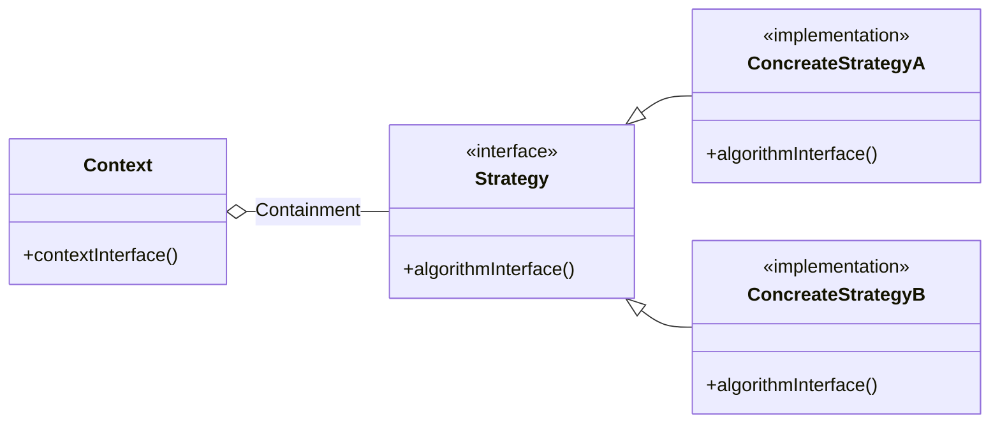
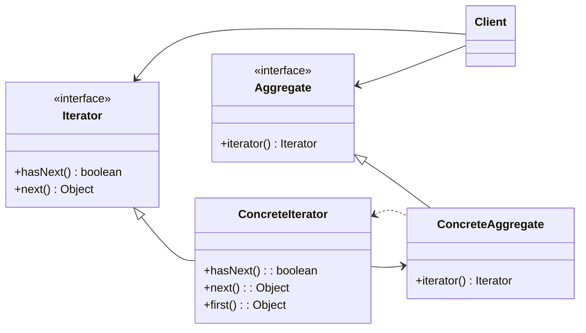
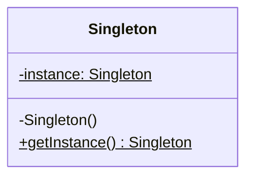
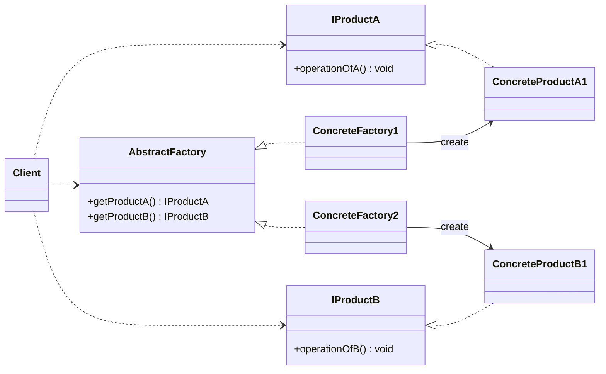

# 13-设计模式

## 策略模式

* 目的：消除选择策略的`switch`语句，直接调用策略类的实现方法
* 上下文类 `Context`：负责执行策略，提供方法使`Strategy`可以访问数据
* 策略类 `Strategy`：策略接口



## 迭代器模式

```java
void f(){
  Collection c = new ArrayList();
  g(c.iterator());
}

void g(Iterator it) {
    while (it.hasNext()) {
        Object o = it.next();
    }
}
```



* 目的：抽象出集合的遍历方式，无需关心集合的具体实现
* 聚合 `Aggregate`：定义了创建迭代器的接口
* 具体聚合 `ConcreteAggregate`：实现了聚合接口，创建具体的迭代器
* 迭代器 `Iterator`：定义了遍历集合的接口
* 具体迭代器 `ConcreteIterator`：实现了迭代器接口，提供具体的遍历方法

## 单件模式

* 目的：确保一个类只有一个实例，并提供一个全局访问点
* 使用私有构造函数和静态方法来创建实例

```java
public class Singleton {
    private static Singleton instance;

    private Singleton() {
        // 私有构造函数，防止外部创建实例
    }

    public static Singleton getInstance() {
        if (instance == null) {
            instance = new Singleton();
        }
        return instance;
    }
}
```



## 抽象工厂模式

```java
if (type == 1) {
    return new Type1();
} else if (type == 2) {
    return new Type2();
}
```

* 工厂模式：消除构造方法无法多态带来的大量判断
* 使用工厂类`Factory`来创建一种对象的多个子类



* 目的：在工厂模式的基础上，创建同一系列的多种对象
* 两组接口：产品接口 + 工厂接口
* 抽象工厂 `AbstractFactory`：定义了创建产品的方法
* 具体工厂 `ConcreteFactory`：实现了抽象工厂的方法，创建具体的产品
* 产品接口 `IProduct`：定义了产品的操作
* 具体产品 `ConcreteProduct`：实现了产品接口，提供具体的操作
