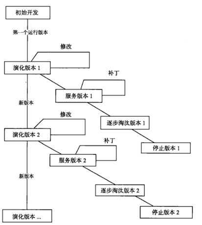
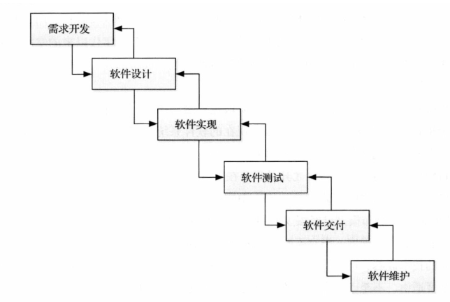
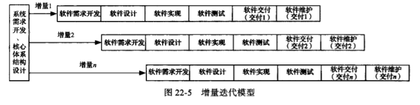
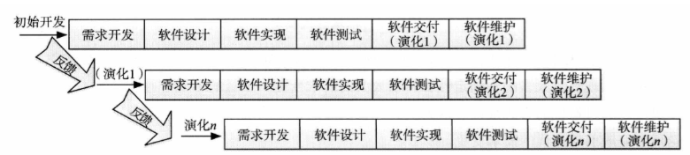

# 17\~19-交付、演化、生命周期模型

## 软件维护

* 软件维护的重要性
  * 维护阶段持续时间长、工作量大、成本高
  * 需求变化频繁
  * 维护质量决定软件的可持续发展
* 用户文档：为用户编写的操作指南或参考教程，如用户使用手册、联机帮助文档等
* 系统文档：为系统管理员编写的系统维护指南，如性能调整、权限控制、故障解决
* 逆向工程：分析目标系统，标识系统的部件及其交互关系，并且使用其他形式或者更高层的抽象创建系统表现的过程
* 再工程：对遗留软件系统进行分析和重新开发，以便进一步利用新技术来改善系统或促进现存系统的再利用

## 软件生命周期模型

### 演化式生命周期模型

* 演化式生命周期模型：初步开发—演化—服务—逐步淘汰—停止

<figure><figcaption>
演化式生命周期模型
</figcaption></figure>

### 瀑布模型

<figure><figcaption>
瀑布模型
</figcaption></figure>

* 文档驱动：需求工程—软件设计—软件实现—软件测试—软件交付—软件维护
* 优点：为软件开发活动定义了清晰的阶段划分
* 缺点
  * 对文档的过高期望具有局限性
  * 对开发活动的线性顺序假设具有局限性
  * 客户/用户参与不足
  * 里程碑力度过粗
* 适用：比较成熟，没有技术难点的软件

### 增量迭代模型

<figure><figcaption>
增量迭代模型
</figcaption></figure>

* 需求驱动：在项目开始前通过需求开发、体系结构设计界定项目范围，随后采用流水线思想，迭代式、渐进交付、并行开发
* 优点
  * 迭代式开发，更符合软件开发的实际情况
  * 渐进交付，加强用户反馈
  * 并行开发，缩短开发时间
* 缺点
  * 加入构建需保证不破坏已有部分
  * 不适用于需求变更频繁，难以界定范围的不稳定领域
* 适用范围：适用于大规模软件系统的开发

### 演化模型

<figure><figcaption>
演化模型
</figcaption></figure>

* 需求驱动：基于用户反馈，规划后续迭代，采用流水线思想，迭代式、渐进交付、并行开发
* 优点：和增量迭代模型类似
* 缺点
  * 需求不明确，难以界定范围
  * 后续迭代容易忽略分析与设计，退化为构建-修复模型
* 适用范围：不稳定领域的大规模软件系统开发
* 和演化模型的区别：演化模型在正式开发前界定项目范围，逐步开发，演化模型则基于用户反馈进行迭代
