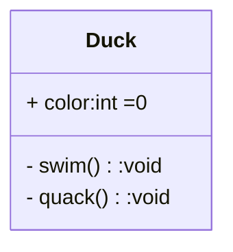

# 90-面向对象知识速查

## UML

### 类图

* `public` **公有**可见性（+）：对能看到这个类的任何元素都可见。
* `protected` **保护**可见性（#）：对这个类及其子类的其他元素可见。
* （无标识符）**包**可见性（\~）：对同一个包中的其他元素可见。
* `private` **私有**可见性（-）：对这个类的其他元素可见。

### UML 多重性表示

| 多重性          | 含义说明        | 举例（自然语言）                   |
| ------------ | ----------- | -------------------------- |
| `*` 或 `0..*` | 任意个，可以没有    | 一个购物车可以包含任意多件商品            |
| `n`          | 固定个数（n为整数）  | 每个扑克玩家有5张牌（`5`）            |
| `n..m`       | 范围在n到m之间的个数 | 每门课的学生人数在10到30之间（`10..30`） |

## 类之间的关系

* 箭头指向“被依赖、被继承、被包含”的那一方。
* 菱形在“拥有者”那边，箭头朝向被拥有的部分。
* 以下所有箭头均为 A 指向 B

### 类级别

| 类型 | 符号         | 说明                              |
| -- | ---------- | ------------------------------- |
| 继承 | `———————▷` | `A` is-a `B`，子类继承父类所有实现，可覆盖     |
| 实现 | `- - - -▷` | `A` implements `B`，必须实现接口中的所有方法 |

### 对象级别

* 组合>聚合>关联>依赖

| 类型 | 符号                 | 说明                                                                             | 多重性                         | 举例                   |
| -- | ------------------ | ------------------------------------------------------------------------------ | --------------------------- | -------------------- |
| 依赖 | `- - - - >`        | 极弱的关系，`A` 临时使用`B`                                                              | 临时关系，无                      | `B` 为 `A` 的局部变量/方法参数 |
| 关联 | `——>` `————`（双向关联） | `A` has-a `B`，无更强的约束（`B`可有可无）                                                  | `A: 0 ..*` `B: 0 ..*`       | `B` 为 `A` 的成员变量      |
| 聚合 | `◇————————>`       | `A` owns-a `B`，`B`的生命周期不由`A`控制，可被其他对象继续使用                                      | `A: 0 ..1` `B: 0 ..*`（集合可空） | 课程包含学生，学生可在多门课程      |
| 组合 | `◆————————>`       | `A` contains-a `B`，`B` 是 `A` 的一部分，`B` 的生命周期由 `A` 控制(`B` 由 `A` 创建，在 `A` 销毁时被销毁) | `A: 0 ..1` `B: 1 ..*`       | 人和心脏                 |
