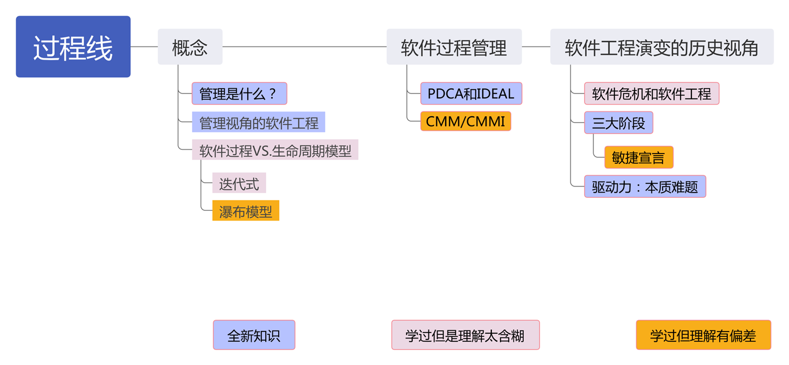

# 01-管理-过程线

<figure><figcaption></figcaption></figure>

## 概念

> 对应 PPT 1

### 管理

* 管理的三大关键要素：目标、状态、纠偏
* 软件项目管理：应用方法、工具、技术以及人员能力来完成软件项目，实现项目目标的过程
* 软件项目管理的三大目标：成本、质量、工期
* 管理视角的软件工程：**能否复制成功**
* 技术视角的软件工程：是否可以将问题解决得更好？

### 软件过程

* 软件过程：为了实现一个或者多个事先定义的目标而建立起来的一组实践的集合
* 广义软件过程：技术、人员、狭义软件过程
* 软件过程管理：使软件过程在开发效率、质量等方面有更好的性能绩效

### 软件过程 & 生命周期模型

* 生命周期模型：对软件过程的一种人为的划分
* 典型生命周期模型：瀑布模型、迭代式模型、增量模型、螺旋模型、原型法
* **⽣命周期模型与软件过程的区别和联系**
  * 生命周期模型是对一个软件开发过程的**人为划分**
  * 生命周期模型是软件开发过程的主框架，是对软件开发过程的一种**粗粒度划分**
  * 生命周期模型往往**不包括技术实践**
* **如何理解瀑布模型**
  * 瀑布模型是\*\*⼀系列模型\*\*，覆盖最简单的场景（过程元素少）到最复杂的场景（过程元素多）
  * 软件项⽬应该结合实际情况**选择合适过程元素**的瀑布模型，项⽬⾯临困难和挑战越多，选择的模型应该越复杂
  * 软件项⽬团队往往**低估项⽬的挑战**，选择了过于简单的不适⽤的瀑布模型
* 迭代式：大型软件系统的开发过程是一个**逐步学习和交流的过程**，软件系统的交付不是一次完成，而是通过多个迭代周期，逐步来完成交付。（前半句是重点）

### 软件过程管理

* 具体方案 -> 参考模型 -> 元模型
* 软件过程管理：对应参考模型，含 CMM/CMMI、SPICE
* 软件过程改进：对应参考元模型，含 PDCA、IDEAL

### CMMI

1. Initial：开发相对混乱，依赖个⼈英雄主义，**没有过程概念**，救⽕⽂化盛⾏
2. Managed：项⽬⼩组**体现出项⽬管理的特征**，有项⽬计划和跟踪、需求管理、配置管理等
3. Defined：**公司层⾯有标准流程和相应的规范**，每个项⽬⼩组可以基于此定义⾃⼰的过程，使得优秀的做法可以在公司共享。
4. Quantitatively Managed：**构建预测模型**，已统计过程控制的⼿段来管理过程
5. Optimizing：继续应⽤统计⽅法识别过程偏差，找到问题根源并消除，避免未来继续发⽣类似问题。

> CMMI 模型不应该是敏捷⽅法的对⽴⾯：CMMI**是过程改进模型**，刻画了软件组织从不成熟到成熟的路线图；敏捷⽅法是**开发⽅法**， 两者是完全不同性质的事物，将两者对⽴是不合适的。

### PDCA

* Plan
  * 分析现状，找出问题
  * 分析影响质量的原因
  * 找出措施
  * 拟定措施计划
* Do：执行措施、计划
* Check：检查效果，发现问题
* Action
  * 总结经验，纳入标准
  * 遗留问题进入下一周期

### IDEAL

* 启动 Initiating -> 诊断 Diagnosing -> 建立 Establishing -> 执行 Acting -> 调整 Leveraging

## 软件工程演变的历史视角

> 对应 PPT 2

* 软件四大本质难题：复杂性、不可见性、可变性、一致性​
* 软件危机：**落后的软件生产方式**无法满足迅速增长的**计算机软件需求**，从而导致软件开发与维护过程中出现一系列严重问题的现象。

### 软件发展三大阶段

* 软硬件一体化
  * 特点：软件支持硬件完成计算任务、功能单一、复杂度有限、几乎不需要需求变更
  * 主流开发方法
    * 软件完全依赖于硬件：Measure twice, cut once
    * 软件作坊：Code and fix
* 软件成为独立产品
  * 特点：摆脱了硬件的束缚、功能强大、规模和复杂度剧增、个人电脑出现、普通人成为软件用户（需求多变、兼容性要求）、来自市场的压力
  * 主流开发方法：形式化方法、结构化程序设计、瀑布模型
* 网络化和服务化
  * 特点：功能更复杂、规模更大、用户数量急剧增加、快速演化和需求不确定、分发方式的变化
  * 主流开发方法：迭代式开发、敏捷开发（XP、Scrum、Kanban）、开源软件开发方式、DevOps

### 敏捷宣言

* 个体和交互 胜过 过程和工具
* 可以工作的软件 胜过 面面俱到的文档
* 客户合作 胜过 合同谈判
* 响应变化 胜过 遵循计划
* 也就是说，尽管右项有其价值，我们更重视左项的价值

## 其余往年题

* 软件过程管理是软件项目管理应该要实现目标：**错误**，软件过程管理和软件项目管理完全是两回事，因此并不是实现目标。（项目管理是设计生产线，过程管理是生产线运行的管理）
* 在公司导入敏捷过程是我们今年过程改进的主要目标：**正确**，过程管理和过程改进是类似的。
* XP 与 CMM/CMMI 是对立的两种软件开发方法：**错误**，CMM 和 CMMI **根本不是软件开发方法**，而是软件过程管理和改进。
* CMM/CMMI 不适合当今互联网环境的项目管理需求：**正确**，CMM/CMMI 是过程管理而非项目管理。（即使去掉互联网环境这个限定词，这个说法也是正确的）（~~这真的是人能说出来的？~~）
* PDCA 和 IDEAL 不适合在敏捷环境中使用：**错误**，PDCA，IDEAL是软件过程改进参考元模型，适合在敏捷环境中使用。
* 不同的软件开发过程应该使用不同的生命周期模型，反之亦如此：**错误**，生命周期模型是由人类划分的
