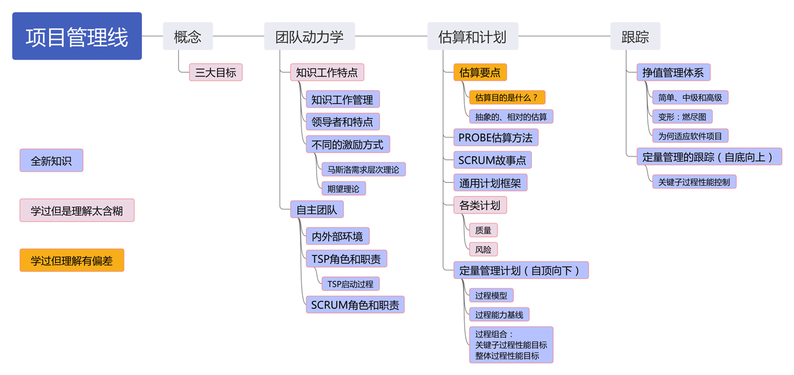
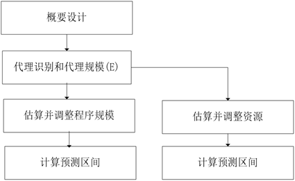
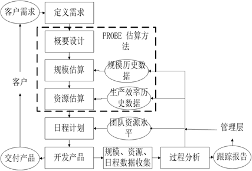

# 02-管理-项目管理线

<figure><figcaption></figcaption></figure>

## 概念

> 详见 01-过程线

## 团队动力学

> 对应 PPT 3

### 知识工作管理

* 软件开发是一项既复杂又富有创造性的知识工作
* 要求从事软件开发的工程师：必须**全身心地参与工作**，在**主观意愿上努力追求卓越**
* 管理知识工作的关键规则是：管理者无法管理工作者，知识工作者必须**自我管理**。
* 要自我管理，知识工作者必须
  * 有积极性
  * 能做出准确的估算和计划
  * 懂得协商承诺
  * 有效跟踪他们的计划
  * 持续地按计划交付高质量产物

### 领导者的特点

* 诚实：领导者应该信守承诺，言行一致，让团队成员感到信任和尊重。
* 能力：领导者必须展现出卓越的能力和广泛的知识。
* 远见：领导者需要超越眼前的挑战和任务，看到更长远的目标和愿景。
* 激励：优秀的领导者应该能够激励团队，鼓励成员追求卓越。

### 激励方式

* 交易型领导方式：威逼、利诱（使用奖励激励）
  * 人们通常能找到新的方式来获得奖励，同时少做工作
* 转变型领导方式：鼓励承诺（使用成就激励）
* 交易型领导方式很少能产生成功的并且有创造性的团队，因此转变型领导方式是首选

### 马斯洛需求理论

* 生理需求、安全感、爱和归属感、尊重、自我实现
* 激励来自为没有满足的需求而努力奋斗
* 低层次的需求必须在高层次需求满足之前得到满足，满足高层次的需求的途径比满足低层次的途径更为广泛
* 威逼利诱对应 Lv1-2，鼓励承诺对应 Lv4

### 麦克勒格的 X-Y 理论

* X 理论：人性本恶，会逃避工作，需要以低层次需求来管理（带来了不良后果）
* Y 理论：人性本善，以高层次需求来管理

### 期望理论

* $$M = V \times E$$
* $$M$$：激发力量，$$V$$：目标价值大小，$$E$$：目标达成概率

### 自主团队

### 必要性

* 软件开发是**复杂的知识工作**
* 在这种性质的工作中，实现软件工程师的**自我管理**往往可以获得最好的工作效率和质量水平
* 如果整个团队的**所有成员**都实现了自我管理，就形成了所谓的自主团队

### 特点

* 自行定义**项目目标**
* 自行决定团队**组成形式**以及成员的**角色**
* 自行决定项目的**开发策略**
* 自行定义项目的**开发过程**
* 自行制定项目的**开发计划**
* 自行**度量、管理和控制**项目工作

### 外部环境

* 在项目启动阶段获得管理层的支持
* 在项目进展中获得管理层的支持

## TSP

### TSP 启动过程

* 第一次会议：建立产品目标和业务目标
* 第二次会议：角色分配和小组目标定义
* 第三次会议：开发流程定义与策略选择
* 第四次会议：整体计划
* 第五次会议：质量计划
* 第六次会议：个人计划以及计划平衡
* 第七次会议：风险评估
* 第八次会议：准备向管理层汇报计划
* 第九次会议：向管理层汇报计划内容
* Launch 阶段总结

### TSP 角色和职责

* **项目组长**：建设和维持高效率的团队
* **计划经理**：开发完整的、准确的团队计划和个人计划，报告项目小组状态
* **开发经理**：制定开发策略，完成估算和设计，带领团队开发优秀的软件产品
* **质量经理**：保证团队严格按照质量计划开展工作，开发出高质量的软件产品
* **过程经理**：维护团队成员的过程数据和会议记录
* **支持经理**：保证项目小组在整个开发过程中都有合适的工具和环境
* **开发人员**：开发

### TSP 对自主团队的支持

* PSP 个人技能培养 -> 团队成员：个体过程度量、过程规范、估算与计划、质量管理
* TSP 团队组件过程 -> 团队规范：项目目标、团队角色、团队过程、项目计划、计划平衡
* TSP 团队工作过程 -> 团队管理：团队交流、团队协作、状态跟踪、风险管理、进度报告

### Scrum 角色和职责

> 详见 11-Scrum

## 估算

> 对应 PPT 4

* 目的：给各类计划提供决策依据
* 对象：规模、时间、日程
* 要点
  * 尽可能划分详细
  * 尽量依赖数据
  * 目标是建立对结果的信心
  * 估算的重点是相关干系人达成一致共识的过程，而非结果

### PROBE

<figure><figcaption>
PROBE 步骤
</figcaption></figure>

* 估算的困境：精确度量方式不便于早期规划/估算，有利于早期规划/估算的方式难以产生精确结果
* 原理
  * 设立合理的代理作为精确度量和早期规划之间的桥梁
  * 相对大小而非绝对大小
* 核心思想
  * 通过概要设计，确定产品功能，及实现功能所需的组件/模块
  * 和以前写的做比较，估算每个组件/模块的规模
  * 结合给出总规模

> 使用 PROBE 方法估算时间的时候，为什么不使用历史数据中的生产效率数据？
>
> 在估算资源需求（例如，人时）的时候，生产效率一般在分母上，考虑到个体软件工程师生产效率波动，容易导致估算偏差范围变大。

### SCRUM 故事点

* 度量实现一个故事（Story）需要付出的工作量
  * 抽象的：混合了对于开发特性所要付出的努力、开发复杂度、各种风险以及类似东西
  * 相对的：设定标准之后，考虑其他特性与标准之间的相对大小关系

## 计划

### WBS 工作分解结构

* 以可交付成果为导向对满足项目目标和开发交付产物的项目相关工作进行的分解
* 归纳和定义了项目的整个工作范围，每下降一层代表对项目工作的更详细定义

### 通用计划框架

<figure><figcaption>
通用计划框架
</figcaption></figure>

### 各类计划

* 任务计划：描述了项目所有的**任务清单**、任务之间的先后顺序以及每个任务所需时间资源
* 日程计划：描述了整个各个任务在**日程上的安排**，即各个任务计划哪天开始和计划哪天结束

### 质量计划

* 确定需要开展的质量保证活动和活动开展的程度（时间、人数和目标）
* 质量保证活动：个人评审、团队评审、单元测试、集成测试、系统测试、验收测试等

### 风险计划

* 在风险发生前识别出潜在的问题，规划和实施风险管理活动，以消除潜在问题的负面影响
* 风险识别
  * 识别与成本、进度及绩效相关的风险
  * 审查可能影响项目的环境因素
  * 审查工作分解结构的所有组件
  * 审查项目计划的所有组件
  * 记录风险的内容、条件及可能的结果
  * 识别每一风险相关的干系人
  * 利用已定义的风险参数，评估已识别的风险
  * 依照定义的风险类别，将风险分类并分组
  * 排列降低风险的优先级
* 风险应对
  * 风险转嫁：通过某种安排，在放弃部分利益的同时，将项目风险转嫁到其他的团队（外包）
  * 风险解决：采取措施，使得风险的来源不再存在
  * 风险缓解：容忍风险的存在，采取措施监控风险，不让风险对项目最终目标的实现造成负面影响

## 跟踪

* 目的：了解项目进度，在出现偏离时采取纠偏措施

### 挣值管理体系 EVM

* 客观度量项目进度的一种项目管理方法
* 核心思想：每项任务实现附以一定价值，100% 完成该项任务，就获得相应价值
* 实现
  * 简单实现：仅关注进度信息
    * 首先需要建立 WBS，定义工作范围
    * 其次为 WBS 中每一项工作定义一个价值（PV）
    * 最后按照一定的规则将某一数值赋给已经完成的工作或者正在进行的工作
      * 0-100 规则：当任务完成时，PV 值转化为 EV 值
      * 50-50 规则：当任务开始时，PV 值的 50% 转化为 EV 值，任务完成时，再加上另外的 50%
    * 挣值 EV：已完成的工作所获得的价值
    * 计划值 PV：在当前时间点，计划完成的工作所获得的价值
    * 项目预算成本 BAC：项目总预算
    * 实际完成的工作所需成本 AC：不对 EV 值产生任何影响。
    * 成本差异：CV = EV – AC
    * 成本差异指数：CPI = EV/AC
    * 预计完成成本：EAC = BAC/CPI
  * 中级实现：在简单实现的基础上，加入**日程偏差**的计算
    * 日程偏差：SV = EV – PV
    * 日程偏差指数：SPI = EV/PV
  * 高级实现：在中级实现的基础上，还需要考察**项目实际成本**
* EVM 为何适应软件项目：**适应项目的动态变化**

### 燃尽图

* 挣值管理的变形，横轴是时间线，纵轴是剩余工作的百分比

### EVM 的局限性

* EVM 一般不能应用软件项目的质量管理。
* EVM 需要**定量化的管理机制**：在探索型项目以及常用的敏捷开发方法中的应用受限
* EVM 完全**依赖项目的准确估算**：在项目早期难以准确估算
