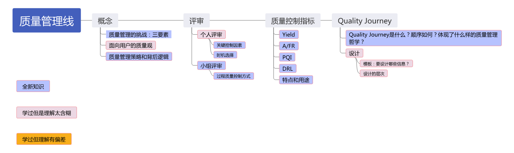

# 03-管理-质量管理线

<figure><figcaption></figcaption></figure>

> 对应 PPT 5

## 概念

* 软件质量：与软件产品满足规定的和隐含的需求能力有关的特征或者特性的全体
* 质量管理的挑战：软件项目的**日程、成本、质量**

### 面向用户的质量观

* 定义质量为**满足用户需求的程度**
* 需明确：
  * 用户究竟是谁？
  * 用户需求的优先级是什么？
  * 这种用户的优先级对软件产品的开发过程产生什么样的影响？
  * 怎样来度量这种质量观下的质量水平？

### PSP 质量管理策略

* 缺陷管理来替代质量管理：高质量产品要求组成软件产品的各个组件基本无缺陷
  * 在评审阶段消除缺陷的代价远低于在测试阶段消除缺陷的代价
* 各个组件的高质量是通过高质量评审实现的

## 评审

### 个人评审

* 关键控制因素：评审速度
* 时机选择
  * 先编译，后评审：编译时发现并消除缺陷的效率大于评审时
  * 先评审，后编译：节省编译阶段的时间

### 小组评审

* 有利于更好地发现缺陷，预防风险，提高 Process Yield，进而确保质量
* 有利于提升个人的技能

## 质量控制指标

### Yield 【必考】

* 度量每个阶段在消除缺陷方面的效率
* $$\text{Phase Yield} = \frac{100 * \text{某阶段发现的缺陷个数}}{\text{某阶段注入的缺陷个数} + \text{进入该阶段前遗留的缺陷个数}}$$
* $$\text{Process Yield} = \frac{100 * \text{第一次编译前发现的缺陷个数}}{\text{第一次编译前注入的缺陷个数}}$$

### A/FR

* 度量评审工作的耗时
* $$\text{A/FR} = \frac{\text{PSP 质检成本}}{\text{PSP 失效成本}}$$
  * PSP 失效成本：编译时间 + 单元测试时间
  * PSP 质检成本：设计评审时间 + 代码评审时间
* A/FR 越大，质量越高，但过高的 A/FR 意味**过度评审**，降低效率
* 期望值：2.0（软件工程师应当花费两倍于编译加测试的时间进行评审）

### PQI

* 5个数据乘积
* PQI 越接近于 1，质量越高，缺陷密度越低
* 前三个是过程度量，后两个是结果度量

| 数据     | 计算公式                                                 | 意义                  |
| ------ | ---------------------------------------------------- | ------------------- |
| 设计质量   | $$\min\{\frac{\text{设计时间}}{\text{编码时间}}, 1\}$$       | 设计的时间应该大于编码的时间      |
| 设计评审质量 | $$\min\{\frac{2 * \text{设计评审时间}}{\text{设计时间}}, 1\}$$ | 设计评审的时间应该大于设计时间的50% |
| 代码评审质量 | $$\min\{\frac{2 * \text{代码评审时间}}{\text{编码时间}}, 1\}$$ | 代码评审时间应该大于编码时间的50%  |
| 代码质量   | $$\min\{\frac{20}{\text{编译缺陷密度} + 10}, 1\}$$         | 代码的编译缺陷密度应当小于10个/千行 |
| 程序质量   | $$\min\{\frac{10}{\text{单元测试缺陷密度} + 5}, 1\}$$        | 代码单元测试缺陷密度应当小于5个/千行 |

### Review Rate

* 指导软件工程师开展有效评审的指标
* 保持适中：高质量的评审需要足够时间，但过度评审会降低效率
* PSP 实践：代码评审速度小于 200 LOC/小时，文档评审速度小于 4 Page/小时

### DRL 缺陷消除效率比

* 度量**不同缺陷消除手段消除缺陷的效率**
* 计算方式：$$\text{DRL} = \frac{\text{该阶段每小时发现的缺陷数}}{\text{单元测试每小时发现的缺陷数}}$$

| 示例   | 缺陷个数/h | DRL            |
| ---- | ------ | -------------- |
| 设计评审 | 3.6    | 3.6/3.5 = 1.03 |
| 编码评审 | 8.0    | 8.0/3.5 = 2.29 |
| 单元测试 | 3.5    | 1.0            |

## Quality Journey

1. 各种测试
2. 进入测试之前的产物质量提升
3. 评审过程度量和稳定
4. 质量意识和主人翁态度
5. 个体review的度量和稳定
6. 诉诸设计
7. 缺陷预防
8. 用户质量观——其他质量属性

## 设计

### 设计的内容

|      | 动态信息         | 静态信息           |
| ---- | ------------ | -------------- |
| 外部信息 | 交互信息（服务、消息等） | 功能（继承、类结构等）    |
| 内部信息 | 行为信息（状态机）    | 结构信息（属性、业务逻辑等） |

### 设计的模板

|      | 动态信息    | 静态信息 |
| ---- | ------- | ---- |
| 外部信息 | OST/FST | FST  |
| 内部信息 | SST     | LST  |

* 操作规格模板（Operational Specification Template）：描述系统与外界的交互，定义测试场景、测试用例
* 功能规格模板（Functional Specification Template）：使用形式化的符号，描述系统的对外接口，记录类和继承关系、外部可见的属性和方法
* 状态规格模板（State Specification Template）：定义程序的所有的状态、状态转换以及状态转换的动作
* 逻辑规格模板（Logical Specification Template）：描述系统的内部静态逻辑

### 设计的层次

* 系统需求定义 -> 系统规格说明 -> 系统高层设计
* -> 子系统规格说明 -> 子系统高层设计
* -> 组件规格说明 -> 组件高层设计
* -> 模块规格说明 -> 模块详细设计
