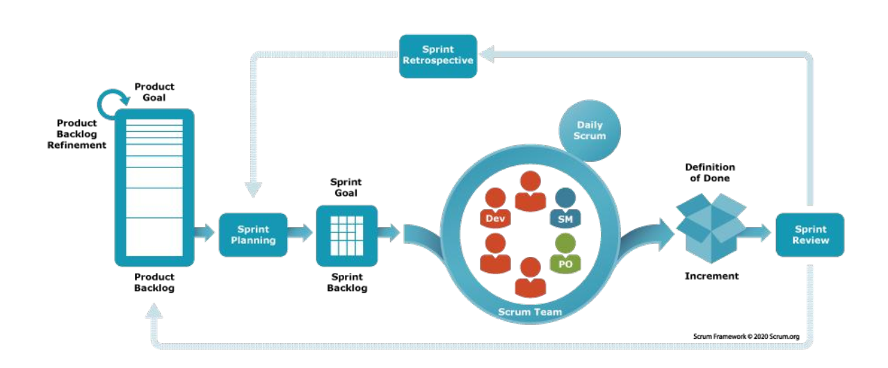

# 11-敏捷-Scrum

* 以下内容由邵栋老师讲解

## 瀑布模型的失败

* 瀑布模型：需求可以完整定义、变化可以被控制，长计划 + 预测主义
* Scrum：拥抱不确定性，短迭代 + 经验主义

## Scrum 定义

* 1986 年在《新型新产品开发策略》提出 Scrum，1995 年提出 Scrum 框架
* Scrum 是一个轻量的框架，通过提供针对复杂问题的自适应解决方案，来帮助人们、团队和组织创造价值
* 流程：由 Scrum Master 营造一个环境
  1. 一名 Product Owner 将解决复杂问题所需的工作整理成一份 Product Backlog。
  2. Scrum Team 在一个 Sprint 期间将选择的工作转化为价值的 Increment。
  3. Scrum Team 和利益攸关者检视结果并为下一个 Sprint 进行调整。
  4. 重复
* Scrum 基于
  * 经验主义：知识源自实际经验以及根据当前观察到事物作出的判断
  * 精益思维：减少浪费，专注于根本
* 核心优势
  * 轻量灵活：仅定义必要规则，兼容多种实践
  * 持续改进：通过事件循环实现经验反馈
  * 价值驱动：以 Product Goal 为导向，确保交付有效性
  * 协作透明：跨角色协作，信息共享最大化

<figure><figcaption><p>Scrum 步骤</p></figcaption></figure>

## Scrum 33355

* 三大支柱：透明、检视、适应
* 五个价值：承诺、专注、开放、尊重、勇气

### 三大角色

* Scrum Team：1 名 Product Owner + 1 名 Scrum Master + 多名开发人员
  * Scrum Master：管理 **Scrum 框架的建立和实践**
  * Product Owner：**最大化产品价值**，管理 Product Backlog
  * Developers：为 Sprint **交付 Increment**
* 在 Scrum Team 没有子团队/层次结构
* 人数为 10 人或更少：规模足够小以保持灵活，同时足够大以便可以在一个 Sprint 中完成重要的工作
* 特点：跨职能、自管理
* 猪和鸡的故事：把无利益和价值牵扯的人排除在决策团队之外
  * 猪：全身投入（Scrum Team）
  * 鸡：参与但不投入（客户、用户、经理）

### 三个工件

| 工件              | 定义                   | 承诺                       |
| --------------- | -------------------- | ------------------------ |
| Product Backlog | 产品需求动态清单             | Product Goal（产品愿景）       |
| Sprint Backlog  | Sprint任务计划（目标+选定的条目） | Sprint Goal（迭代目标）        |
| Increment       | 符合完成标准的可交付成果         | Definition of Done（完成标准） |

### Product Backlog

* **按重要性排序**的需求 / 故事的列表
* Scrum Team 所承担工作的唯一来源
* 能够被 Scrum Team 在一个 Sprint 中完成（Done）的 Product Backlog 条目被认为准备就绪，在Sprint Planning 事件中可供选择。它们通常在精化活动后获得这种透明度
* Product Backlog 精化：将 Product Backlog 条目分解，进一步定义更小更精确的行为

### 用户故事

```plaintext
作为<某类用户>
我想<做某事>
从而<创造某些价值>  
```

* Ron Jeffries的 3C 原则
  * Card：在卡片上写下期望的软件特性
    * **用户故事是占位符**：不必讨论过多细节
  * Conversation：对要开发的软件深入讨论
  * Confirmation：对完工条件进行确认

### Definition of Done（DoD）

* 对完成工作的标准化定义，描述用户故事/任务/功能何时可以被认为真正完成
* 作用：提高透明度、保证质量、支持验收流程、防止技术债

> 假设一个团队正在开发一个电子商务应用的“用户注册功能”，其 DoD 可能如下：
>
> 1. 开发完成：
>    * 用户可以通过表单输入基本信息（用户名、密码、邮箱）。
>    * 提交表单后，信息存储到数据库。
> 2. 测试通过：
>    * 表单的必填项验证功能正常。
>    * 注册成功后，用户会收到确认邮件（已在开发环境中验证）。
>    * 单元测试覆盖率达到 95%。
> 3. 集成完成：
>    * 功能已合并到主分支，并通过持续集成管道中的所有检查。
> 4. 文档补充：
>    * 用户手册中新增“如何注册”的部分。
>    * 开发文档中记录了接口的详细信息和数据库结构。
> 5. 验收完成：
>    * 产品负责人在测试环境中成功完成了用户注册操作。

### 行为驱动开发（Behavior-Driven Development，BDD）

* 通过定义软件的行为来驱动开发过程
* 从 TDD 演化
* 重点：增强团队对需求的理解，确保开发的软件满足业务目标
* 流程
  1. 编写用户故事：作为 - 我想 - 从而
  2. 定义验收标准：Scenario（场景描述） - Given（初始状态） - When（执行操作） - Then（预期结果）

### 用户故事 INVEST 原则

* Independent 独立性
* Negotiable 可协商性
* Valuable 有价值性
* Estimable 可估算性
* Small 短小
* Testable 可测试性

### 五个事件

| 事件                   | 说明                              | 时间盒    |
| -------------------- | ------------------------------- | ------ |
| Sprint               | 固定周期（<= 1 个月），通常为 2 周，不可变更目标与质量 |        |
| Sprint Planning      | 确定 Sprint Goal 与交付计划            | 8 小时/月 |
| Daily Scrum          | 15 分钟每日站会，调整当日计划                |        |
| Sprint Review        | 展示增量，调整 Backlog                 | 4 小时/月 |
| Sprint Retrospective | 改进流程与效能                         | 3 小时/月 |

### 每日 Scrum 会议

* 回答问题
  * 昨天做了什么
  * 今天准备干什么
  * 遇到的障碍，需要其他人如何帮你
* 移动任务板上的即时贴到对应的地方
* 结束后计算剩余故事点，更新燃尽图

### Sprint 评审会议

* 以产品为中心
* 参与者：Scrum Team + 利益相关者
* 目的：收集外部反馈

## 估算

* 不应花太多时间，做出快速但不精确的估计
* 估算单位
  * **相对值**，更容易，缩小人与人的能力误差
    * 选择可识别的最小用例为 2 个 story point
    * 估计一个迭代周期内能完成的 Story Point
  * 体恤尺码：通常使用 S/M/L，若工作项过大则拆分，必要时使用 XS/XL
* 估算过程
  * 计划扑克：基于共识的估算工具，团队成员使用斐波那契数列卡片进行投票，以快速达成对故事点的估算
  * 卡片队列估算法：先根据相对大小排序，后按照工作量分组
  * “金发女孩” 估算技术：将工作量分割/组合，使之大小相当
* 估算差异的原因：需求理解不一致

## Scrum 局限

* 没有技术实践
* Scrum：关注项目管理和团队过程
* XP：侧重工程实践和代码质量
* 没有 XP 的支撑，Scrum 难以成功

## 大规模敏捷

* SAFe (Scaled Agile Framework)：一个为大型企业设计的、分层次的敏捷实施框架，通过引入敏捷发布火车 (ART) 和项目群增量 (PI) 等概念来协调多个团队。但因其流程繁重而存在争议。
* LeSS (Large-Scale Scrum)：一种更精简的规模化方法，其核心理念是“大规模Scrum仍然是Scrum”。它提倡多个团队共享一个产品负责人和一个产品待办列表。

## AI 时代对 Scrum 的冲击

> 好像是今年新增的

### 角色冲击：从跨职能团队到人 - Agent 混合团队

* 传统：致力于创建每个 Sprint 可用 Increment 的人员
* Agent 时代：“代码编写者” -> “Agent编排者”

### Product Owner 的挑战

* Product Backlog 的粒度需重新校准：Agent 可能在一天内完成原本需要数天的编码任务
* 用户故事的“可估算性”受到冲击：AI Agent 产出质量方差大，Velocity 预测更困难
* 使用“测试规格”而非自然语言描述需求：TDD 成为向 Agent 传达需求的精确语言

### Scrum Master 的新使命

* 移除障碍 -> 管理人 - Agent 协作的流动性
* 新职责：识别价值流中的瓶颈漂移（编码不再是瓶颈，评审变成了新瓶颈）

### 事件冲击：Sprint节奏与仪式的适配压力

* 传统假设被打破：人类产能稳定 -> Sprint 工作量可预测
* 估算的困境：Agent 可能需返工，耗时波动大，动摇 Story Point 的相对稳定性
* 建议：将边界清晰、验收标准明确的 Story 交给 Agent；模糊、需要人类判断的 Story 由人类主导

### Daily Scrum

* 追加：Agent 的产出中，什么已验证？什么待评审？
* 关注焦点：人的进度 -> 人 - Agent 协作流的瓶颈
  * 看板的“遍历看板墙、关注味道”在此更为适用
* 当“等待评审”列持续膨胀时，团队需要做出决策
  * 暂停 Agent 的新任务
  * 调配更多人力做评审
  * 启用 AI 辅助评审

### Sprint Review / Demo

* 追问：团队是否真的理解这些代码？

### Sprint Retrospective

* 增加新维度：Agent 的使用效果如何？哪些类型的任务适合委托？哪些不适合？
* 修正认知偏差、建立团队对 Agent 能力边界共识

### 工件冲击：Backlog、DoD 和 Increment 的重新定义

* 用户故事需要更细的粒度
* INVEST原则的重新审视
  * Independent：✓ Agent 可以并行处理多个独立 Story
  * Negotiable：变为精确的提示工程与测试规格定义
  * Valuable：✓ 不变
  * Estimable：⚠️ 因Agent产出方差大，估算难度上升
  * Small：✓✓ 在Agent时代尤为重要
  * Testable：✓✓✓ 升级为必需品
* 拓展 DoD 的指标：人类已评审并理解 AI 生成代码的核心逻辑、安全审查已通过、无“理解力负债”积累
* Increment：识别质量的新风险（PR 评审时间、Bug 率、变更失败率上升）

### 三大支柱

* 透明：对于 AI 的产出，需要更高的透明度
* 检视：评审成为重要因素
* 适应：经验主义是应对 AI 不确定性的最佳框架

### 为什么 Scrum 框架依然有效？

* Scrum 定义：“一个基于团队进行复杂系统和产品开发的框架”，Agent 不改变“复杂系统”的本质。
* Scrum 的核心价值观是人类的价值观：AI Agent 没有价值观，它需要被人类的价值观所约束和引导。
* 经验主义的本质：“知识源自实际经验以及根据当前观察到的事物作出的判断”，在 Agent 产出充满不确定性的时代，比任何时候都更重要。
