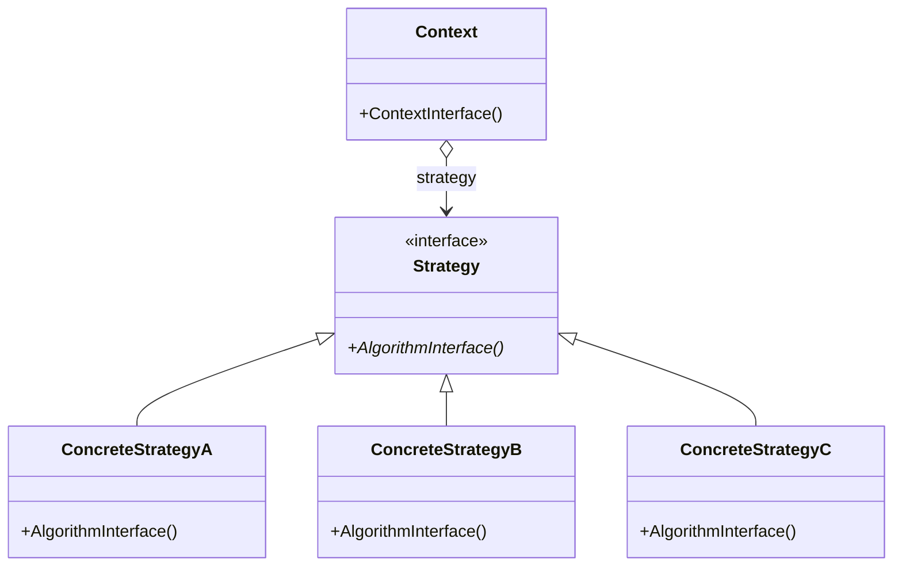

# 02-策略模式

## 策略模式 Startegy / Policy Pattern

* 定义：定义并封装一系列算法，使之可以互换，使算法独立于使用者而变化
* 角色
  * `Context`：上下文，持有一个策略对象的引用并调用对应策略
  * `Strategy`：策略接口，定义了算法的接口
  * `ConcreteStrategy`：具体策略，实现了策略接口的算法

### 例子

* `Duck` 类，拥有 `fly()` 方法和 `quack()` 方法
  * `RubberDuck` 类：不应该 `fly()`，但应该 `quack()`
  * `MallardDuck` 类：应该 `fly()`，但不应该 `quack()`
  * ……
* 使用继承：需要覆盖不适用的方法，难以维护
* 使用接口：代码无法复用，需要编写大量重复代码

### 分析

* 使用场景
  * 类似的类，区别仅在于其行为不同
  * 封装算法的不同变体
  * 封装算法内部细节
  * 消除条件语句
* 父类中包含一个接口类型的成员变量，子类通过设置该成员变量来改变行为
* 可在运行时动态改变策略
* 涉及的思想
  * 封装变化
  * 使用组合代替继承：用“多态的行为”代替“多态的类”
  * 针对接口而非实现编程
  * 单一职责原则
* 优点
  * 消除条件语句
  * 提供多种算法/行为的选择
* 缺点
  * 客户在选择合适的策略之前必须先了解策略的不同
  * 策略和上下文之间通信开销
  * 对象数量增加

```java
public abstract class Duck {
    FlyBehavior flyBehavior;
    QuackBehavior quackBehavior;

    public Duck() {
    }

    public void performFly() {
        flyBehavior.fly();
    }

    public void performQuack() {
        quackBehavior.quack();
    }

    public void setFlyBehavior(FlyBehavior flyBehavior) {
        this.flyBehavior = flyBehavior;
    }

    public void setQuackBehavior(QuackBehavior quackBehavior) {
        this.quackBehavior = quackBehavior;
    }
}

public interface FlyBehavior {
    void fly();
}

public interface QuackBehavior {
    void quack();
}

public class NoFly implements FlyBehavior {
    @Override
    public void fly() {
        System.out.println("I can't fly.");
    }
}

public class CanFly implements FlyBehavior {
    @Override
    public void fly() {
        System.out.println("I can fly.");
    }
}

public class ModelDuck extends Duck {
    public ModelDuck() {
        flyBehavior = new NoFly();
        quackBehavior = new Quack();
    }
}
```

### 类图


