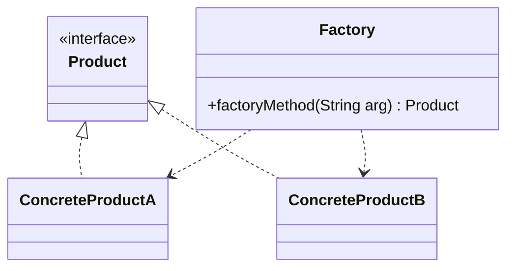
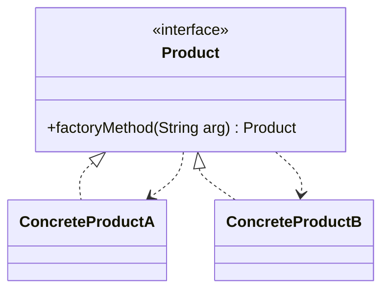
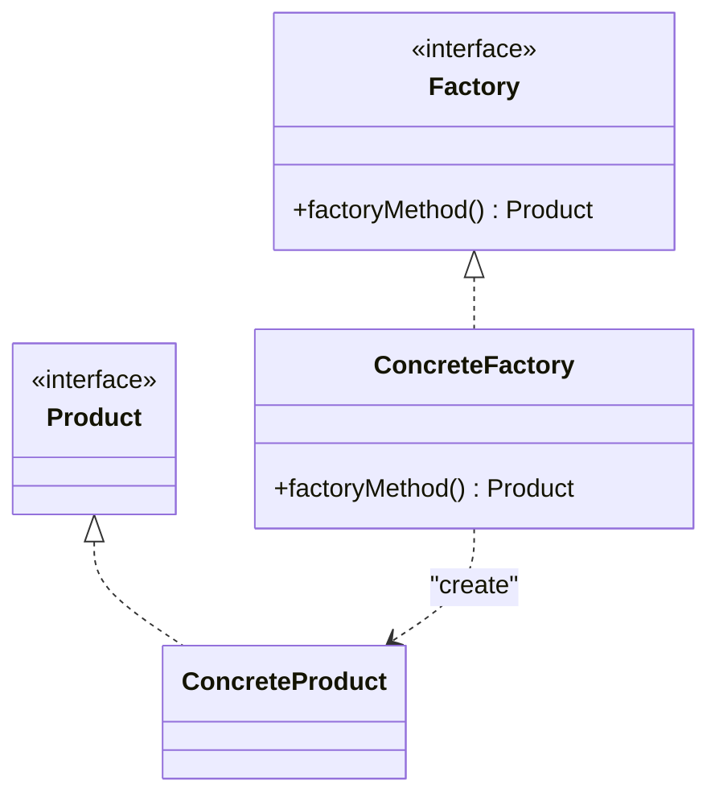
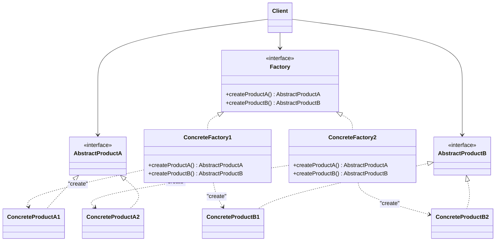

# 03-工厂模式

## 简单工厂模式

* 目的：对于同一个类的不同子类，创建对象时无需调用 `new`，而是通过一个统一的函数，传入参数来决定创建哪个子类的对象。
* 角色
  * `Factory`：工厂类，提供一个静态方法，根据传入的参数决定创建哪个子类的对象。
  * `Product`：抽象产品类，定义了工厂方法所创建的对象的接口。
  * `ConcreteProductA` `ConcreteProductB`：具体产品类

```java
public class PayMethodFactory {
  public static AbstractPay getPayMethod(String type) {
    if (type.equalsIgnoreCase("cash")) {
      return new CashPay();
    } else if (type.equalsIgnoreCase("creditcard")) {
      return new CreditcardPay();
    }
  }
}
```

```java
Cipher cp=Cipher.getInstance("DESede");
```

### 分析

* 工厂方法是**静态方法**，可直接调用
* 优点
  * 封装对象的创建细节
  * 将对象创建和使用分离，降低耦合
  * 将创建参数放在配置文件中，和源代码分离，可在不更改源码的基础上修改产品类
* 缺点
  * 工厂职责过重，集中了所有创建逻辑
  * 违反开闭原则，每增加一个产品都要修改工厂方法
  * 使用静态方法，无法通过继承来扩展工厂方法
* 使用场景
  * 需要创建的对象较少
  * 客户端只知道传入工厂类的参数，对于如何创建对象不关心

### 类图



* 简化版本：抽象类本身提供静态工厂方法



## 工厂方法模式

* 目的：解决简单工厂方式中违反开闭原则的问题
* 定义工厂接口，使用不同的工厂子类创建不同产品
* 角色
  * `AbstractFactory`：抽象工厂，定义工厂方法的接口
  * `ConcreteFactory`：具体工厂，实现工厂方法，创建具体产品
  * `Product`：抽象产品
  * `ConcreteProduct`：具体产品

```java
class AbstractPayFactory {
  public abstract AbstractPay getPayMethod();
}

class CashPayFactory extends AbstractPayFactory {
  @Override
  public AbstractPay getPayMethod() {
    return new CashPay();
  }
}

PayMethodFactory factory;
AbstractPay payMethod;
factory=new CashPayFactory();
payMethod =factory.getPayMethod();
payMethod.pay();
```

* 乍一看又引入了工厂的选择，但是上面的例子仅仅是为了演示
* 真实的开发中使用配置文件 + 反射来自动化创建工厂
* 如果使用各类框架的话，直接使用装饰器（如 `@Autowired`），框架会自动根据配置文件创建实例，完成依赖注入

### 分析

* 优点
  * 简单工厂模式的所有优点
  * 增加新产品，无需修改工厂方法，符合开闭原则
* 缺点
  * 增加新产品时，类的个数成对增加
  * 抽象层增加，且需引入反射等技术
* 适用场景
  * 一个类不知道它所需要的对象的类：客户端只需知道工厂类名即可
  * 一个父类通过其子类来指定创建哪个对象
  * 运行时动态决定创建的对象类型

### 类图



## 抽象工厂模式

* 目的：使用一个工厂，创建同一系列的不同产品
* 产品等级结构：某一产品的父类和与之对应的不同子类
* 产品族：同一工厂生产（同一系列），位于不同产品等级结构中的不同产品
* 抽象工厂模式：抽象工厂下的每一个具体工厂负责生产一个产品族的不同产品
* 角色
  * `AbstractFactory`：抽象工厂
  * `ConcreteFactory1` `ConcreteFactory2`：具体工厂
  * `AbstractProductA` `AbstractProductB`：抽象产品
  * `ConcreteProductA1` `ConcreteProductB2` ……：具体产品

### 分析

* 优点
  * 隔离了具体产品的生成
  * 保证客户端只使用一个产品族的对象
  * 便于增加/替换产品族，符合开闭原则
* 缺点：受限于开闭原则，难以添加新的产品
* 适用场景：系统中存在多个产品族，每次只使用一个

### 类图



## 总结

* 一个工厂只生产一个产品：抽象工厂模式退化为工厂方法模式
* 将工厂的抽象类和工厂方法合并：工厂方法模式退化为简单工厂模式
