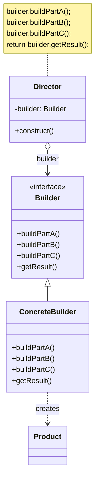
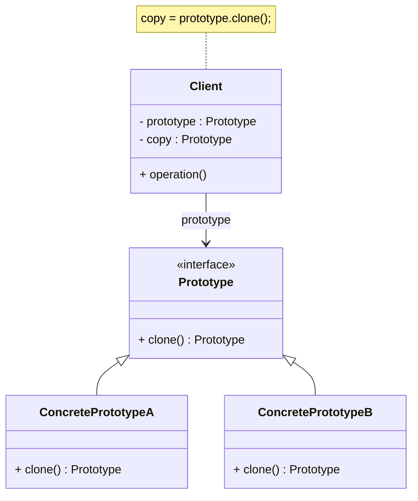
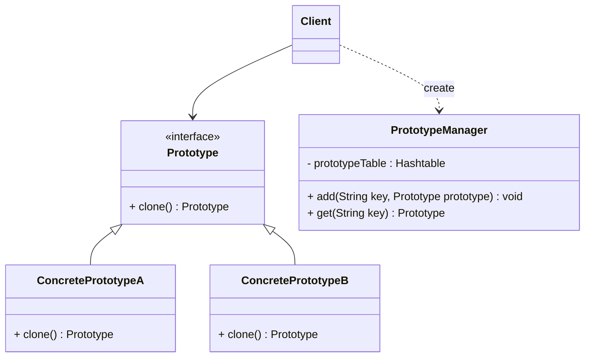

# 04-创建型模式

## 生成器/建造者模式

* 场景：构建一个复杂对象，需要对其内部诸多变量/对象初始化，使用传统的构造函数会有大量的参数/重载版本，不易维护
* 生成器模式
  * 将一个复杂对象的构建与它的表示分离
  * 使得同样的构建过程可以创建不同的表示：不同的 `ConcreteBuilder` 可以创建不同的 `Product`
  * 一步一步创建一个复杂的对象，只需执行所需的步骤，最后一步返回最终对象
* 角色
  * `Builder`：抽象建造者，定义了创建产品的步骤
  * `ConcreteBuilder`：具体建造者，定义了具体**构建过程的实现**
  * `Director`：指挥者，控制构建过程的**执行顺序**
  * `Product`：产品角色，最终构建出来的复杂对象

```java
public class Product {
    private String partA;
    private String partB;
    private String partC;
    // 省略 Getter 和 Setter 方法
}

public abstract class Builder {
    protected Product product = new Product();

    public abstract void buildPartA();
    public abstract void buildPartB();
    public abstract void buildPartC();

    public Product getResult() {
        return product;
    }
}

public class Director {
    private Builder builder;

    public Director(Builder builder) {
        this.builder = builder;
    }

    public void setBuilder(Builder builder) {
        this.builder = builder;
    }

    public Product construct() {
        builder.buildPartA();
        builder.buildPartB();
        builder.buildPartC();
        return builder.getResult();
    }
}
```

```java
Builder b = new ConcreteBuilder();
Director d = new Director(b);
Product p = d.construct();
```

### 分析

* 优点
  * 封装对象构建细节，将产品本身和构建过程解耦
  * 可通过替换 `ConcreteBuilder` 来创建不同的产品
  * 可以控制构建过程的执行顺序
  * 增加新的 `ConcreteBuilder` 不会影响现有代码，符合开闭原则
* 缺点
  * 不适用于产品间差异较大的情形
  * 若产品内部构建过程复杂，需要引入很多 `ConcreteBuilder`，增加系统复杂度
* 适用环境
  * 产品对象内部结构复杂
  * 构建步骤间有依赖，需指定顺序
  * 对象的创建过程独立于创建该对象的类：引入指挥者类封装创建过程
  * 隔离复杂对象的创建和使用，使得相同的创建过程可以创建不同的产品
* 简化
  * 省略 `ConcreteBuilder`：系统中只有单独的建造者
  * 省略 `Director`：直接在 `Builder` 中控制构建过程的执行顺序
* 和工厂模式的差别
  * 工厂模式：生产配件
  * 生成器模式：**组装**配件

### 类图



## 原型模式

* 场景：有些对象需频繁创建
  * 重新创建并逐一设置属性值比较麻烦
  * 有时候不知道对象的类，无法直接创建对象
* 原型模式：用原型实例指定创建对象的种类，并且通过复制这些原型创建新的对象。
  * 允许一个对象再创建另外一个可定制的对象
* 角色
  * `Prototype`：抽象原型，声明一个克隆自身的接口
  * `ConcretePrototype`：具体原型，实现克隆方法，返回一个自身的副本
  * `Client`：客户角色，使用原型实例来创建新的对象
* 实现
  * 在需要复制的类中实现 `Cloneable` 接口和 `clone()` 方法，直接调用 `clone()` 复制对象
  * 若调用 `clone()` 方法时对象的类没有实现 `Cloneable` 接口，则会抛出 `CloneNotSupportedException` 异常

```java
public class PrototypeDemo implements Cloneable {
    public Object clone() {
        Object object = null;
        try {
            object = super.clone();
        } catch (CloneNotSupportedException exception) {
            System.err.println("Not support cloneable");
        }
        return object;
    }
}
```

### 分析

* 浅克隆：不复制部分对象属性，直接使用原对象中该属性的引用
* 优点
  * 简化对象创建过程，提高新实例的创建效率
  * 可动态增减产品类
  * 简化对象的创建结构：无需知道特定的类，从原型注册表中获取对象并直接创建
* 缺点
  * 需要为每一个类配备 `clone()` 方法，修改已有类可能会违反开闭原则
  * 实现深克隆需要额外的代码
* 适用环境
  * 创建对象的成本较大
  * 需要大量复制相同或相似的对象
  * 避免使用分层次的工厂类来创建分层次的对象
  * 保存对象状态：撤销/恢复机制
* 拓展
  * 带原型管理器的原型模式：使用一个原型管理器类来管理原型对象
  * 相似对象的复制：先复制，再修改属性

### 类图

#### 常规



#### 带原型管理器


