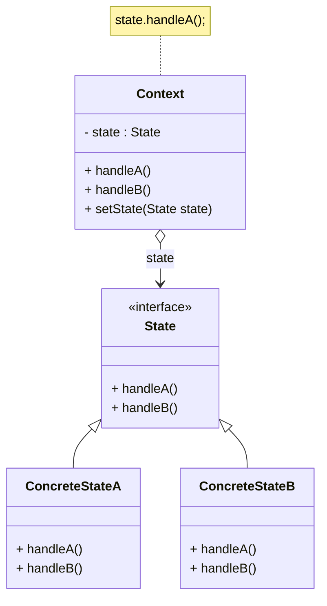
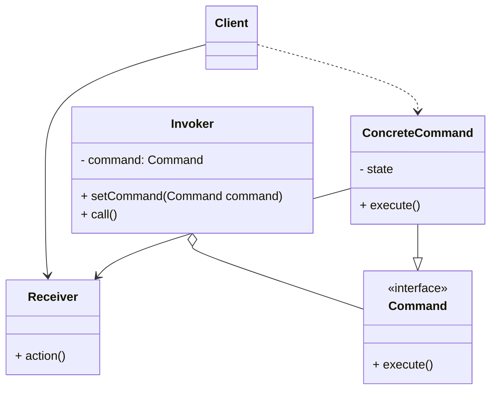

# 05-状态&命令模式

## 状态模式

* 有状态的对象：对象的行为随着状态（某些属性的值）的改变而改变
* 使用 `switch` 实现：难以维护，违反开闭原则
* 状态模式：允许一个对象在其内部状态改变时改变它的行为，对象看起来好像修改了它的类
* 角色
  * `Context`：需要根据状态改变行为的原始对象
  * `State`：抽象状态接口
  * `ConcreteState`：具体状态类，定义在该状态下的行为
* 扩展
  * 简单状态模式：状态间独立，不存在状态转移，符合开闭原则
  * 可切换状态的状态模式：状态间存在转移（调用 `setState()`），增加新状态类需修改已有代码，违反开闭原则
  * 共享状态：将状态作为环境的静态对象，避免创建大量重复的状态对象

### 分析

* 优点
  * 封装了转换规则
  * 枚举可能的状态
  * 方便增加新的状态
  * 允许状态转换逻辑与状态对象合成一体：避免巨大的条件语句块
  * 让多个环境对象共享一个状态对象：减少系统中对象的个数
* 缺点
  * 增加类/对象的个数
  * 实现不当会导致系统混乱
  * 违反开闭原则：切换到新的状态需要修改原有代码
* 适用环境
  * 对象的行为依赖于它的状态，且必须在运行时根据状态改变行为
  * 代码中包含大量与对象状态有关的条件语句
* 和策略模式的区别：状态知道其他状态的存在，且存在状态间的转移

### 类图



## 命令模式 Command / Action / Transaction Pattern

* 场景：需要向某些对象发送请求执行某些操作，但是发送者/接受者并不关心对方的存在
  * 例：使用 `Ctrl + S` / 点击保存按钮来保存文档
  * 使用命令模式解耦发送者 & 接受者
* 命令模式：将一个请求封装为一个对象，可用不同的请求对客户进行参数化，对请求排队 / 记录请求日志，支持可撤销的操作
* 角色
  * `Command`：抽象命令类，定义命令的接口
  * `ConcreteCommand`：具体命令类
  * `Invoker`：调用者，调用命令对象执行请求
  * `Receiver`：接受者，被 Command 调用以执行请求
  * `Client`：客户类

```java
public abstract class Command {
    public abstract void execute();
}

public class Invoker {
    private Command command;

    public Invoker(Command command) {
        this.command = command;
    }

    public void setCommand(Command command) {
        this.command = command;
    }

    public void call() {
        command.execute();
    }
}

public class ConcreteCommand extends Command {
    private Receiver receiver;

    public void execute() {
        receiver.action();
    }
}

public class Receiver {
    public void action() {
        // 具体操作
    }
}
```

### 分析

* 封装命令，分离发出命令和执行命令的责任
* 每一个命令都是一个操作：请求的一方发出请求，要求执行一个操作；接收的一方收到请求，并执行操作
* 请求方无需知道接收方的接口和命令执行细节
* 使请求本身成为可被存储/传递的对象
* 引入了抽象命令接口，发送者针对抽象命令接口编程
* 优点
  * 降低系统耦合度
  * 便于加入新命令 / 更改命令实现 / 自定义请求方需调用的命令
  * 便于设计命令队列 / 宏命令
  * 方便实现 Undo / Redo
* 缺点：导致系统有过多的具体命令类
* 使用场景
  * 将请求调用者和接受者解耦
  * 需要在不同的时间指定请求、将请求排队和执行请求
  * 需要支持撤销重做：为命令对象实现 `undo()` 方法，调用 `undo()` 来撤销命令
  * 宏命令：组合一组命令：递归的调用每个成员命令的 `execute()` 方法

### 类图


