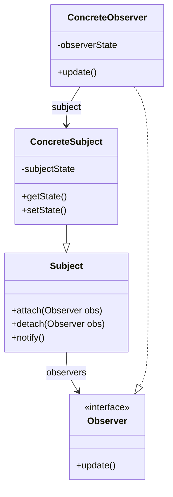
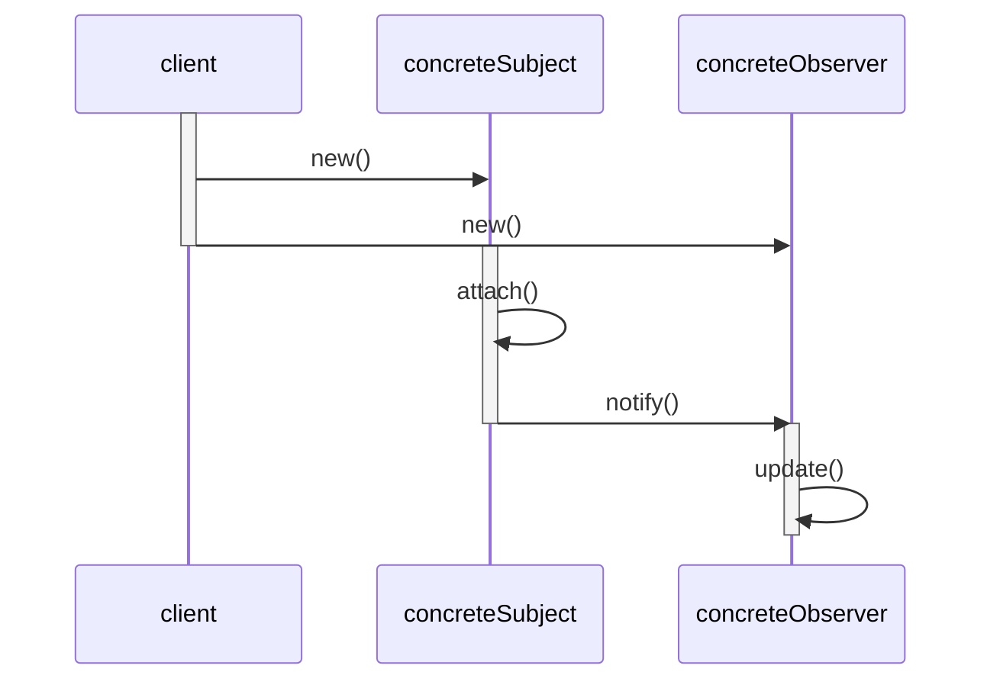
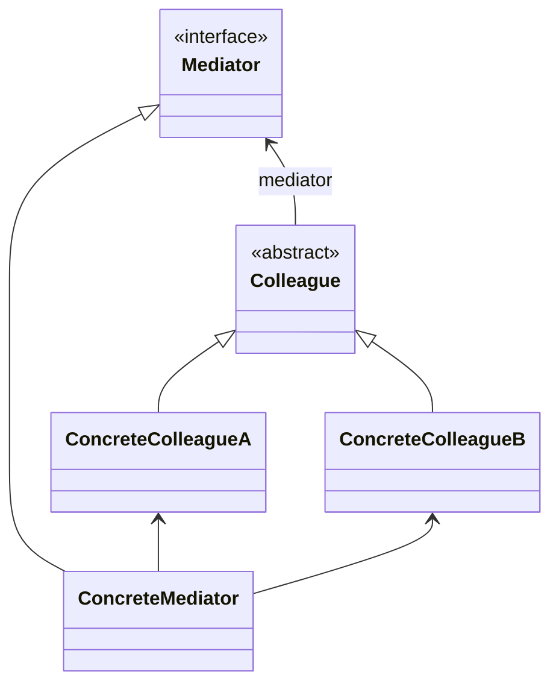
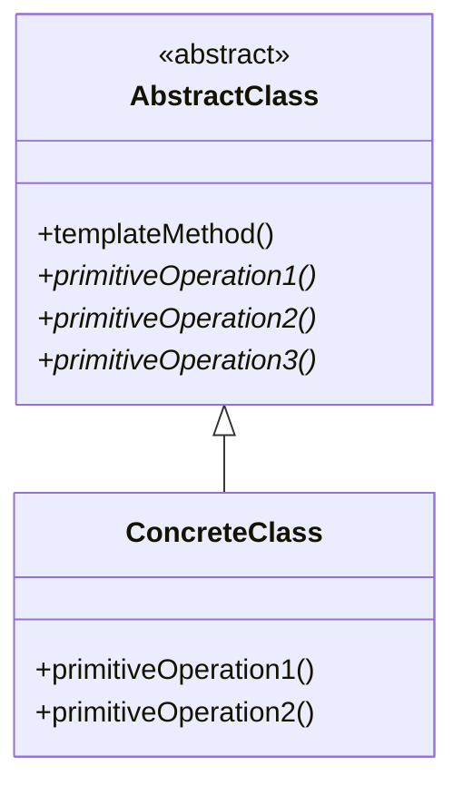

# 06-行为型模式

## 观察者模式

* 定义：建立对象间的一对多依赖关系，当一个对象状态发生改变时，其它依赖对象都会收到通知并自动更新
  * 观察者间无直接联系，可按需增减观察者
  * 别名：发布-订阅模式、模型-视图模式、源-监听器模式、从属者模式
* 角色
  * `Subject`：观察目标（发生变化的对象，拥有一个观察者列表，可以添加和移除观察者）
  * `ConcreteSubject`：具体目标对象
  * `Observer`：观察者（需要知道目标对象状态变化的对象）
  * `ConcreteObserver`：具体观察者

```java
public interface Subject {
    protected List<Observer> observers = new ArrayList<>();
    void attach(Observer observer);
    void detach(Observer observer);
    void notify();
}

public interface Observer {
    void update();
}

public class ConcreteSubject implements Subject {
    private String state;

    @Override
    public void attach(Observer observer) {
        observers.add(observer);
    }

    @Override
    public void detach(Observer observer) {
        observers.remove(observer);
    }

    @Override
    public void notify() {
        for (Observer observer : observers) {
            observer.update();
        }
    }
}

public class ConcreteObserver implements Observer {
    private String observerState;

    @Override
    public void update() {
        // 获取目标对象状态并更新观察者状态
    }
}

Subject subject = new ConcreteSubject();
Observer observer = new ConcreteObserver();
subject.attach(observer);
subject.notify();
```

### 分析

* 优点
  * 实现表示层和数据逻辑层的分离
  * 在观察目标和观察者间建立一个抽象耦合
  * 支持广播通信
  * 符合开闭原则
* 缺点
  * 观察者过多时可能会影响性能
  * 观察者之间若存在循环依赖，可能导致系统崩溃
  * 观察者无法知道目标对象的状态变化原因，仅能知道状态发生了变化
* 适用环境
  * 一个抽象模型有两个方面，其中一个方面依赖于另一个方面
  * 一个对象的改变将导致其他对象也发生改变
  * 一个对象必须通知其他对象，而不知道其他对象是谁
  * 链式触发机制：A 改变后通知 B，B 改变后通知 C
  * MVC 模式：当 Model 发生改变时，View 得到通知并更新
    * Model：观察目标
    * View：观察者
    * Controller：中介

### Java 中的 `Observable` 和 `Observer`

> `java.util.Observable` 和 `java.util.Observer` 已被废弃，但是 2025 年的往年卷还在考这个……

* `Observable` 类提供两种通知方法
  * `notifyObservers()`：Pull 模型，通知所有观察者，但不传递变更的数据
    * 观察者须调用 `getXxx()` 方法从目标对象中获取变更的数据
    * 适用场景：不同观察者需要不同的数据，由观察者自己决定获取哪些数据
    * 缺点：观察者需要知道目标对象的接口，增加了耦合度；多次通知存在开销
  * `notifyObservers(Object arg)`：Push 模型，通知所有观察者，并传递变更的数据
    * 观察者直接从参数中获取变更的数据，无需调用 `getXxx()` 方法从目标对象中获取数据
    * 适用场景：目标对象明确知道观察者所需的数据，且所有观察者需要的数据相同

### 类图



### 顺序图



## 中介者模式

* 目的：在多模块相互引用的系统中，提供一个中介者来封装模块之间的交互，降低模块间耦合
* 角色
  * `Mediator`：中介者接口，定义模块之间的交互方法
  * `ConcreteMediator`：具体中介者
  * `Colleague`：同事接口
  * `ConcreteColleague`：具体同事类

```java
public interface Mediator {
    protected List<Colleague> colleagues = new ArrayList<>();
    public void register(Colleague colleague){
        colleagues.add(colleague);
    }
    public abstract void operation();
}

public class ConcreteMediator extends Mediator{
    public void operation() {
        ((ConcreteColleagueA) colleagues.get(0)).someMethod();
        ((ConcreteColleagueB) colleagues.get(1)).someMethod();
    }
}

public abstract class Colleague {
    protected Mediator mediator;

    public Colleague(Mediator mediator) {
        this.mediator = mediator;
        mediator.register(this);
    }
}

public class ConcreteColleagueA extends Colleague {
    public ConcreteColleagueA(Mediator mediator) {
        super(mediator);
    }

    public void someMethod() {
        // 业务逻辑
        mediator.operation();
    }
}
```

### 分析

* 中介者的职责
  * 中转作用（结构性）：同事之间不直接引用，通过中介者转发消息
  * 协调作用（行为性）：中介者进一步封装同事间的关系，同事之间的交互逻辑由中介者负责协调
* 优点
  * 简化对象交互
  * 将各同事解耦
  * 减少子类生成
  * 简化同事类
* 缺点：中介者过于复杂，维护困难
* 使用场景
  * 对象间存在复杂的引用关系
  * 一个对象由于引用了很多其他对象，导致难以复用
  * 通过一个类封装多个类中的行为，又不想生成太多子类
  * 实例
    * GUI 应用的组件存在交互关系
    * MVC 模式中的 Controller
* 中介者模式将对象引用其他对象的数目最小化，符合**迪米特法则**

### 类图



## 模板方法模式

* 多个子类中的同一操作存在共同的步骤，也存在不同的步骤 -> 将共同的方法提取到父类，不同的方法在子类单独实现
* **基于继承**的代码复用
* 目的：定义操作中算法的骨架，将一些步骤延迟到子类中，使子类不改变算法结构即可重定义该算法的某些特定步骤
* 角色
  * `AbstractClass`：抽象类，定义算法骨架
  * `ConcreteClass`：具体类，实现算法的具体步骤
* 方法
  * 基本方法：各个步骤
  * 模板方法：定义算法骨架，汇总基本方法
    * 抽象方法：无具体实现
    * 具体方法：已有默认实现
    * 钩子方法：**可选步骤**，子类若需启用该步骤，需重写该方法
      * 普通函数：默认实现为空或定义默认实现
      * 条件判断：默认返回 `true`，用于判断是否执行可选步骤

```java
public abstract class AbstractClass {
    public final void templateMethod() {
        primitiveOperation1();
        primitiveOperation2();
        if (hookMethod()) {
            primitiveOperation3();
        }
    }

    protected abstract void primitiveOperation1(); // 抽象方法
    protected void primitiveOperation2() { // 具体方法
        // 默认实现
    }
    protected void primitiveOperation3() {
    
    }
    protected boolean hookMethod() { // 钩子方法
        return true; // 默认启用可选步骤
    }
}
```

### 分析

* _&#x7C7B;_&#x7684;行为型模式：只有类之间的继承关系，没有对象关联关系
* 运行时子类的方法将覆盖父类的方法，实现子类对父类的反向控制
* 优点
  * 在类中定义抽象算法，由子类实现细节的处理
  * 代码复用
  * 实现了反向控制结构：子类无需调用父类，而是通过对子类的的拓展增加新的行为，符合开闭原则
  * 符合单一职责原则，提升类的内聚性
* 缺点
  * 类的个数增加
* 使用场景
  * 一次性实现算法中不变的部分，将可变的行为留给子类来实现
  * 提取公共行为，避免代码重复
  * 分割复杂算法
  * 控制子类扩展
* 关于继承：虽然存在诸多问题，模板方法体现了恰当使用继承的优势

#### 好莱坞原则

> Don’t call us, we’ll call you.

* 子类无需调用父类，而是通过覆盖父类的方法来增加新的行为
* 只需父类正常调用子类，即可实现新的逻辑

### 类图


