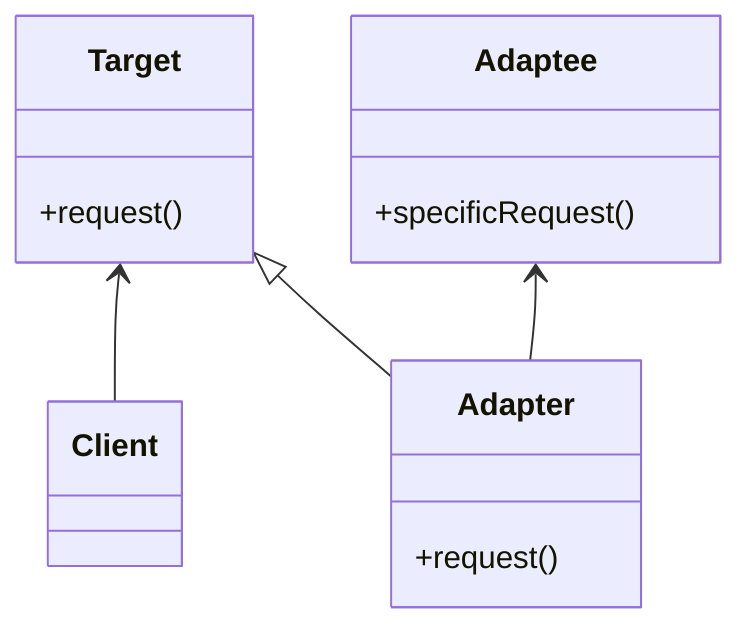
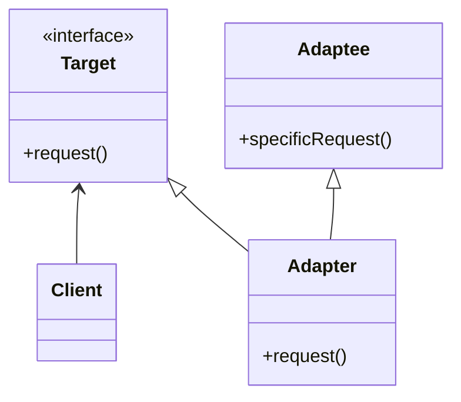
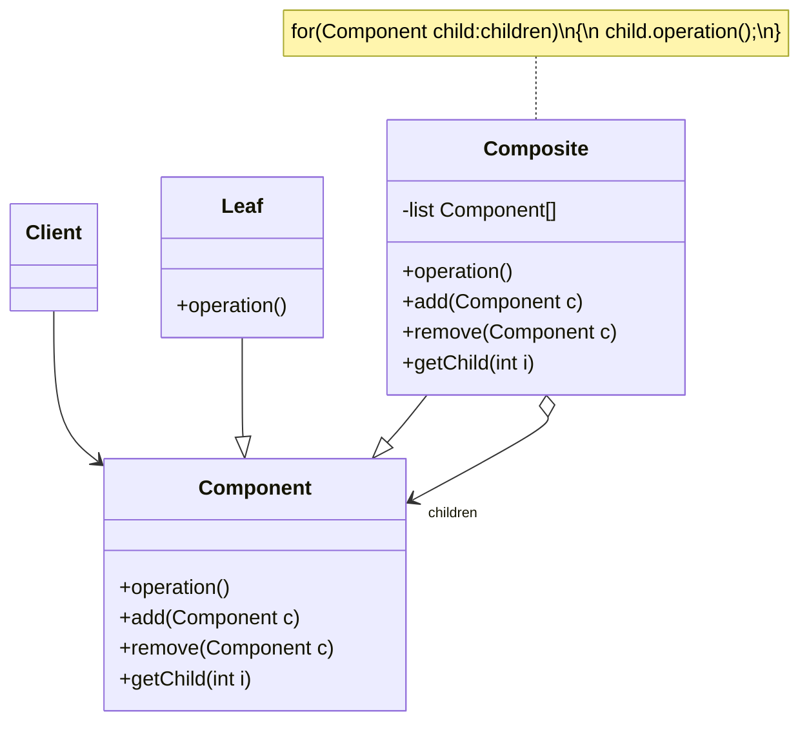

# 07-适配器&组合模式

## 适配器模式 Adapter / Wrapper

* 目的：现有接口和客户类不兼容，使用适配器将其进行包装，转换为客户期望的接口，使客户类利用现有类的功能
* 角色
  * `Target`：目标抽象类，客户期望的接口
  * `Adapter`：适配器类，继承或实现 `Target`
  * `Adaptee`：被适配的类，具有客户不期望的接口
  * `Client`：客户类，通过 `Target` 与接口交互
* 分类
  * 对象适配器：`Adapter` 持有 `Adaptee` 的实例，通过组合实现适配
  * 类适配器：`Adapter` 继承 `Adaptee`，通过继承实现适配

```java
// 对象适配器示例
class ObjectAdapter implements Target {
    private Adaptee adaptee;

    public ObjectAdapter(Adaptee adaptee) {
        this.adaptee = adaptee;
    }

    @Override
    public void request() {
        adaptee.specificRequest();
    }
}

// 类适配器示例
class ClassAdapter extends Adaptee implements Target {
    @Override
    public void request() {
        specificRequest();
    }
}
```

### 分析

* 优点
  * 将 `Target` 和 `Adaptee` 解耦，引入客户类无需更改原有代码
  * 提高了适配者的复用性
  * 将具体的实现封装在适配者类中，对于客户端来说是透明的
  * 灵活性和拓展性好，可根据配置文件动态加载适配器类，符合开闭原则
* 类适配器模式
  * 优点：利用继承，适配器可以置换适配者，进一步增强灵活性
  * 缺点：对于 Java、C# 等单继承语言，类适配器模式无法适配适配者的子类
* 对象适配器模式
  * 优点：可以通过组合，适配适配者的子类，适用范围更广
  * 缺点：无法置换适配者类的方法
* 使用环境
  * 使用既有类，但是接口不符合系统需要
  * 建立一个可以重复使用的类，用于与一些彼此不相关或者接口不兼容的类协同工作

### 默认适配器模式 / 单接口适配器模式

* 场景：接口中方法较多，客户只需适配其中的部分方法，没有必要适配全部方法
* 解决方案：提供一个抽象类实现接口（默认适配器），默认使用空实现以实现所有方法，客户继承该抽象类并重写需要适配的方法

### 双向适配器模式

* `Adapter` 中同时包含 `Target` 和 `Adaptee` 的引用，两者可互相调用

### 类图

#### 对象适配器



#### 类适配器



## 组合模式/整体-部分模式 Composite

* 目的：在递归的树状结构中，一致地表示叶子对象和容器对象（组合对象），使用户无需区分
* 定义：组合多个对象形成树形结构以表示“整体-部分”的结构层次。组合模式对单个对象（即叶子对象）和组合对象（即容器对象）的使用具有一致性。
* 角色
  * `Component`：抽象构件，定义了叶子和组合对象的共同接口
  * `Leaf`：叶子构件
  * `Composite`：容器构件，包含子组件，可以是叶子或容器
  * `Client`：客户类，通过 `Component` 与构件交互

```java
public abstract class Component {
    public abstract void add(Component c);
    public abstract void remove(Component c);
    public abstract Component getChild(int i);
    public abstract void operation();
}

public class Leaf extends Component {
    @Override
    public void add(Component c) {
        throw new UnsupportedOperationException();
    }

    @Override
    public void remove(Component c) {
        throw new UnsupportedOperationException();
    }

    @Override
    public Component getChild(int i) {
        throw new UnsupportedOperationException();
    }

    @Override
    public void operation() {
        // 叶子对象的具体操作
    }
}

public class Composite extends Component {
    private List<Component> children = new ArrayList<>();

    @Override
    public void add(Component c) {
        children.add(c);
    }

    @Override
    public void remove(Component c) {
        children.remove(c);
    }

    @Override
    public Component getChild(int i) {
        return children.get(i);
    }

    @Override
    public void operation() {
        for (Component child : children) {
            child.operation();
        }
    }
}
```

### 分析

* 客户类直接和 `Component` 交互，无需区分叶子对象和组合对象，简化了客户端代码
* `Composite` 和 `Component` 建立聚合关系，既可包含叶子，也可包含容器，形成树形结构
* 优点
  * 清晰定义分层次的复杂对象，易于增加新构件
  * 客户端可一致调用所有对象，实现简单
  * 可不断递归实现复杂的树形结构
  * 更容易加入对象构件，无需更改客户端代码，符合开闭原则
* 缺点
  * 使设计变的过于抽象：不是所有的叶子都和容器有关联
  * 增加新构件时难以对构件类型进行限制：任何继承自 `Component` 的子类都能被加入
* 使用场景
  * 对象存在整体-部分的层次，客户端希望一致处理
  * 对象的结构是动态的并且复杂程度不同
* 对于 `add()` `remove()` `getChild()` 等叶子对象无法实现的方法，应该如何处理？
  * 透明组合模式：在 `Component` 中声明所有方法，叶子对象实现时抛出异常，客户端无需区分叶子和组合对象
  * 安全组合模式：在 `Component` 中只声明 `operation()` 方法，组合对象单独实现 `add()` `remove()` `getChild()` 方法，客户端需要额外代码区分叶子和组合对象

### 类图


