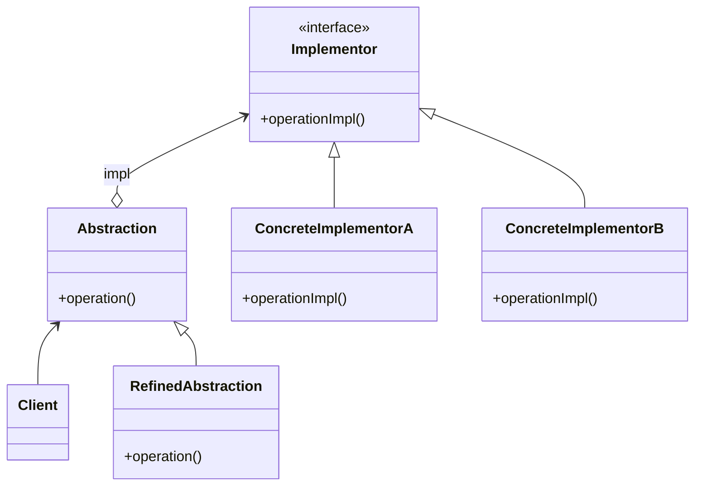
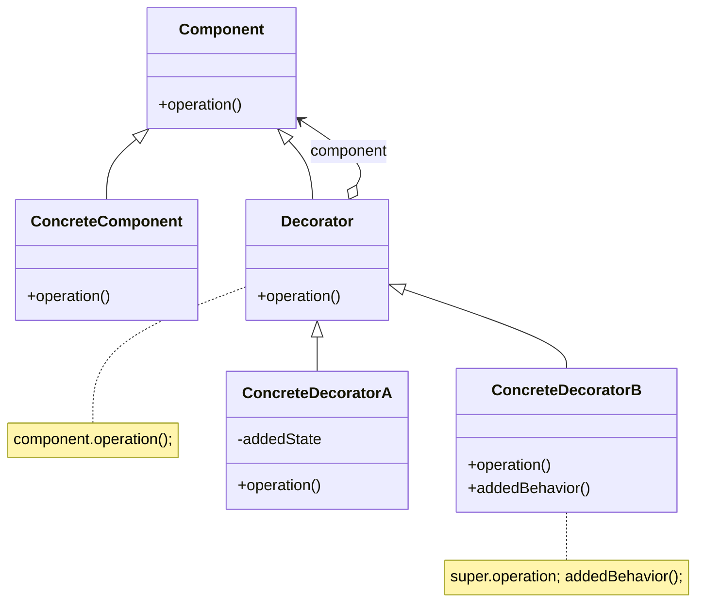

# 08-桥接&装饰器模式

## 桥接模式

* 目的：对于有两个变化维度的系统，使用组合的方式来解耦这两个维度
* 定义：将抽象部分与它的实现部分分离，使它们都可以独立地变化
* 角色
  * `Abstraction`：抽象类，定义了抽象类的接口，并持有一个实现类的引用
  * `RefinedAbstraction`：扩展抽象类
  * `Implementor`：实现类接口，实现了抽象类中变化的部分
  * `ConcreteImplementor`：具体实现类
* 使用组合代替继承，将抽象化和实现化解耦
  * 抽象化：抽象共同性质，形成类
  * 实现化：给出具体实现，和抽象化互逆

### 分析

* 优点
  * 分离抽象接口及其实现
  * 避免多继承
  * 提高可扩展性，扩展变化维度时无需修改已有系统
  * 实现细节对用户透明
* 缺点
  * 增加系统的理解和设计难度
  * 需正确识别出两个不同的变化维度
* 适用场景：一个类存在多个变化维度，需避免多继承
* 桥接模式和适配器模式联用：当已有类不兼容实现类的接口时，使用适配器模式

### 类图

## 装饰器模式

* 定义：在不改变接口的情况下，动态地为对象增加额外的职责/功能
* 角色
  * `Component`：抽象构件角色，定义一个对象接口
  * `ConcreteComponent`：具体构件角色，没有额外功能
  * `Decorator`：抽象装饰角色，兼容抽象构件的接口，并持有一个抽象构件的引用
  * `ConcreteDecorator`：具体装饰角色，负责给构件对象增加额外的职责

### 分析

* 优点
  * 提供比继承更多的灵活性
  * 使用动态的方式扩展对象的功能：使用配置文件，在运行时选择装饰器
  * 可使用多个具体装饰类装饰对象，创造不同行为的组合
  * 具体构建类和具体装饰类可独立变化，符合开闭原则
* 缺点
  * 产生很多小对象
  * 易于出错
* 适用场景
  * 动态地给对象增加职责
  * 不能采用继承或继承不利于系统维护
* 装饰模式的简化：将 `Decorator` 类作为 `ConcreteComponent` 的子类
* 透明装饰模式：客户端中将被装饰后的对象也声明为 `Component` 类型，完全针对抽象接口编程
* 半透明装饰模式：客户端将被装饰后的对象声明为具体的类型，可调用装饰器中新增的方法

### 类图

