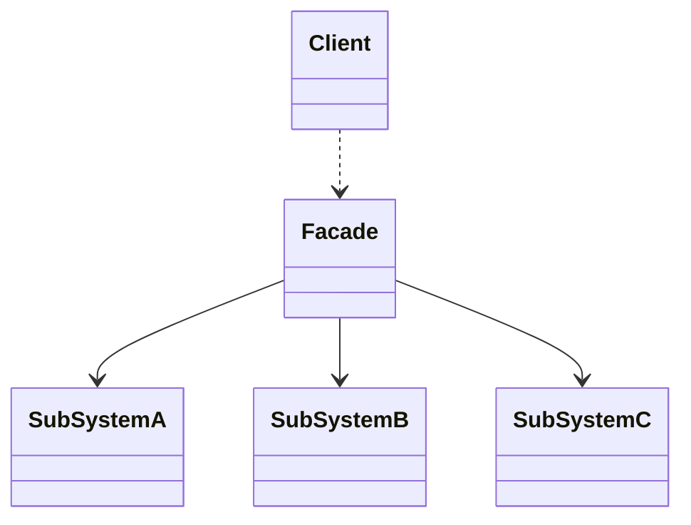
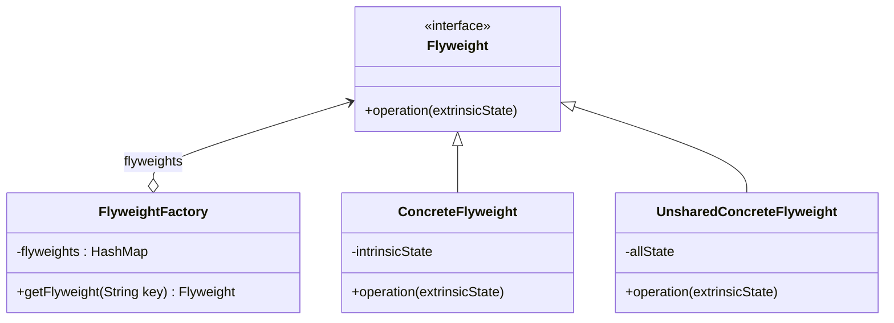
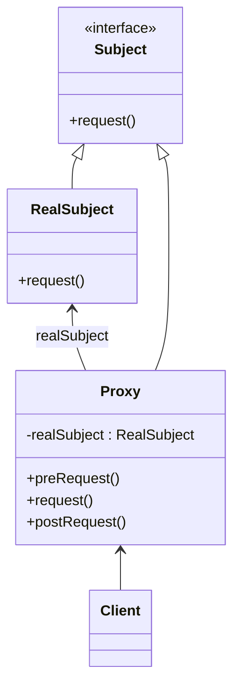

# 09-结构型模式

## 外观模式

* 定义：外部与一个子系统的通信必须通过一个统一的外观对象进行，为子系统中的一组接口提供一个一致的接口
* 角色
  * `Facade`：外观角色
  * `SubSystem`：子系统角色

### 分析

* 优点
  * 对客户屏蔽子系统组件，减少了客户处理的对象数目
  * 实现了子系统与客户之间的松耦合关系
  * 降低编译的依赖性
* 缺点
  * 不能很好地限制客户使用子系统类
  * 违反开闭原则：没有引入抽象外观类时，新增子系统需要修改外观类和客户端源代码。
* 适用场景
  * 为复杂子系统提供简单的接口
  * 客户程序和多个子系统之间存在很强的依赖性
  * 在层次化结构中，使用外观模式定义每一层的入口
* 拓展
  * 通常而言，外观类是单例，但也可以设计多个外观类
  * 不要试图通过外观类，给子系统增加行为
  * 外观模式符合迪米特法则
  * 引入抽象外观类：解决违反开闭原则的问题

### 类图



## 享元模式

* 目的：通过共享技术，重用类似或相同的细粒度对象
* 内部状态：可共享的相同内容
* 外部状态：由外部环境设置，不可共享的内容
* 享元工厂：使用工厂模式，通过享元工厂维护享元池存储享元对象
  * 根据 Key 获取享元对象，若不存在则创建新的享元对象并存入享元池
* 角色
  * `Flyweight`：抽象享元角色
  * `ConcreteFlyweight`：具体享元角色，实例为享元对象，存储内部状态，可共享
  * `UnsharedConcreteFlyweight`：非共享具体享元角色，存储所有状态，不可共享
  * `FlyweightFactory`：享元工厂角色，负责创建和管理享元对象
* 单纯享元模式：只有共享的具体享元角色
* 复合享元模式：和**组合模式**结合使用，复合享元对象包含多个单纯享元对象，本身不可共享，分解后可共享

### 分析

* 优点
  * 节约内存
  * 使享元对象在不同环境中被共享
* 缺点：使系统更复杂，运行时间变长
* 适用场景
  * 一个系统有大量相同或者相似的对象
  * 对象的大部分状态都可以外部化
  * 多次重复使用享元对象

### 类图



## 代理模式

* 定义：给某一个对象提供一个代理，并由代理对象控制对原对象的引用。
* 角色
  * `Subject`：抽象主题角色，声明真实主题和代理对象的共同接口
  * `RealSubject`：真实主题角色
  * `Proxy`：代理主题角色，持有一个真实主题的引用，给客户使用
  * `Client`：客户角色
* 保护代理：控制对真实主题的访问权限
* 远程代理：为一个位于不同的地址空间的对象提供一个本地的代理对象
* 虚拟代理：根据需要创建开销很大的对象，延迟其创建和初始化，使用较小的对象作为占位符
* Copy-on-Write 代理：当对象被修改时，才创建一个真实对象的副本

```java
public interface Subject {
    void request();
}

public class RealSubject implements Subject {
    @Override
    public void request() {
        System.out.println("RealSubject: Handling request.");
    }
}

public class Proxy implements Subject {
    private RealSubject realSubject;

    @Override
    public void request() {
        preRequest();
        realSubject.request();
        postRequest();
    }

    private void preRequest() {
        System.out.println("Proxy: Pre-processing before request.");
    }

    private void postRequest() {
        System.out.println("Proxy: Post-processing after request.");
    }
}
```

### 分析

### 类图


