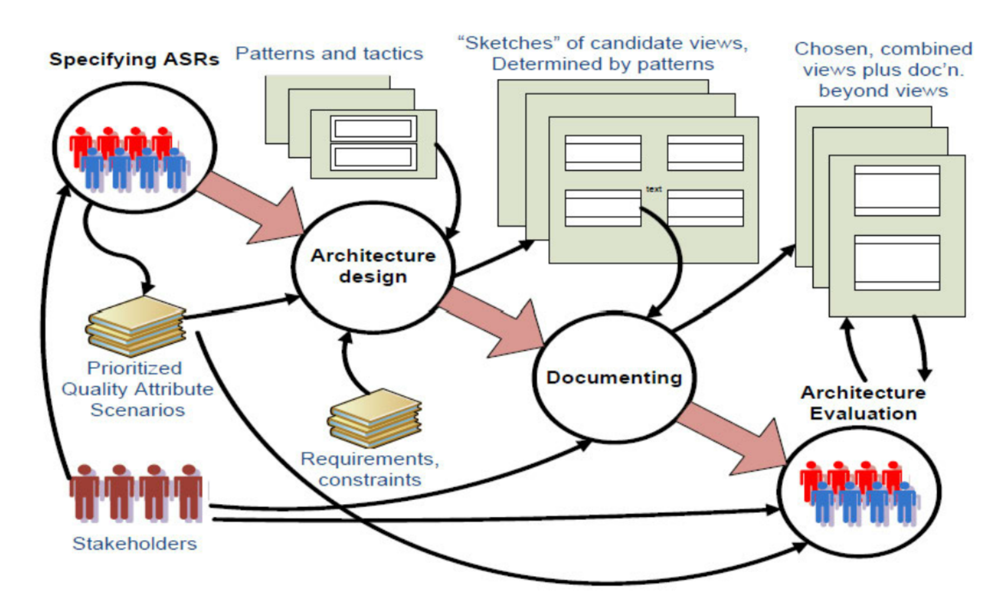

# 11-软件架构

## 软件架构定义

* 系统的基本**组织**，体现在其**组件元素**，它们之间的**相互关系**以及环境以及支配其**设计和演进的原则**

### 简述架构、结构与设计之间的区别与联系

* 架构是设计的早期阶段，设计包含架构设计
* 结构是静态的；架构是动态的

## 架构的来源

* 非功能性需求 NFR、架构攸关需求 ASR、质量属性、涉众、组织、技术环境

## K.Kruchen 的 4+1 视图模型

* 逻辑视图：描述了系统内部各个部件的逻辑关系
* 过程视图：描述元素间的**并发和交互**
* 物理视图：描述了主要过程和部件是如何**映射到应用硬件上**的（部署）
* 开发视图：描述了软件部件是如何**在软件内部组织**的，比如配置管理工具
* 架构用例：描述架构需求

## 软件架构过程

<figure><figcaption>
软件架构过程
</figcaption></figure>

| 步骤         | 输入                     | 输出               |
| ---------- | ---------------------- | ---------------- |
| 1. 识别 ASRs | 无                      | 排序后的质量属性场景       |
| 2. 架构设计    | 排序后的质量属性场景、需求和约束、模式和战术 | 一组候选视图的草图（由模式决定） |
| 3. 架构文档化   | 一组候选视图的草图（由模式决定）       | 视图 & 视图以外的文档     |
| 4. 架构评估    | 视图 & 视图以外的文档、优化的质量属性场景 | 视图 & 视图以外的文档     |

## Architecturally Significant Requirements（ASR）架构攸关需求

* 定义：对架构产生深远影响的需求，若此需求不存在，架构会产生巨大变化
* 包括：功能需求、质量需求、约束
* 识别 ASR 的方法
  * 从需求文档中收集
  * 通过采访涉众收集：质量属性研讨会
  * 了解业务目标
  * Utility 树

### 简述软件需求、质量属性、ASRs 的区别与联系

* 软件需求包含功能性需求与非功能性需求
* 质量属性是业务目标决定的，是非功能性需求的一种反映
* ASRs 对于体系结构有深远的影响，是软件需求的一部分

## 设计决定

### 通用架构设计策略

* 分解
* 抽象
* 分而治之
* 生成和测试
* 迭代：渐进式细化
* 重用元素

### 质量设计决策

* 职责分配
* 协调模型：组件间的沟通交互
* 数据模型：数据格式，存储方式
* 资源管理
* 架构元素映射：将架构元素映射到软件实现
* 绑定时间决策：系统的变化必须在何时前固定下来
* 技术选择
